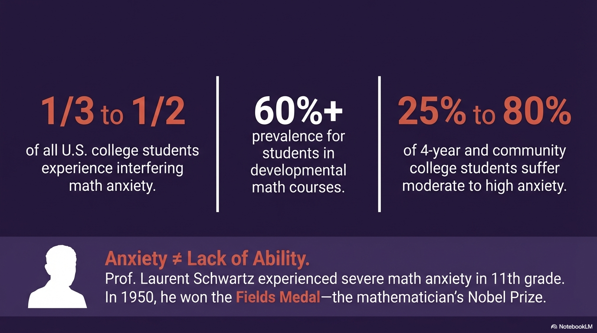
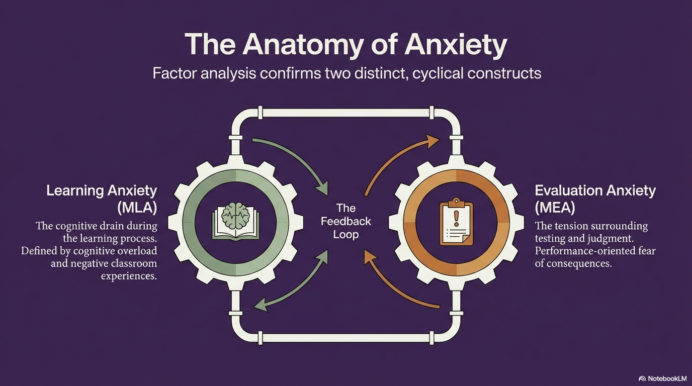
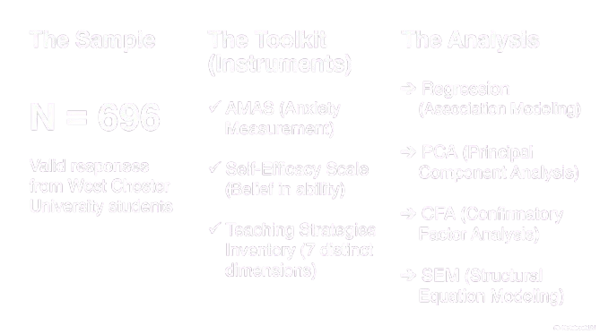
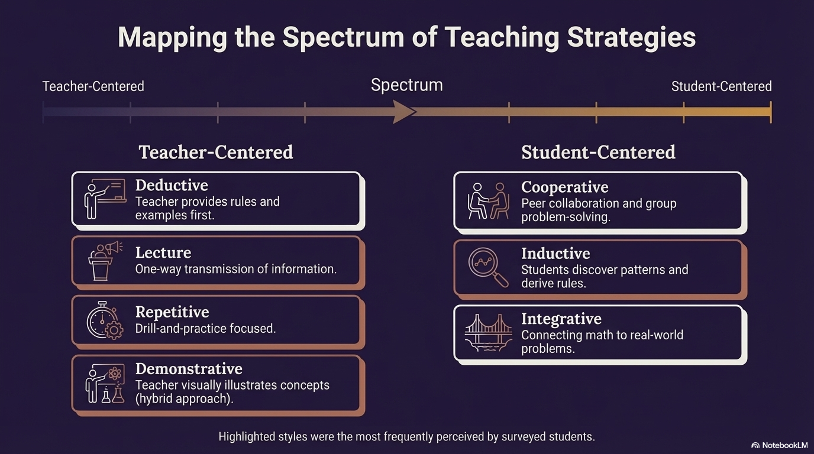
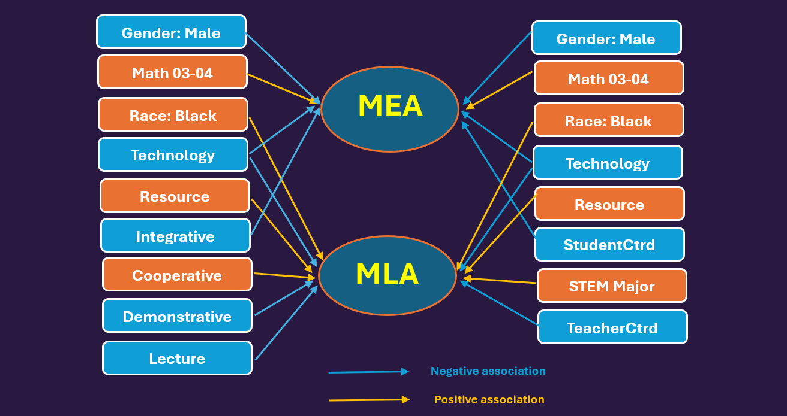
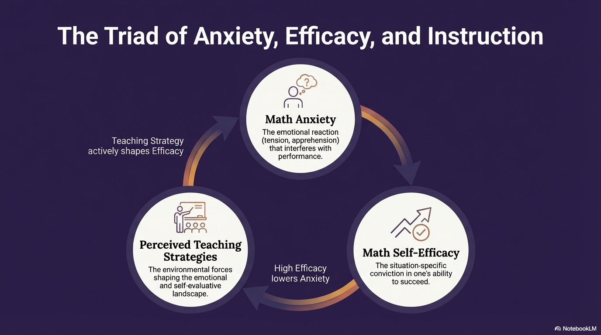
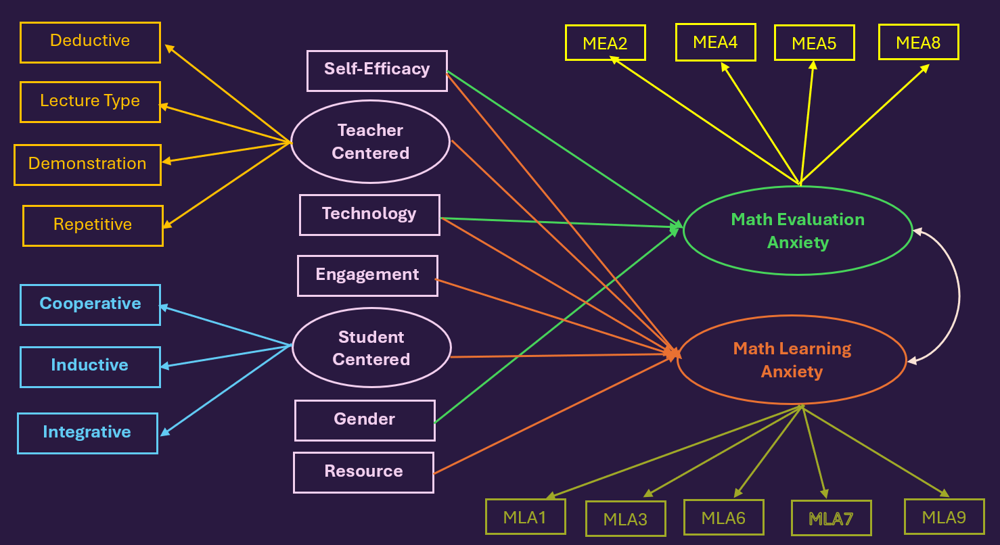
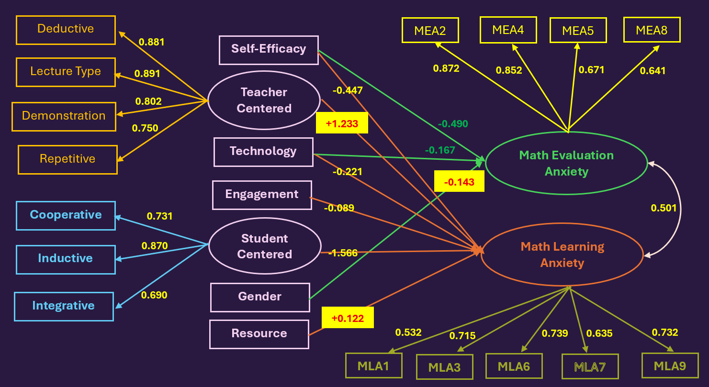
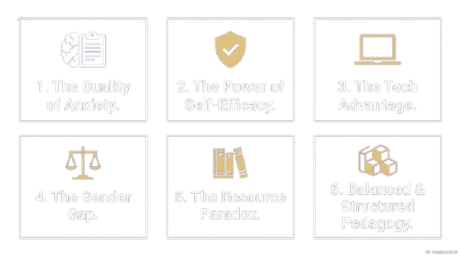

```{r setup, include=FALSE}
options(htmltools.dir.version = FALSE)
if (!require("knitr")) {
   install.packages("knitr")
   library(knitr)
}
if (!require("pander")) {
   install.packages("pander")
   library(pander)
}
if (!require("plotly")) {
   install.packages("plotly")
   library(plotly)
}
if (!require("ggplot2")) {
   install.packages("ggplot2")
   library(ggplot2)
}
# code chunk specifies whether the R code, warnings, and output 
# will be included in the output files.
if (!require("knitr")) {
   install.packages("knitr")
   library(knitr)
}
if (!require("pander")) {
   install.packages("pander")
   library(pander)
}
if (!require("tidyverse")) {
   install.packages("tidyverse")
library(tidyverse)
}
if (!require("GGally")) {
   install.packages("GGally")
library(GGally)
}
# Install and load the package
if (!require("ica")) {
  install.packages("ica")
library(ica)
}
if (!require("fastICA")) {
  install.packages("fastICA")
  library(fastICA)
}
if (!require("MASS")) {
  install.packages("MASS")
  library(MASS)
}
if (!require("ggplot2")) {
  install.packages("ggplot2")
  library(ggplot2)
} 
if (!require("plotly")) {
  install.packages("plotly")
  library(plotly)
} 
if (!require("lavaan")) {
  install.packages("lavaan")
  library(lavaan)
} 
if (!require("semTools")) {
  install.packages("semTools")
  library(semTools)
}
if (!require("stringr")) {
  install.packages("stringr")
  library(stringr)
}
if (!require("reshape2")) {
  install.packages("reshape2")
  library(reshape2)
}
if (!require("psych")) {
  install.packages("psych")
  library(psych)
}
if (!require("ggridges")) {
  install.packages("ggridges")
  library(ggridges)
}
if (!require("RColorBrewer")) {
  install.packages("RColorBrewer")
  library(RColorBrewer)
}
if (!require("heatmaply")) {
  install.packages("heatmaply")
  library(heatmaply)
}
if (!require("semPlot")) {
  install.packages("semPlot")
  library(semPlot)
}
if (!require("lavaanPlot")) {
  install.packages("lavaanPlot")
  library(lavaanPlot)
}
if (!require("boot")) {
  install.packages("boot")
  library(boot)
}
if (!require("leaps")) {
  install.packages("leaps")
  library(leaps)
}
if (!require("viridis")) {
  install.packages("viridis")
  library(viridis)
}
if (!require("RColorBrewer")) {
  install.packages("RColorBrewer")
  library(RColorBrewer)
}
if (!require("DT")) {
  install.packages("DT")
  library(DT)
}
if (!require("reactable")) {
  install.packages("reactable")
  library(reactable)
}
if (!require("htmltools")) {
  install.packages("htmltools")
  library(htmltools)
}
knitr::opts_chunk$set(
                  fig.width=3, 
                  fig.height=3, 
                  fig.retina=12,
                  out.width = "100%",
                  cache = FALSE,
                  echo = TRUE,
                  message = FALSE, 
                  warning = FALSE,
                  hiline = TRUE
                  )
```


```{r xaringan-themer, include=FALSE, warning=FALSE}
library(xaringanthemer)
  style_duo_accent(primary_color = "#1F4257",
          secondary_color = "#380F2A",
          # fonts
          header_font_google = google_font("Martel"),
          text_font_google = google_font("Lato"),
          code_font_google = google_font("Fira Mono"))
```


class:inverse1, top

<h1 align="center"> Agenda</h1>
<BR>


    
<table>
        <tr>
            <td style="font-size: 30px;">
            <li> Math Anxiety: Scope and Key Concepts</li>
            <li> Study Design, Sampling and Methods</li>
            <li> Some Demographics</li>
            <li> Psychometric Measurements and Validation </li>
            <li> Gender gap of Math Anxiety</li>
            <li> Anxiety Distorts Perceived Teaching Styles</li>
            <li> Exploratory Data Analysis of Anxiety</li>
            <li> Key Association Analysis of Anxiety</li>
            <li> Modeling the Math Anxiety Ecosystem - SEM</li>
            <li> Intervention Strategies</li>
            </td>
        </tr>
</table>
    

---
class: transition0 center middle

## <font color = "gold"><b>Epidemic of Math Anxiety</b></font>


---
class: inverse00 center middle

### Epidemic of Math Anxiety

```{r  echo=FALSE, fig.align='center', out.width = '900px'}

```


---
class: inverse0 center middle

```{r  echo=FALSE, fig.align='center', out.width = '1100px'}

```


---
class: transition0 center middle

## <font color = "gold"><b>Design and Analysis Overview</b></font>


---
class: inverse00 center middle

## Sampling, Instruments and Analysis 

```{r  echo=FALSE, fig.align='center', out.width = '900px'}

```


---
class: inverse00 center top

## Methods of Aggregating Likert Scales

### Clasical Approaches

<center>
<table style="width:70%">
        <tr>
            <td style="font-size: 30px; text-align: left;">
            <li> Summation</li>
              <ul style="font-size: 20px; text-align: left;">
                 <font color = "gold"><b>Disadvantage</b></font>: Equal importance assumed among multi-items
              </ul>
            <li> Average</li>
              <ul style="font-size: 20px; text-align: left;">
                 <font color = "gold"><b>Disadvantage</b></font>: Equal importance assumed among multi-items
              </ul>
            <li> Factor Analysis Scoring</li>
            <ul style="font-size: 20px; text-align: left;">
                 <font color = "gold"><b>Disadvantage</b></font>: Normal assumption the item scores
              </ul>
            <li> Principal Component Analysis Scoring </li>
            <ul style="font-size: 20px; text-align: left;">
                 <font color = "gold"><b>Disadvantage</b></font>: Loss of information
              </ul>
            </td>
        </tr>
</table>
</center>   


---
class: inverse00 center top

## Weighted Average of Directional PCAs 

### Our Novel Approach: Double Weighted Average

<center>
<table style="width:80%">
        <tr>
            <td style="font-size: 26px; text-align: left;">
            <font color = "Orange"><b>Step 1</b></font>: &nbsp;Reversing the scores of negative worded items<BR><br>
            <font color = "Orange"><b>Step 2</b></font>: &nbsp;Summing/Averaging item scores<BR><br>
            <font color = "Orange"><b>Step 3</b></font>: &nbsp;Performing PCA (linear or nonlinear)<BR><br>
            <font color = "Orange"><b>Step 4</b></font>: &nbsp;Adjusting PCA sign for positive correlation with total scores<BR><br>
            <font color = "Orange"><b>Step 5</b></font>: &nbsp;Taking weighted PCA average using variance proportions<BR>
            </td>
        </tr>
</table>
</center>   


---
class: inverse00 center top

## Comparing Aggregation Methods: Math Anxiety Scores 


```{r echo = FALSE}
final.anxiety.dat <- na.omit(read.csv("https://pengdsci.github.io/MathAnxiety/completeAnxietyData.csv"))
#final.anxiety.dat <- finalDat
```

```{r echo = FALSE}
plotly.fun <- function(in.data){
   in.avg <- density(in.data[,1])
   in.pc1 <- density(in.data[,2])
   in.pcw <- density(in.data[,3])
   in.cfa <- density(in.data[, 4])
   dat.name <- sub("\\..*", "",names(in.data)[1])  #sub( text)
   # plot density curves
  fig <- plot_ly(x = ~in.avg$x, y = ~in.avg$y, 
               type = 'scatter', 
               mode = 'lines', 
               name = 'avg', 
               fill = 'tozeroy')  %>% 
           # adding more density curves
       add_trace(x = ~in.pc1$x, y = ~in.pc1$y, 
                 name = 'pca1', 
                 fill = 'tozeroy')  %>% 
       add_trace(x = ~in.pcw$x, y = ~in.pcw$y, 
                 name = 'pca.wt', 
                 fill = 'tozeroy')  %>% 
       add_trace(x = ~in.cfa$x, y = ~in.cfa$y, 
                 name = 'cfa', 
                 fill = 'tozeroy')  %>% 
       layout(#xaxis = list(title = 'Aggregated Scores'),
              #yaxis = list(title = 'Density'),
                 xaxis = list(title = "Aggregated Scores", 
                              color = "white", 
                           tickfont = list(color = 'white')),
                 yaxis = list(title ="Density", 
                              color = "white",
                         gridcolor = 'lightgray',
              tickfont = list(color = 'white')),
              plot_bgcolor = '#291940',
              paper_bgcolor = '#291940',
              showlegend = FALSE,
              #title = dat.name,
               margin = list(
                  t = 100,  # Adjust this value to increase or decrease the top margin
                  b = 50,
                  l = 50,
                  r = 50)
             )
     fig
     }
####
in.anxiety.mea = final.anxiety.dat[, c( "Anxiety.mea.avg", "Anxiety.mea.pca1", "Anxiety.mea.wt.pca","Anxiety.mea.cfa")]
in.anxiety.mla = final.anxiety.dat[, c("Anxiety.mla.avg","Anxiety.mla.pca1", "Anxiety.mla.wt.pca","Anxiety.mla.cfa")]
```

```{r echo = FALSE, fig.align='center', fig.width=8, fig.height=6}
p.mea <- plotly.fun(in.anxiety.mea)
p.mla <- plotly.fun(in.anxiety.mla)
# Arrange in 1x2 grid
subplot(p.mea, p.mla, nrows = 1, titleX = TRUE, titleY = TRUE, margin = 0.1) %>%
  layout(
    annotations = list(
      list(x = 0.25, 
           y = 1.05, 
           text = "Math Evaluation Anxiety", 
           xref = "paper", 
           yref = "paper", 
           showarrow = FALSE, 
           font = list(size = 14, color = "white")),
      list(x = 0.95, 
           y = 1.05, 
           text = "Math Learnng Anxiety", 
           xref = "paper", 
           yref = "paper", 
           showarrow = FALSE, 
           font = list(size = 14, color = "white"))
    ),
    showlegend = FALSE
  )
```


---
class: transition0 center middle

## <font color = "gold"><b>Demographics</b></font>


---
class: inverse00 center top

###  Gender and Race


```{r include =FALSE, fig.align='center', fig.width=8, fig.height=4}
# Enhanced hover information
Demographic.bar <-function(in.cat, varname){
  freq.tbl <- table(in.cat)
  df <- data.frame(
      category <- names(freq.tbl),
      values <- as.vector(freq.tbl)
  )
  # High-contrast colors (manually defined)
  accessible_colors <- c(
  '#D55E00',  # Vermillion
  '#0072B2',  # Blue
  '#F0E442',  # Yellow
  '#009E73',  # Green
  '#56B4E9',  # Sky Blue
  '#E69F00',  # Orange
  '#CC79A7'   # Pink
  )
  fig <- plot_ly(df, x = ~category, y = ~values, type = 'bar',
                #hoverinfo = 'text',
                text = ~paste('Category:', category, 
                             '<br>Value:', values, 
                             '<br>Percentage:', round(values/sum(values)*100, 1), '%'),
               #text = ~paste("Value:", values), 
               textposition = 'none',
               marker = list(
                 color = accessible_colors[1:nrow(df)],
                 line = list(color = 'white', width = 2)
               ),
               textfont = list(color = 'white', size = 12)) %>%
   layout(
     title = list(
                  text = paste("<b>Frequency Distributions of Demographics</b>"),
                  font = list(color = 'gold',
                              family = 'arial',
                              size = 24)),
    xaxis = list(title = "Categories", 
                 color = "white", 
                 tickfont = list(color = 'white')),
    yaxis = list(title ="Values", 
                 color = "white",
                 gridcolor = 'lightgray',
                 tickfont = list(color = 'white')),
    plot_bgcolor = '#291940',
    paper_bgcolor = '#291940',
    showlegend = FALSE,
    margin = list(
                  t = 100,  # Adjust this value to increase or decrease the top margin
                  b = 50,
                  l = 50,
                  r = 50)
  )
fig
}
```


```{r echo = FALSE}
final.anxiety.dat <- na.omit(read.csv("https://pengdsci.github.io/MathAnxiety/completeAnxietyData.csv"))
#final.anxiety.dat <- finalDat
in.cat.sex <-  final.anxiety.dat$sex
in.cat.race <-  final.anxiety.dat$race
in.cat.class <-  final.anxiety.dat$class
in.cat.major <-  final.anxiety.dat$major
in.cat.math.level <-  final.anxiety.dat$math.level
in.cat.modality <-  final.anxiety.dat$modality
##
g.sex <- Demographic.bar(in.cat.sex, "Gender Distribution")
g.race <- Demographic.bar(in.cat.race, "Racial Distribution")
g.class <- Demographic.bar(in.cat.class, "Class Distribution")
g.major <- Demographic.bar(in.cat.major, "Major Distribution")
g.math.level <- Demographic.bar(in.cat.math.level, "Math Course Level")
g.modality <- Demographic.bar(in.cat.modality, "Learning Modality")
```


```{r echo = FALSE, fig.align='center', fig.width=8, fig.height=7}
# Arrange in 2x2 grid
subplot(g.sex, g.race,  nrows = 1, titleX = FALSE, titleY = TRUE, margin = 0.1) %>%
  layout(
    annotations = list(
      list(x = 0.35, y = 1.1, text = "Gender", 
           xref = "paper", yref = "paper", showarrow = FALSE, font = list(size = 14, color = "white")),
      list(x = 0.75, y = 1.1, text = "Race", 
           xref = "paper", yref = "paper", showarrow = FALSE, font = list(size = 14, color = "white"))
    ),
    showlegend = FALSE
  )
```


---
class: inverse00 center top

###  Class and Major


```{r echo = FALSE, fig.align='center', fig.width=8, fig.height=7}
# Arrange in 2x2 grid
subplot(g.class, g.major, nrows = 1, titleX = FALSE, titleY = TRUE, margin = 0.1) %>%
  layout(
    annotations = list(
      list(x = 0.35, y = 1.05, text = "Class Level", 
           xref = "paper", yref = "paper", showarrow = FALSE, font = list(size = 14, color = "white")),
      list(x = 0.75, y = 1.05, text = "Major", 
           xref = "paper", yref = "paper", showarrow = FALSE, font = list(size = 14, color = "white"))
    ),
    showlegend = FALSE
  )
```


---
class: inverse00 center top

###  Course Level and Learning Modality


```{r echo = FALSE, fig.align='center', fig.width=8, fig.height=7}
# Arrange in 2x2 grid
subplot(g.math.level, g.modality, nrows = 1, titleX = FALSE, titleY = TRUE, margin = 0.1) %>%
  layout(
    annotations = list(
      list(x = 0.35, y = 1.1, text = "Math Course Level", 
           xref = "paper", yref = "paper", showarrow = FALSE, font = list(size = 14, color = "white")),
      list(x = 0.75, y = 1.1, text = "Learning Modality", 
           xref = "paper", yref = "paper", showarrow = FALSE, font = list(size = 14, color = "white"))
    ),
    showlegend = FALSE
  )
```


---
class: transition0 center middle

## <font color = "gold"><b>Graphical Exploration: <br> Gender Gap in Math Anxiety</b></font>


---
class: inverse00 center top

###  Overall Gender Gaps


```{r echo = FALSE, fig.align='center', fig.width=8, fig.height=7}
mea0 <- final.anxiety.dat[, c("sex", "Anxiety.mea.wt.pca")]
mla0 <- final.anxiety.dat[, c("sex", "Anxiety.mla.wt.pca")]
names(mea0) = c("sex", "anxiety.score")
names(mla0) = c("sex", "anxiety.score")
mea.mla <- rbind(mea0, mla0)

anxiety.type <- c(rep("mea", dim(mea0)[1]), rep("mla", dim(mea0)[1]))
mea.mla$anxiety.type <- anxiety.type
####
df = na.omit(mea.mla)
# Create more complex grouped boxplot with statistical annotations
# Custom hover information
fig <- plot_ly(df, 
               x = ~anxiety.type, 
               y = ~anxiety.score, 
               color = ~sex,
               type = "box",
               hoverinfo = "y+x+name",
               hovertemplate = paste(
                 "Gender: %{x}<br>",
                 "Anxiety Type: %{fullData.name}<br>",
                 "Anxiety Score: %{y:.2f}<br>",
                 "<extra></extra>"
               )) %>%
  layout(
    title = list(
                  text = paste("<b>Gender Gaps in Math Anxiety</b>"),
                  font = list(color = 'gold',
                              family = 'arial',
                              size = 24)),
    xaxis = list(title = "", color = "white"),
    yaxis = list(title = "Anxiety Score", color = "white"),
    boxmode = "group",
    ##
    plot_bgcolor = '#291940',
    paper_bgcolor = '#291940',
    legend = list(
    # Legend text formatting
    font = list( color = 'white'  )),    # Legend text color
    hoverlabel = list(bgcolor = "white", font = list(size = 12)),
    margin = list( t = 100,  # Adjust this value to increase or decrease the top margin
                  b = 50,
                  l = 50,
                  r = 50)
  )

fig

```


---
class: inverse00 center top

###  Adjusted Gender Gaps: MLA

```{r echo = FALSE}
## plotly for anxiety vs gender and other categorical demographic factor
gender.plotly <- function(in.var1, in.var2){
      gender.anxiety <- plot_ly(final.anxiety.dat, 
                              x = ~sex, 
                              y = ~Anxiety.mla.wt.pca, 
                              color = as.formula(paste0("~",in.var1)),
                              type = "box",
                              boxpoints = "no",
                              jitter = 0.3,
                              pointpos = 0,
                              hoverinfo = "y + x + name",
                              hovertext = ~paste("Group:", in.var1,
                                                "<br>Factor:", sex,
                                                "<br>Score:", round(Anxiety.mla.wt.pca, 2)),
                              marker = list(size = 5, opacity = 0.7)) %>%
        layout( 
         title = list(
                  text = paste("<b>MLA: Gender vs ", in.var2,"</b>"),
                  font = list(color = 'gold',
                              family = 'arial',
                              size = 24)),   
         xaxis = list(title = "", color = "white"),
         yaxis = list(title = "Learning Anxiety Score", color = "white"),
         boxmode = "group",
         ##
         plot_bgcolor = '#291940',
         paper_bgcolor = '#291940',
         legend = list(
         # Legend text formatting
         font = list( color = 'white'  )),    # Legend text color
         #
         hoverlabel = list(bgcolor = "white", font = list(size = 12)),
         margin = list(
                  t = 100,  # Adjust this value to increase or decrease the top margin
                  b = 50,
                  l = 50,
                  r = 50)
         )

 gender.anxiety 
}

```

```{r echo = FALSE, fig.align='center', fig.width=8, fig.height=7}
gender.race.mla = gender.plotly("race", "Race")
gender.race.mla
```


---
class: inverse00 center top

###  Adjusted Gender Gaps: MLA


```{r echo = FALSE, fig.align='center', fig.width=8, fig.height=7}
gender.modality.mla = gender.plotly("modality", "Modality")
gender.modality.mla
```


---
class: inverse00 center top

###  Adjusted Gender Gaps: MEA


```{r echo = FALSE, fig.align='center', fig.width=8, fig.height=7}

## plotly for anxiety vs gender and other categorical demographic factor
gender.plotly <- function(in.var1, in.var2){
      gender.anxiety <- plot_ly(final.anxiety.dat, 
                              x = ~sex, 
                              y = ~Anxiety.mea.wt.pca, 
                              color = as.formula(paste0("~",in.var1)),
                              type = "box",
                              boxpoints = "no",
                              jitter = 0.3,
                              pointpos = 0,
                              hoverinfo = "y + x + name",
                              hovertext = ~paste("Group:", in.var1,
                                                "<br>Factor:", sex,
                                                "<br>Score:", round(Anxiety.mea.wt.pca, 2)),
                              marker = list(size = 5, opacity = 0.7)) %>%
    layout( 
         title = list(
                  text = paste("<b>MEA: Gender vs ", in.var2,"</b>"),
                  font = list(color = 'gold',
                              family = 'arial',
                              size = 24)),
         xaxis = list(title = "", color = "white"),
         yaxis = list(title = "Evaluation Anxiety Score", color = "white"),
         boxmode = "group",
         ##
         plot_bgcolor = '#291940',
         paper_bgcolor = '#291940',
         legend = list(
         # Legend text formatting
         font = list( color = 'white'  )),    # Legend text color
         #
         hoverlabel = list(bgcolor = "white", font = list(size = 12)),
         margin = list(
                  t = 100,  # Adjust this value to increase or decrease the top margin
                  b = 50,
                  l = 50,
                  r = 50)
         )

 gender.anxiety 
}

```

```{r echo = FALSE, fig.align='center', fig.width=8, fig.height=7}
gender.race = gender.plotly("race", "Race")
gender.race
```


---
class: inverse00 center top

###  Adjusted Gender Gaps: MEA


```{r echo = FALSE, fig.align='center', fig.width=8, fig.height=7}
gender.modality = gender.plotly("modality", "Modality")
gender.modality
```


---
class: transition0 center middle

## <font color = "gold"><b>Graphical Exploration:<br> Student-Perceived Teaching Strategies</b></font>


---
class: inverse00 center top

```{r  echo=FALSE, fig.align='center', out.width = '1100px'}

```


---
class: inverse00 center top

###  Perceived Teaching Style vs Math Anxiety


```{r echo = FALSE, fig.align='center', fig.width=8, fig.height=7}

var.name <-c( "Anxiety.mea.wt.pca", "Anxiety.mla.wt.pca", "SelfEfficacy.wt.pca", "Technology.wt.pca",
              "Cooporative.wt.pca", "Deductive.wt.pca", "Demonstration.wt.pca",
              "Inductive.wt.pca", "Integrative.wt.pca", "LectureType.wt.pca",
              "Repetitive.wt.pca", "Engage.wt.pca", "Resource.wt.pca")
all.composite.scores <- final.anxiety.dat[, var.name]
names(all.composite.scores) <- c( "Anxiety.mea", "Anxiety.mla", "SelfEfficacy", "Technology",
              "Cooporative", "Deductive.", "Demonstration",
              "Inductive", "Integrative", "LectureType",
              "Repetitive", "Engage", "Resource.")
# define a long table for group plots
## Test Anxiety
mea.tech.by.gender <- data.frame(
  anxety.index = rep(all.composite.scores$Anxiety.mea, 7),
  gender.anx.type = paste0(rep(final.anxiety.dat$sex, 7), " & mea"),
  teach.index = c(all.composite.scores$Cooporative, all.composite.scores$Deductive.,
                  all.composite.scores$Demonstration, all.composite.scores$Inductive,
                  all.composite.scores$Integrative, all.composite.scores$LectureType,
                  all.composite.scores$Repetitive),
  TeachingStyle = rep(c("Cooperative", "Deductive", "Demonstration", "Inductive",  
                        "Integrative", "LectureType",  "Repetitive"), each = 693)
  
)
names(mea.tech.by.gender) <- c("anxety.index", "gender.anx.type", "teach.index", "TeachingStyle")
mea.tech.by.gender <- na.omit(mea.tech.by.gender)

## Learning Anxiety   4019
mla.tech.by.gender <- data.frame(
  anxety.index = rep(all.composite.scores$Anxiety.mla, 7),
  gender.anx.type = paste0(rep(final.anxiety.dat$sex, 7), " & mla"),
  teach.index = c(all.composite.scores$Cooporative, all.composite.scores$Deductive.,
                  all.composite.scores$Demonstration, all.composite.scores$Inductive,
                  all.composite.scores$Integrative, all.composite.scores$LectureType,
                  all.composite.scores$Repetitive),
  TeachingStyle = rep(c("Cooperative", "Deductive", "Demonstration", "Inductive",  
                        "Integrative", "LectureType",  "Repetitive"), each = 693)
  
)
names(mla.tech.by.gender) <- c("anxety.index", "gender.anx.type", "teach.index", "TeachingStyle")
mla.tech.by.gender <- na.omit(mla.tech.by.gender)

## Stacking
anxiety.sex.teach <- na.omit(rbind(mla.tech.by.gender, mea.tech.by.gender))


# Create ggplot with facets
gg <- ggplot(anxiety.sex.teach, aes(x = anxety.index, y = teach.index, color = TeachingStyle, group = TeachingStyle)) +
  #geom_point(alpha = 0.5, size = 1.5) +
  geom_smooth(method = "loess", span = 0.75, se = FALSE, size = 1) +
  facet_wrap(~ gender.anx.type, ncol = 2, nrow = 2) +
  scale_color_viridis_d(option = "plasma") +
  labs(title = "Perceived Teaching Style vs Math Anxiety ",
       x = "Math Anxiety Index",
       y = "Teaching Index") +
  theme_minimal() +
    theme(
    # remove grids
    panel.grid.major.x = element_blank(),  # Remove major x grids
    panel.grid.minor.x = element_blank(),   # Remove minor x grids
    panel.grid.major.y = element_blank(),  # Remove major y grids
    panel.grid.minor.y = element_blank(),   # Remove minor y grids
    
    # plot and panel back ground color
    panel.background = element_rect(fill = "#3B2450"),  # dark purple
    plot.background = element_rect(fill = "#291940", color = "#291940"),
    strip.background = element_rect(fill = "#291940"),
    strip.text = element_text(face = "bold", color = "white"),
    plot.title = element_text(hjust = 0.5, color = "gold", size = 18),
    axis.title.x = element_text(color = "white", size = 12),
    axis.title.y = element_text(color = "white", size = 12),
    
    # Tick labels
    axis.text = element_text(color = "white", size = 11),
    axis.text.x = element_text(color = "white", angle = 0),
    axis.text.y = element_text(color = "white"),
    
    # Legend
    legend.title = element_text(color = "white", size = 13, face = "bold"),
    legend.text = element_text(color = "orange", size = 11),
    legend.background = element_rect(fill = "#291940", color = "black"),
    legend.key = element_rect(fill = "#291940", color = "gray70"),
    legend.position = "right"
  )

# Convert to interactive plotly
ggplotly(gg) 

```


---
class: inverse00 center top

###  Perceived Teaching Style vs Self-Efficacy


```{r echo = FALSE, fig.align='center', fig.width=8, fig.height=6}
# define a long table for group plots
efficay.teach <- data.frame(
  efficacy.index <- rep(all.composite.scores$SelfEfficacy, 7),
  gender <- rep(final.anxiety.dat$sex,7),
  teach.index <-c(all.composite.scores$Cooporative, all.composite.scores$Deductive.,
                  all.composite.scores$Demonstration, all.composite.scores$Inductive,
                  all.composite.scores$Integrative, all.composite.scores$LectureType,
                  all.composite.scores$Repetitive),
  TeachingStyle = rep(c(" Cooperative", "Deductive", "Demonstration", "Inductive",  
                        "Integrative", "LectureType",  "Repetitive"), each = 693)
)
names(efficay.teach) <- c("efficacy.index", "gender", "teach.index", "TeachingStyle")

# Create plot with smoothed lines
# Create ggplot with facets
gg <- ggplot(efficay.teach, aes(x = efficacy.index, y = teach.index, color = TeachingStyle, group = TeachingStyle)) +
  #geom_point(alpha = 0.5, size = 1.5) +
  geom_smooth(method = "loess", span = 0.75, se = FALSE, size = 1) +
  facet_wrap(~  gender, ncol = 2, nrow = 2) +
  scale_color_viridis_d(option = "plasma") +
  labs(title = "Perceived Teaching Style vs Self-efficacy",
       x = "Math Self-efficacy",
       y = "Teaching Index") +
  theme_minimal() +
    theme(
    # remove grids
    panel.grid.major.x = element_blank(),  # Remove major x grids
    panel.grid.minor.x = element_blank(),   # Remove minor x grids
    panel.grid.major.y = element_blank(),  # Remove major y grids
    panel.grid.minor.y = element_blank(),   # Remove minor y grids
    
    # plot and panel back ground color
    panel.background = element_rect(fill = "#3B2450"),  # dark purple
    plot.background = element_rect(fill = "#291940", color = "#291940"),
    strip.background = element_rect(fill = "#291940"),
    strip.text = element_text(face = "bold", color = "white"),
    plot.title = element_text(hjust = 0.5, color = "gold", size = 18),
    
    # Tick labels
    axis.text = element_text(color = "white", size = 11),
    axis.text.x = element_text(color = "white", angle = 0),
    axis.text.y = element_text(color = "white"),
    axis.title.x = element_text(color = "white", size = 12),
    axis.title.y = element_text(color = "white", size = 12),
    
    # Legend
    legend.title = element_text(color = "white", size = 13, face = "bold"),
    legend.text = element_text(color = "orange", size = 11),
    legend.background = element_rect(fill = "#291940", color = "black"),
    legend.key = element_rect(fill = "#291940", color = "gray70"),
    legend.position = "right"
  )


# Convert to interactive plotly
ggplotly(gg) 

```

---
class: inverse00 center top

###  Other Factors vs Math Anxiety


```{r echo = FALSE, fig.align='center', fig.width=8, fig.height=7}
# define a long table for group plots
mea.other <- data.frame(
  anxiety.index <- rep(all.composite.scores$Anxiety.mea, 4),
  gender <- paste0(rep(final.anxiety.dat$sex,4), " & mea"),
  factor.index <-c(all.composite.scores$SelfEfficacy, all.composite.scores$Technology,
                  all.composite.scores$Engage, all.composite.scores$Resource.),
  RelatedFactors = rep(c("SelfEfficacy", "Technology", "Engagement", "UseResource"), each = 693)
)
names(mea.other) = c("anxiety.index", "gender", "factor.index", "RelatedFactors")

# mla
mla.other <- data.frame(
  anxiety.index <- rep(all.composite.scores$Anxiety.mla, 4),
  gender <- paste0(rep(final.anxiety.dat$sex,4), " & mla"),
  factor.index <-c(all.composite.scores$SelfEfficacy, all.composite.scores$Technology,
                  all.composite.scores$Engage, all.composite.scores$Resource.),
  RelatedFactors = rep(c("SelfEfficacy", "Technology", "Engagement", "UseResource"), each = 693)
)
names(mla.other) = c("anxiety.index", "gender", "factor.index", "RelatedFactors")

anxitey.other <- rbind(mea.other, mla.other)

## plot panels
# Create ggplot with facets
gg <- ggplot(anxitey.other, aes(x = anxiety.index, y = factor.index, color = RelatedFactors, group = RelatedFactors)) +
  #geom_point(alpha = 0.5, size = 1.5) +
  geom_smooth(method = "loess", span = 0.75, se = FALSE, size = 1) +
  facet_wrap(~ gender, ncol = 2, nrow = 2) +
  scale_color_viridis_d(option = "plasma") +
  labs(title = "Other Factors v.s. Math Anxiety",
       x = "Math Learning Anxiety",
       y = "Other Factors") +
  theme_minimal() +
    theme(
    # remove grids
    panel.grid.major.x = element_blank(),  # Remove major x grids
    panel.grid.minor.x = element_blank(),   # Remove minor x grids
    panel.grid.major.y = element_blank(),  # Remove major y grids
    panel.grid.minor.y = element_blank(),   # Remove minor y grids
    
    # plot and panel back ground color
    panel.background = element_rect(fill = "#3B2450"),  # dark purple
    plot.background = element_rect(fill = "#291940", color = "#291940"),
    strip.background = element_rect(fill = "#291940"),
    strip.text = element_text(face = "bold", color = "white"),
    plot.title = element_text(hjust = 0.5, color = "gold", size = 18),
    
    # Tick labels
    axis.text = element_text(color = "white", size = 11),
    axis.text.x = element_text(color = "white", angle = 0),
    axis.text.y = element_text(color = "white"),
    axis.title.x = element_text(color = "white", size = 12),
    axis.title.y = element_text(color = "white", size = 12),
    
    # Legend
    legend.title = element_text(color = "white", size = 13, face = "bold"),
    legend.text = element_text(color = "orange", size = 11),
    legend.background = element_rect(fill = "#291940", color = "black"),
    legend.key = element_rect(fill = "#291940", color = "gray70"),
    legend.position = "right"
  )


# Convert to interactive plotly
ggplotly(gg)
```


---
class: transition0 center middle

## <font color = "gold"><b>Association Analysis: <br> Identify Driving Factors of Anxiety</b></font>


---
class: inverse00 center top

### MEA: Individual Teaching Styles


```{r echo = FALSE, eval = TRUE}
anxiety.inf.data0 <- na.omit(read.csv("https://pengdsci.github.io/MathAnxiety/Anxiety.Analytic.Data.csv"))
inf.var <- c("Anxiety.mea.wt.pca", "Anxiety.mla.wt.pca", "sex", "race", "class", "major", "math.level", "modality", "SelfEfficacy.wt.pca", "Technology.wt.pca",
 "Cooporative.wt.pca", "Deductive.wt.pca", "Demonstration.wt.pca", "Inductive.wt.pca",    "Integrative.wt.pca", "LectureType.wt.pca", "Repetitive.wt.pca", "Engage.wt.pca", "Resource.wt.pca","Teacher.ctrd.wt.pca", "Student.ctrd.wt.pca")
##
anxiety.reg.data <- anxiety.inf.data0[, inf.var]
reg.var.name <- c("MEA", "MLA", "sex", "race", "class", "major", "math.level", "modality", "SelfEfficacy", "Technology",
 "Cooperative", "Deductive", "Demonstration", "Inductive",    "Integrative", "Lecture", "Repetitive", "Engage", "Resource","TeacherCtrd", "StudentCtrd")
names(anxiety.reg.data) <- reg.var.name 
```


```{r echo = FALSE}
BestSubsetsReg <- function(best.subset.model){
   # View the results
   reg.summary <- summary(best.subset.model)
}
```

```{r echo = FALSE, fig.align='center', fig.width=7, fig.height=6}
library(leaps)
mea.lm.data <- anxiety.reg.data[,-c(2,20,21)]
mea.best.subsets.lm <- regsubsets(MEA ~., data = mea.lm.data, nvmax = 8,  method = "backward" )
#BestSubsetsReg(mea.best.subsets.lm)
```


```{r echo = FALSE, fig.align='center', fig.width=7, fig.height=7}
library(MASS)
mea.lm.data <- anxiety.reg.data[,-c(2,20,21)]
mea.lm <- lm(MEA ~SelfEfficacy + Inductive + Integrative + math.level + sex +
    Technology, data = mea.lm.data)
stepwise.mea.model <- stepAIC(mea.lm, direction = "both", trace = 0)
```


```{r echo = FALSE}
library(boot)
### Bootstrap confidence intervals
boot.coef <- function(data, indices) {
  d <- data[indices, ]  # resample rows
  fit <- lm(MEA ~ SelfEfficacy + Integrative + math.level + 
    sex + Technology, data = d)
  return(coef(fit))      # return coefficients
}
######
# Extract CIs for all coefficients
get.all.boot.cis <- function(boot.output, type = "perc") {
  n.coef <- ncol(boot.output$t)
  ci.matrix <- matrix(NA, nrow = n.coef, ncol = 2)
  rownames(ci.matrix) <- colnames(boot.output$t)
  colnames(ci.matrix) <- c("bt.low.95%", "bt.up.95%")
  
  for (i in 1:n.coef) {
    ci.obj <- boot.ci(boot.output, type = type, index = i)
    if (type == "perc") {
      ci.matrix[i, ] <- ci.obj$percent[4:5]
    }
  }
  
  return(ci.matrix)
}

# Perform bootstrap (R = number of re-samples)
set.seed(311)  # for reproducibility
boot.results <- boot(mea.lm.data, boot.coef, R = 1000)
## bootstrap CI
all.cis <- get.all.boot.cis(boot.results)
InferenceTable01 <- round(cbind(summary(stepwise.mea.model)$coef, all.cis),4)
#print(InferenceTable) 
```


```{r echo=FALSE}
InterActiveTable <- function(indat){
# Create table with complete styling
datatable(indat,
          options = list(
            pageLength = 11,
            dom = 'Bfrtip',
            initComplete = JS(
              "function(settings, json) {",
              "$(this.api().table().container()).css({'background-color': '#2d1b3c'});",
              "$(this.api().table().container()).find('td').css({'background-color': '#4a2c5a', 'color': '#EFBF04'});",
              "$(this.api().table().header()).css({'background-color': '#6b3f8c', 'color': 'gold'});",
              
              "$('.dataTables_wrapper').css('color', '#EFBF04');",
              
              "$('.dataTables_filter input').css({",
              "  'background-color': '#4a2c5a',",
              "  'color': '#EFBF04',",
              "  'border': '2px solid #6b3f8c',",
              "  'border-radius': '1px',",
              "  'padding': '1px',",
              "  'margin-left': '5px'",
              "});",
              
              "$('.dataTables_filter label').css({",
              "  'color': '#EFBF04',",
              "  'font-weight': 'bold'",
              "});",
              
              "$('.dataTables_filter input').attr('placeholder', 'Search...');",
              "$('.dataTables_filter input').css('placeholder', {'color': '#8a6ca3'});",
              
              "$('.dataTables_length label').css({",
              "  'color': '#EFBF04',",
              "  'font-weight': 'bold'",
              "});",
              
              "$('.dataTables_length select').css({",
              "  'background-color': '#4a2c5a',",
              "  'color': '#EFBF04',",
              "  'border': '2px solid #6b3f8c',",
              "  'border-radius': '1px',",
              "  'padding': '0px',",
              "  'margin': '0 1px'",
              "});",
              
              "$('.dataTables_length select option').css({",
              "  'background-color': '#4a2c5a',",
              "  'color': '#EFBF04'",
              "});",
              
              "$('.dataTables_info').css({",
              "  'color': '#EFBF04',",
              "  'padding': '0px 0px',",
              "  'font-size': '14px'",
              "});",
              

               "$('.dataTables_paginate').css({",
              "  'margin-top': '0px',",
              "  'color': 'gold !important',",
              "  'font-size': '12px'  /* Font size for the entire pagination container */",
              "});",
              
              "$('.paginate_button').css({",
              "  'color': 'gold !important',",
              "  'background-color': '#4a2c5a !important',",
              "  'border': '2px solid #6b3f8c !important',",
              "  'border-radius': '1px !important',",
              "  'margin': '0 0px !important',",
              "  'padding': '0px 0px !important',  /* Increased padding for larger boxes */",
              "  'font-size': '12px !important',    /* Font size for Previous/Next and page numbers */",
              "  'min-width': '20px !important'     /* Minimum width for consistent box sizes */",
              "});",
              
              
              "$('.paginate_button.current').css({",
              "  'color': 'gold !important',",
              "  'background-color': '#6b3f8c !important',",
              "  'border': '2px solid #8a5cb8 !important',",
              "  'font-weight': 'bold !important'",
              "});",
              
              "$('.paginate_button:hover').css({",
              "  'color': 'gold !important',",
              "  'background-color': '#5d3b77 !important',",
              "  'border': '2px solid #8a5cb8 !important',",
              "  'cursor': 'pointer !important'",
              "});",
              
              "$('.paginate_button.disabled').css({",
              "  'color': 'gold  !important',",
              "  'background-color': '#3a2450 !important',",
              "  'border': '2px solid #4a2c5a !important',",
              "  'opacity': '0.5 !important'",
              "});",
              
              "$(this.api().table().container()).css({",
              "  'border': '2px solid #6b3f8c',",
              "  'border-radius': '0px',",
              "  'overflow': 'hidden'",
              "});",
              
              "$('.dataTables_wrapper').css({",
              "  'padding': '0px',",
              "  'background-color': '#2d1b3c'",
              "});",
              "}"
            )
          )) 
  }
```

```{r echo = FALSE}
reg.result01 <- as.data.frame(InferenceTable01)
# Create table with custom styling
InterActiveTable(reg.result01)
```


---
class: inverse00 center top

### MEA: Teacher and Student Centered Teaching


```{r echo = FALSE}
# Perform best subset selection
# 'nvmax' specifies the maximum number of variables to consider in a subset
best.subset.model.ctrd <- regsubsets(MEA~ sex+ race+ class+ major+ math.level+ modality+ SelfEfficacy+ Technology + TeacherCtrd+ StudentCtrd, data = anxiety.reg.data, nvmax = 10,  method = "backward" )
##
best.subset.ctrd <- lm(MEA~ sex+ math.level+  SelfEfficacy+ Technology + StudentCtrd, data = anxiety.reg.data)
##
```

```{r echo = FALSE}
### Bootstrap confidence intervals
boot.coef.ctrd <- function(data, indices) {
  d <- data[indices, ]  # resample rows
  fit <- lm(MEA~ sex+ math.level+  SelfEfficacy+ Technology + StudentCtrd, data = d)
  return(coef(fit))      # return coefficients
}

# Perform bootstrap (R = number of re-samples)
set.seed(312)  # for reproducibility
boot.results.ctrd <- boot(anxiety.reg.data, boot.coef.ctrd, R = 1000)
# Combine the linear regression output with the bootstrap CI
all.ctrd.cis <- get.all.boot.cis(boot.results.ctrd )
InferenceTable02 <- round(cbind(summary(best.subset.ctrd)$coef, all.ctrd.cis ),4)
#print(InferenceTable) 

reg.result02 <- as.data.frame(InferenceTable02)
# Create table with custom styling
InterActiveTable(reg.result02)
```


---
class: inverse00 center top

### MLA: Individual Teaching Styles


```{r echo = FALSE, fig.align='center', fig.width=7, fig.height=6}
mla.lm.data <- anxiety.reg.data[,-c(1,20,21)]
mla.full.lm <- lm(MLA ~., data = mla.lm.data)
###
mla.best.subsets.lm <- regsubsets(MLA ~., data = mla.lm.data, nvmax = 16,  method = "backward" )
###
pred.var <- names(coef(mla.best.subsets.lm ,7))[-(1:2)]
acutal.var <-c("race", pred.var)
formula.str <- paste("MLA", "~", paste(acutal.var, collapse = " + "))
MLA.model.formula <- as.formula(formula.str)
MLA.model <- lm(MLA.model.formula , data = mla.lm.data)
#summary(MLA.model )
### Bootstrap confidence intervals
boot.coef.mla <- function(data, indices) {
  d <- data[indices, ]  # resample rows
  fit <- lm(MLA.model.formula, data = d)
  return(coef(fit))      # return coefficients
}

# Perform bootstrap (R = number of re-samples)
set.seed(312)  # for reproducibility
boot.results.mla<- boot(mla.lm.data, boot.coef.mla, R = 1000)
## combine regular regression output and the bootstrap CI
all.cis.mla <- get.all.boot.cis(boot.results.mla)
InferenceTable03 <- round(cbind(summary(MLA.model)$coef, all.cis.mla),4)
#print(InferenceTable) 

reg.result03 <- as.data.frame(InferenceTable03)
# Create table with custom styling
InterActiveTable(reg.result03)
```


---
class: inverse00 center top

### MLA: Teacher and Student Centered Teaching


```{r echo = FALSE, fig.align='center', fig.width=7, fig.height=6}
mla.lm.data.ctrd <- anxiety.reg.data[,-c(1, 11:17)]
mla.full.ctrd <- lm(MLA ~., data = mla.lm.data.ctrd)
###
mla.best.subsets.ctrd <- regsubsets(MLA ~., data = mla.lm.data.ctrd, nvmax = 16,  method = "backward" )
BestSubsetsReg(mla.best.subsets.ctrd)
## final model
pred.var.ctrd <- names(coef(mla.best.subsets.ctrd,7))[-(1:4)]
acutal.var.ctrd <-c("race", "major", pred.var.ctrd)
formula.str.ctrd <- paste("MLA", "~", paste(acutal.var.ctrd, collapse = " + "))
MLA.model.formula <- as.formula(formula.str.ctrd)
MLA.model.ctrd <- lm(MLA.model.formula , data = mla.lm.data.ctrd)
#summary(MLA.model.ctrd)$coef
### Bootstrap confidence intervals
boot.coef.mla.ctrd <- function(data, indices) {
  d <- data[indices, ]  # resample rows
  fit <- lm(MLA.model.formula , data = d)
  return(coef(fit))      # return coefficients
}
# Perform bootstrap (R = number of re-samples)
set.seed(312)  # for reproducibility
boot.results.ctrd <- boot(mla.lm.data.ctrd, boot.coef.mla.ctrd, R = 1000)
## combining bootstrap CIs with the default output in the lm()
all.ctrd.cis <- get.all.boot.cis(boot.results.ctrd )
InferenceTable04 <- round(cbind(summary(MLA.model.ctrd)$coef, all.ctrd.cis ),4)
#print(InferenceTable) 
reg.result04 <- as.data.frame(InferenceTable04)
# Create table with custom styling
InterActiveTable(reg.result04)
```


---
class: inverse00 center middle

### Graphical Summary

```{r  echo=FALSE, fig.align='center', out.width = '900px'}

```


---
class: transition0 center middle

## <font color = "gold"><b>Modeling the Anxiety Ecosystem<br> A Structural Equation Modeling (SEM) Approach</b></font>


---
class: inverse00 center middle


```{r  echo=FALSE, fig.align='center', out.width = '1100px'}

```


---
class: inverse00 center middle

### The Path Analysis of the Math Anxiety Ecosystem

```{r  echo=FALSE, fig.align='center', out.width = '900px'}

```


---
class: inverse00 center middle

### The Structural Equation Modeling Approach

```{r  echo=FALSE, fig.align='center', out.width = '900px'}

```


---
class: transition0 center middle

# <font color = "gold"><b>Key Takeways</b></font>


---
class: inverse00 center middle

### Six Insights Derived from the Data

```{r  echo=FALSE, fig.align='center', out.width = '900px'}

```


---
class: inverse00 center middle


### From Data to Intervention


```{r  echo=FALSE, fig.align='center', out.width = '900px'}

```


---
class: inverse00 center middle

<center><div class='wrap'>
<iframe src="https://pengdsci.github.io/MathAnxiety/index4presentation.html" height="600px" width="100%" style="border:1px solid black;"></iframe>
</div></center>
<center>
<a href="https://pengdsci.github.io/MathAnxiety/index4presentation.html"><font color = "gold">https://pengdsci.github.io/MathAnxiety/index4presentation.html</font></a>
</center>


---
class: transition0 center middle


```{r  echo=FALSE, fig.align='center', out.width = "60%"}

```


---
class: transition0 center, middle

<!--/*# <font size = 12 color = "gold"><b>Thank You!</b></font>-->


Slides created using the following R packages in RStudio.

[**xaringan**](https://github.com/yihui/xaringan)<br>
[gadenbuie/xaringanthemer](https://github.com/gadenbuie/xaringanthemer)

and

[**Google NotebookLM**](https://notebooklm.google/)


