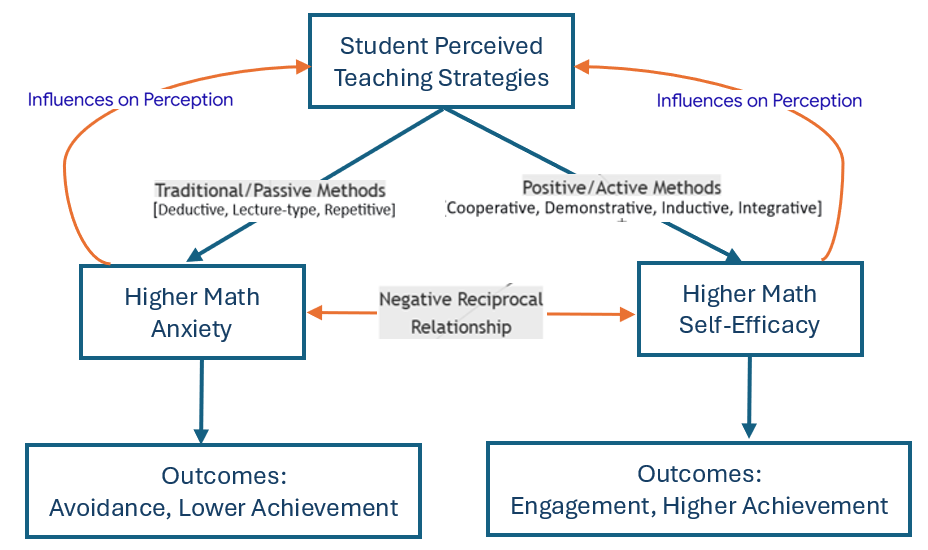

```{css, echo = FALSE}
#TOC::before {
  content: "Table of Contents";
  font-weight: bold;
  font-size: 1.2em;
  display: block;
  color: navy;
  margin-bottom: 10px;
}


div#TOC li {     /* table of content  */
    list-style:upper-roman;
    background-image:none;
    background-repeat:none;
    background-position:0;
}

h1.title {    /* level 1 header of title  */
  font-size: 22px;
  font-weight: bold;
  color: DarkRed;
  text-align: center;
  font-family: "Gill Sans", sans-serif;
}

h4.author { /* Header 4 - and the author and data headers use this too  */
  font-size: 15px;
  font-weight: bold;
  font-family: system-ui;
  color: navy;
  text-align: center;
}

h4.date { /* Header 4 - and the author and data headers use this too  */
  font-size: 18px;
  font-weight: bold;
  font-family: "Gill Sans", sans-serif;
  color: DarkBlue;
  text-align: center;
}

h1 { /* Header 1 - and the author and data headers use this too  */
    font-size: 20px;
    font-weight: bold;
    font-family: "Times New Roman", Times, serif;
    color: darkred;
    text-align: center;
}

h2 { /* Header 2 - and the author and data headers use this too  */
    font-size: 18px;
    font-weight: bold;
    font-family: "Times New Roman", Times, serif;
    color: navy;
    text-align: left;
}

h3 { /* Header 3 - and the author and data headers use this too  */
    font-size: 16px;
    font-weight: bold;
    font-family: "Times New Roman", Times, serif;
    color: navy;
    text-align: left;
}

h4 { /* Header 4 - and the author and data headers use this too  */
    font-size: 14px;
  font-weight: bold;
    font-family: "Times New Roman", Times, serif;
    color: darkred;
    text-align: left;
}

/* Add dots after numbered headers */
.header-section-number::after {
  content: ".";

body { background-color:white; }

.highlightme { background-color:yellow; }

p { background-color:white; }

}

/********** DT Table css **********/
/* purple-theme.css */
.dark-purple-table {
  background-color: #2d1b3c !important;
  color: #e0b0ff !important;
}

.dark-purple-table td {
  background-color: #4a2c5a !important;
  color: #e0b0ff !important;
  border-color: #6b3f8c !important;
}

.dark-purple-table th {
  background-color: #6b3f8c !important;
  color: white !important;
  font-weight: bold !important;
}

.dark-purple-table tr:hover td {
  background-color: #5d3b77 !important;
}
```

```{r setup, include=FALSE}
# code chunk specifies whether the R code, warnings, and output 
# will be included in the output files.
if (!require("knitr")) {
   install.packages("knitr")
   library(knitr)
}
if (!require("pander")) {
   install.packages("pander")
   library(pander)
}
if (!require("tidyverse")) {
   install.packages("tidyverse")
library(tidyverse)
}
if (!require("GGally")) {
   install.packages("GGally")
library(GGally)
}
# Install and load the package
if (!require("ica")) {
  install.packages("ica")
library(ica)
}
if (!require("fastICA")) {
  install.packages("fastICA")
  library(fastICA)
}
if (!require("MASS")) {
  install.packages("MASS")
  library(MASS)
}
if (!require("ggplot2")) {
  install.packages("ggplot2")
  library(ggplot2)
} 
if (!require("plotly")) {
  install.packages("plotly")
  library(plotly)
} 
if (!require("lavaan")) {
  install.packages("lavaan")
  library(lavaan)
} 
if (!require("semTools")) {
  install.packages("semTools")
  library(semTools)
}
if (!require("stringr")) {
  install.packages("stringr")
  library(stringr)
}
if (!require("reshape2")) {
  install.packages("reshape2")
  library(reshape2)
}
if (!require("psych")) {
  install.packages("psych")
  library(psych)
}
if (!require("ggridges")) {
  install.packages("ggridges")
  library(ggridges)
}
if (!require("RColorBrewer")) {
  install.packages("RColorBrewer")
  library(RColorBrewer)
}
if (!require("heatmaply")) {
  install.packages("heatmaply")
  library(heatmaply)
}
if (!require("semPlot")) {
  install.packages("semPlot")
  library(semPlot)
}
if (!require("lavaanPlot")) {
  install.packages("lavaanPlot")
  library(lavaanPlot)
}
if (!require("boot")) {
  install.packages("boot")
  library(boot)
}
if (!require("leaps")) {
  install.packages("leaps")
  library(leaps)
}
if (!require("viridis")) {
  install.packages("viridis")
  library(viridis)
}
if (!require("RColorBrewer")) {
  install.packages("RColorBrewer")
  library(RColorBrewer)
}
if (!require("DT")) {
  install.packages("DT")
  library(DT)
}
if (!require("reactable")) {
  install.packages("reactable")
  library(reactable)
}
if (!require("htmltools")) {
  install.packages("htmltools")
  library(htmltools)
}
## library(htmltools
knitr::opts_chunk$set(echo = TRUE,       # include code chunk in the output file
                      warning = FALSE,   # sometimes, you code may produce warning messages,
                                         # you can choose to include the warning messages in
                                         # the output file. 
                      results = TRUE,    # you can also decide whether to include the output
                                         # in the output file.
                      message = FALSE,
                      comment = NA
                      )  
```


```{r echo=FALSE, fig.align='center', out.width="15%"}

```
\

# Introduction

The subject of mathematics causes fear and difficulty for a wide range of students. We often hear students claim, "I don't like math", "I'm just not good at math", "I'm not a math person", or "I wasn't born with the math gene", etc. Although these claims are not perfect indicators of math anxiety, students who have these fixed mindsets will be more likely to experience math anxiety.

> Roughly one-third to one-half of U.S. college students experience math anxiety at a level that can interfere with their learning and performance, with prevalence rising sharply to over 60% for students enrolled in developmental math courses. See Chang & Beilock (2016), Luttenberger (2018), and among others.


While math anxiety can have a serious impact on academic performance, it does not mean a lack of mathematics ability. Prof. Laurent Schwartz experienced math anxiety in the 11th grade, but this did not prevent him from becoming a prominent mathematician. In fact, he won the Fields Model (the mathematician's Nobel Prize) in 1950. Effectively managing math anxiety requires a deep understanding of math anxiety.

This project aims to identify factors that are strongly associated with math anxiety and use them to reduce math anxiety and, consequently, improve academic performance. Specifically:

1.  The results of this project will contribute to the body of existing knowledge.

2.  Identification of environmental factors aids the development of intervention tools for educators and support staff to help students reduce math anxiety and improve their academic performance.

3.  The outcomes of this project can be used to implicitly improve retention.

# Literature Review

Mathematics anxiety involves feelings of fear, tension, apprehension, and physiological reactivity interfering when individuals engage with number manipulation and mathematical problem-solving (see, for example, Pletzer et al. 2016). In the U.S., an estimated 25% of four-year college students and up to 80% of community college students suffer from a moderate to a high degree of mathematics anxiety (Chang & Beilock, 2016). The frequency of negative effects of math anxiety on college students is increasing.

The earliest research on math anxiety can be traced back to Gough (1954) who used the term mathemaphobia. The term math anxiety was first used by Dreger and Aiken (1957). The first definition of math anxiety is credited to Richardson and Suinn (1972), who described math anxiety as "feelings of tension and anxiety that interfere with the manipulation of numbers and solving of mathematical problems in a wide variety of ordinary life and academic situations".

In the past 70 years, numerous authors conducted extensive research on math anxiety. Particularly, in the past 20 years, researchers from different disciplines including mathematics have investigated the association between math anxiety and math achievement, the causes of math anxiety, characteristics of students that increase susceptibility to math anxiety, and efforts that educators can take to remedy it.

Math anxiety is real. Its negative impact on students' academic performance and their future professional life is profound. Extensive research publications since 2000 have shown that math anxiety relates inversely to positive attitudes toward mathematics and is bound directly to avoidance of the subject (see for example, Segool et al., 2013). It affects both math and overall academic performance since math anxiety leads to the drainage of cognitive resources, motivation reduction, and strategy impairment (Klee et al., 2022).

Math anxiety can also lead to poor academic performance and course withdrawal, putting students behind schedule and increasing the risk of drop out, which reduces student retention rates. Wilson (2013) studied math anxiety of mature-age pre-service teachers as a potential contributing factor that impacts student retention. Daker et al. (2021) recently studied the impact of math anxiety on first-year STEM students and concluded that math anxiety predicts STEM avoidance and underperformance throughout the university, independently of math ability.

A wealth of empirical studies on various aspects of math anxiety have been conducted since Dreger & Aiken's (1957) seminal work. Due to the complex pathways toward the development of math anxiety and its links with achievements and confounders, the origins and outcomes of math anxiety are still not fully understood.

Recent and ongoing research focuses on the development and dynamic interplay between factors that cause math anxiety. Most of the research can be classified into three categories: situational, dispositional, and environmental (O'Leary et al., 2017). The current project will explore all three types of factors, but the primary focus is on the environmental factors such as prior perceptions, attitudes, and experiences that have affected the individual.

# Research Objectives

Since lower mathematics achievement predicts higher subsequent math anxiety and higher math anxiety predicts lower future achievement, reducing math anxiety will help students develop a positive attitude to mathematics, build confidence, boost motivation, and consequently improve their achievements. This study aimed to identify the factors that can reduce math anxiety in college students. Specific objectives are

**Objective 1**: Adopting well-established psychometric survey instruments AMAS and self-efficacy instruments to collect math anxiety and self-efficacy data.

**Objective 2**: Include some demographic characteristics such as age and gender to compare the results with that of existing research and use them as a baseline.

**Objective 3**: Teaching strategies can reduce math anxiety and improve learning outcomes. We will investigate several different strategies in mathematics teaching such as conceptual, procedure, etc., to see if these strategies affect the level of math anxiety.

**Objective 4**: Effectively using the technologies can reduce math anxiety. The recently developed educational technologies during the pandemic have not been discussed in the literature on math anxiety. We will investigate how these new technologies affect math anxiety.

**Objective 5**: Learning modalities and styles are also associated with math anxiety. Most of the research in this direction is based on high school students. We will explore how these learning modalities and styles affect math anxiety among college students.

**Objective 6**: Creating and using campus learning resources can reduce math anxiety and improve their academic performance (Moliner & Alegre, 2020). We will explore whether and how learning resources on college campuses reduce anxiety.

# Materials

## Participants

The survey was approved by WCU’s IRB. We invited all WCU students who took their first WCU mathematics or statistics class in the fall semester of 2024 or the spring semester of 2025. Participation in the study was voluntary, and responses remained anonymous. Data were collected during the fall 2024 and spring 2025 semesters in accordance with protocols established by WCU’s Institutional Research. Via Qualtrics, we sent an invitation email to all eligible students at mid-semester in both semesters. A reminder email was sent near the end of each semester to students who had not yet responded, in order to increase participation. A $10 Amazon gift card was offered to participants who completed the survey; these were distributed through Qualtrics to ensure anonymity. The study population is defined as WCU students aged 18 years or older who were taking their first mathematics (MAT) course at WCU.

## Survey Instruments

The survey will have three components:

1.  **Multi-item Survey Instrument Math Anxiety**: AMAS. We will use the frequently used AMAS with nine items contributing to two scales: Math Learning and Math Testing. AMAS originates from a reanalysis of a MARS-R by Hopko et al. (2003). AMAS is short (completion takes about 5 minutes) and has good psychometric properties: high reliability as measured by internal consistency and test-retest method, construct validity as measured by exploratory and confirmatory factor analyses, and convergent and discriminant validity. (Numerous subsequent studies have confirmed these results.) We will use AMAS to measure math anxiety in this project.

2.  **Multi-item Survey Instrument for Math Self-efficacy**. Math anxiety and math self-efficacy are negatively correlated. The three-item short version of math self-efficacy questionnaires: (1) I usually understand a mathematical idea quickly; (2) I have to work very hard to understand mathematics; (3) I can connect mathematical ideas that I have learned; used by Rozgonjuk et al. (2020).

3.  **Multi-item Survey Instrument for Student's Perception on Faculty Teaching Strategies**: Students' mathematics anxiety is directly influenced by their instructors' teaching strategies. This study employs the Teaching Strategies Inventory used by Cardino Jr. and Ortega-Dela Cruz (2020) to assess students' perceptions of these strategies. The inventory comprises eight distinct dimensions (subscales).

4.  **Multi-item Survey Instrument for Student Learning Modalities**: AVID (Advancement Via Individual Determination) is a program introduced by Meadowlark Elementary School that aims to close the achievement gap by preparing all students for college readiness and success in a global society. We used AVID's Student Learning Modality Inventory to identify student learning styles (auditory, visual, and kinesthetic) in this study. The inventory can be found at <https://pengdsci.github.io/MathAnxiety/AVID_Learning_Style_Inventory.pdf>.

5.  **Multi-item Survey Instrument for Student's Engagement**: We select 12 questionnaires from the NSSE (National Survey of Student Engagement) to assess students in-class and after-class engagement and use of learning resources. The The core NSSE survey for a first-year or senior student consists of approximately 40 to 50 required items, but the total bank of potential questions is much larger. The complet instrument can be found at <https://nsse.indiana.edu/nsse/survey-instruments/us-english.html>.

6.  **Single-item questions**: These questions capture demographic information.

# Raw Data Processing

At the end of data collection, we received 895 responses. Of these, 199 participants did not complete the main survey subscales. The analysis is based on the remaining 696 responses for which the main subscales were completed, which contained only a few missing values. Several redundant variables were removed from the raw data. In addition, some original categorical variables were recategorized to avoid sparse groups and improve interpretability.

```{r echo = FALSE, eval = TRUE}
WorkingData <- read.csv("C:\\Users\\75CPENG\\OneDrive - West Chester University of PA\\Desktop\\cpeng\\WCU-Teaching\\2025Fall\\MathAxiety\\WorkingDataSetNoMissings02.csv")
WorkingData$ID <- 1:dim(WorkingData)[1]
# Demographics
Demographics <- WorkingData[, c("ID", "Sex", "Gender", "Class", "Major", "Ethnicity", "Course2")]
# Math Anxiety
Anxiety <- WorkingData[, c("ID", "AMAS.1", "AMAS.2", "AMAS.3", "AMAS.4", "AMAS.5", "AMAS.6", "AMAS.7", "AMAS.8", "AMAS.9")]
# Self-efficacy
SelfEfficacy <- WorkingData[, c("ID",  "MSES.1", "MSES.2", "MSES.3" )]
###########################
#   Teaching Strategies
###########################
## Cooperative
Cooporative <- WorkingData[, c("ID",  "S.CA.1", "S.CA.2", "S.CA.3", "S.CA.4", "S.CA.5", "S.CA.6")]
## Lecture Type
LectureType <- WorkingData[, c("ID",  "S.LT.1", "S.LT.2", "S.LT.3",  "S.LT.4",  "S.LT.5", "S.LT.6", "S.LT.7")]
## Deductive Approach
Deductive <- WorkingData[, c("ID",  "S.DA.1" , "S.DA.2", "S.DA.3", "S.DA.4", "S.DA.5", "S.DA.6", "S.DA.7")]
## Inductive Approach
Inductive <- WorkingData[, c("ID", "S.IA.1", "S.IA.2",  "S.IA.3",  "S.IA.4", "S.IA.5","S.IA.6", "S.IA.7")]
## Demonstration
Demonstration <-WorkingData[, c("ID", "S.D.1", "S.D.2", "S.D.3", "S.D.4", "S.D.5",  "S.D.6", "S.D.7")]
## Repetitive Exercises
Repetitive <- WorkingData[, c("ID", "S.RE.1",  "S.RE.2", "S.RE.3", "S.RE.4", "S.RE.5", "S.RE.6", "S.RE.7")]
## Integrative Approach
Integrative <- WorkingData[, c("ID", "S.IA.1.1", "S.IA.2.1", "S.IA.3.1", "S.IA.4.1", "S.IA.5.1", "S.IA.6.1", "S.IA.7.1")]
# Using Technology: drop T1 and T7
Technology <- WorkingData[, c("ID", "T.2", "T.3", "T.4", "T.5", "T.6", "T.8", "T.9", "T.10", "T.11","T.12")]
# Learning Modalities
Modality <- WorkingData[, c("ID",  "MS.1", "MS.2", "MS.3", "MS.4", "MS.5", "MS.6", "MS.7", "MS.8", "MS.9", "MS.10", "MS.11", "MS.12")]
# Engagement: keep only first three items
Engage <- WorkingData[, c("ID",  "CR.1", "CR.2", "CR.3")]
# Resources
Resource <- WorkingData[, c("ID", "CR.9", "CR.10", "CR.11", "CR.12")]
```


## Missing Value Imputation

To main this sample size, we use random imputation approach to fill in the missing values. Since all multi-item sub-scales were measured using a Likert scale, the scores follows a multinomial distribution. The empirical distribution will be used in the random imputation to main the probability distribution of the observed data. The following code imputes the missing values in all multi-item subscales.

```{r, eval = TRUE}
Imputation = function(DataName){
  for (i in 1:(dim(DataName)[2])){
    vec = as.vector(DataName[, i])
    na.id = which(is.na(vec))
    n0 = length(na.id)
    prob0 = table(vec)/length(vec)
    imput.val = NULL
      for (j in 1:n0){
      imput.val[j] = sample(1:length(prob0), size = 1, prob = prob0)
    }
    DataName[na.id, i] = imput.val
  }
   DataName
}
```


```{r echo = FALSE, eval = TRUE}
Comp.Anxiety = Imputation(Anxiety)
Comp.SelfEfficacy0 = Imputation(SelfEfficacy)
# reverse coding in Self-Efficacy
Comp.SelfEfficacy = Comp.SelfEfficacy0
Comp.SelfEfficacy$MSES.1 =6- Comp.SelfEfficacy0$MSES.1
Comp.SelfEfficacy$MSES.3 =6- Comp.SelfEfficacy0$MSES.3
##
Comp.Cooporative = Imputation(Cooporative)
Comp.LectureType = Imputation(LectureType)
Comp.Deductive = Imputation(Deductive)
Comp.Inductive = Imputation(Inductive)
Comp.Demonstration = Imputation(Demonstration)
Comp.Repetitive = Imputation(Repetitive)
Comp.Integrative = Imputation(Integrative)
## reverse coding in 5 and 7 in Technology
Comp.Technology0 = Imputation(Technology)
Comp.Technology1 = Comp.Technology0
Comp.Technology1$T.5 =6- Comp.Technology0$T.5
##
Comp.Technology = 6 - Comp.Technology1
##
Comp.Engage = 5-Imputation(Engage)
Comp.Resource = 5-Imputation(Resource)
## Modality
Comp.Modality = Imputation(Modality)
```

## Reverse Scoring

**Reverse scoring** is a crucial data preparation step for multi-item surveys where some items are worded in the opposite direction to prevent response bias. After item-wise review of all instruments along with statistical procedures of correlation and confirmatory factor analysis (CFA), item 2 in the *Self-efficacy Instrument* and **all questions** except items 5 and 7 in the *Technology Instrument* were negatively worded. The scores of these items were reversed.

In addition, all questions regarding engagement and resource use were reverse-worded, so their scores were reversed for the subsequent analysis.

## Sparse Category Regrouping

Two variables need to be regrouped in the following: course level and ethnicity.

-   **Math Course Level**
    -   *Math.I*: MATQ30, MAT100 (Math for Teacher I), MAT101 (Math for Teacher I), MAT102 (Math for Teacher II), 
    -   *Math.II*: MAT103 (Intro Math), MAT104 (Intor Applied Math), MAT112 (Algebra and Functions with Support), MAT113 (Algebra and Functions), MAT115 (Algebra, Functions, and Trigonometry), MAT131 (Pre-calc)
    -   *Math.III*: MAT143 (Brief Calc.), MAT145 (Calc. for Biology), MAT151 (Discrete Math), MAT161 (Calc. I)
    -   *Math.IV*: MAT162-MAT480 (Math Course beyond Calc I)
    -   *Stats*: MAT121 (stats I), MAT125 (Stats and Prob.), STA200 (Stats II)
    -   *Other*: All courses not listed above
-   **Ethnicity**
    -   *White*
    -   *Black*: Black and African American
    -   *Asian*
    -   *Other*: Native Hawaiian or Pacific Islander, Multiple Ethnicity or Other, Prefer Not To Answer
-   **Learning Modalities**

```{r}
df_with_freq <- Comp.Modality %>%
  rowwise() %>%
  mutate(
    freq_A = sum(c_across(MS.1:MS.12) == "1"),
    freq_B = sum(c_across(MS.1:MS.12) == "2"),
    freq_C = sum(c_across(MS.1:MS.12) == "3")
  ) %>%
  ungroup()
###
df_with_freq$max_freq_col <- names(df_with_freq)[max.col(df_with_freq[, c("freq_A", "freq_B", "freq_C")]) + 1]
df_with_freq$max_freq_value <- apply(df_with_freq[, c("freq_A", "freq_B", "freq_C")], 1, max)
df_with_freq$modality <- ifelse(df_with_freq$max_freq_col=="MS.1", "Auditory", 
                                ifelse(df_with_freq$max_freq_col=="MS.2", "Visual", "Kinesthetic"))

```

```{r, echo = FALSE, eval = TRUE}
Demographics$math.level = ifelse(Demographics$Course2 %in% c(1, 2, 3, 4), "math01", 
                              ifelse(Demographics$Course2 %in% c(5, 6, 7, 8, 9, 12), "math02", 
                                     ifelse(Demographics$Course2 %in% c(13, 14, 15, 16), "math03", 
                                            ifelse(Demographics$Course2 %in% c(10, 11, 36, 37, 38, 39, 40, 41, 42), "stats",
                                                   ifelse(Demographics$Course2 %in% c(43, 44), "other", "math04"))))) 
Demographics$race = ifelse(Demographics$Ethnicity == 1, "white", 
                              ifelse(Demographics$Ethnicity == 2, "Black", 
                                     ifelse(Demographics$Ethnicity == 4, "Asian", "other")))
Demographics$sex = ifelse(Demographics$Sex == 1, "female", "male")
Demographics$major = ifelse(Demographics$Major == 1, "STEM", 
                            ifelse(Demographics$Major == 2, "Business",
                                   ifelse(Demographics$Major == 3, "Health", "Other")))
Demographics$class = ifelse(Demographics$Class == 1, "yr1", 
                            ifelse(Demographics$Class == 2, "yr2",
                                   ifelse(Demographics$Class == 3, "yr3",
                                           ifelse(Demographics$Major == 4, "yr4", "yr5+"))))
Demographics$modality <- df_with_freq$modality

demographics = Demographics[, c("ID", "sex", "race", "class", "major", "math.level", "modality")]
```

## Exploratory Factor Analysis (EFA) on Anxiety

The abbreviated mathematical anxiety (MA) instrument developed by Hopko et al. (2003) is characterized by a two-factor structure that divides into two subscales: mathematics evaluation anxiety (MEA) and mathematics learning anxiety (MLA). The subsequent exploratory factor analysis serves to validate this construct.

```{r results = FALSE}
# Check correlations (visually)
n = dim(Comp.Anxiety[,-1])[1]
cor_matrix <- cor(Comp.Anxiety[,-1])
#corPlot(cor_matrix, upper = FALSE)
# Bartlett's Test of Sphericity (we want a significant p-value, p < .05)
cortest.bartlett(cor_matrix, n = n)

# KMO Measure of Sampling Adequacy (MSA) (We want overall MSA > 0.6, ideally > 0.8)
KMO(cor_matrix)
```

Bartlett's test of sphericity produced a statistically significant result (p \< .001), confirming that the variables are sufficiently correlated to proceed with factor analysis. The Kaiser-Meyer-Olkin (KMO) Measure of Sampling Adequacy, with both overall and item-level values exceeding 0.80, indicates that the data contain adequate common variance to warrant factor analysis. Furthermore, the scree plot clearly demonstrates the anticipated two-factor structure of the construct.

```{r}

# Get eigenvalues
fa_result <- fa(Comp.Anxiety[,-1], nfactors = ncol(Comp.Anxiety[,-1]), rotate = "none")
eigenvalues <- fa_result$e.values

# Scree plot with horizontal line using shapes
scree_plot <- plot_ly(x = 1:length(eigenvalues), y = eigenvalues,
                      type = 'scatter', mode = 'lines+markers',
                      line = list(width = 3),
                      marker = list(size = 8)) %>%
  layout(
    title = "Scree Plot with Kaiser Criterion (Eigenvalue)",
    xaxis = list(title = "Factor Number"),
    yaxis = list(title = "Eigenvalue"),
    shapes = list(
      list(
        type = "line",
        x0 = 0,
        x1 = length(eigenvalues),
        y0 = 1,
        y1 = 1,
        line = list(color = "red", width = 2, dash = "dash")
      )
    ),
    annotations = list(
      list(
        x = length(eigenvalues) * 0.8,
        y = 1.1,
        text = "Kaiser Criterion (λ = 1)",
        showarrow = FALSE,
        font = list(color = "red")
      )
    ),
     margin = list(
                  t = 100,  # Adjust this value to increase or decrease the top margin
                  b = 50,
                  l = 50,
                  r = 50)
  )

scree_plot
```

Next, we perform EFA to identify the items of MEA and MLA through factor loadings.

```{r}
## two-factor aEFA
efa_2factor <- fa(Comp.Anxiety[,-1], nfactors = 2, rotate = "oblimin", 
                  fm = "pa", scores = "regression")
# Create a clean loadings table
loadings_table <- fa.sort(efa_2factor$loadings[])
pander(loadings_table, digits = 2, cutoff = 0.3)
```

As shown in the table above, items 2, 4, 5, and 8 load onto the evaluation anxiety factor, whereas the remaining items load onto the learning anxiety factor. Two distinct subscales will be established for subsequent analyses.

```{r}
Anxiety.mea <- Comp.Anxiety[, c("ID",  "AMAS.2", "AMAS.4", "AMAS.5",  "AMAS.8")]
Anxiety.mla <- Comp.Anxiety[, c("ID", "AMAS.1", "AMAS.3", "AMAS.6", "AMAS.7", "AMAS.9")]
```

# Validation and Reliability

The major multi-item instruments used in this study are well-established and have been used in various published research. In practice, the validity and reliability of such established instruments must be confirmed before any statistical analysis. We next perform reliability and validity analyses to warrant the credibility of the overall survey design and the quality of the collected data.

## Validity Analysis

**Validity** of a multi-item survey instrument answers the question: "Am I actually measuring what I intend to measure?" It's about the soundness of the interpretation of the scores. In psychometrics, **validity** refers to the degree to which a scale measures what it claims to measure. For a single-factor instrument, this means all items are indicators of one underlying construct such as maths anxiety, self-efficacy, engagement, etc. in this comprehensive survey. The CFA has been used in survey research widely, see Watson, et al (1988) and Marsh (1996).

**Confirmatory Factor Analysis (CFA)** is a powerful statistical technique used to test a pre-specified theory about the structure of your instrument. We use CFA to confirm that your hypothesized single-factor model is consistent with the observed data. It provides rigorous evidence for construct validity in a list of conventional measures:

-   **Factor Loadings** are the standardized weights from the Confirmatory Factor Analysis (CFA). The suggested guidelines are:

    -   A loading **magnitude greater than 0.5** indicates that the item shares at least 25% of its variance with the latent factor. In the following table, we report the minimum loading for each instrument under the column `std.all.min`.
    -   All loadings must be statistically significant (p \< 0.05). We report the maximum p-value for each instrument under the column `pval.max`.

-   **Standardized Root Mean Square Residual (SRMR)** measures the goodness-of-fit of the CFA model. It represents the average standardized residual between the observed and predicted correlation matrices. A lower value indicates a better fit, with a suggested cutoff of **less than 0.08**.

-   **Comparative Fit Index (CFI)** is another goodness-of-fit measure for the CFA. It compares the specified model to a null (independence) model. A higher value indicates a better fit, with a suggested cutoff of **greater than 0.9**.

-   **Tucker-Lewis Index (TLI)** also measures the goodness-of-fit of the CFA. Its interpretation and usage are similar to those of the CFI.

After some exploratory analysis, we dropped a few items from the Technology Instrument and defined two sucscales of the initial resource instruments: **use of resource** and **student engagement**.

The final results on the struct validity measures are summarized in the following table.

```{r echo = TRUE, eval = TRUE}
cfa.analysis <- function(dataset){
  #dataset <- Comp.Anxiety
  predictors <- names(dataset[, -1])  
  n0 <- length(predictors)
  cfa.model <-  paste("latent =~", paste(predictors, collapse = " + "))
  cfa.fit <- cfa(cfa.model, data = dataset[, -1], estimator = "MLM")
  results <- summary(cfa.fit, standardized = TRUE, fit.measures = TRUE, rsquare = TRUE)
  std.all.min <- min(results$pe$std.lv[1:n0])
  pval.max <- max(results$pe$pvalue[2:n0])
  srmr <- results$fit["srmr"]
  cfi <- results$fit["cfi"]
  tli <- results$fit["tli"]
  #rmsea <- results$fit["rmsea"]
  cbind(std.all.min = std.all.min, pval.max = pval.max, srmr = srmr, cfi = cfi,  tli = tli)
}
```

```{r echo = TRUE, eval = TRUE, message = FALSE, warning=FALSE}
anxiety.mea.vlid <-cfa.analysis(Anxiety.mea)
anxiety.mla.vlid <-cfa.analysis(Anxiety.mla)
anxiety.vlid <-cfa.analysis(Comp.Anxiety)
efficacy.vlid <-cfa.analysis(Comp.SelfEfficacy)
tech.vlid <-cfa.analysis(Comp.Technology)
cooperative.vlid <-cfa.analysis(Comp.Cooporative)
deductive.vlid <-cfa.analysis(Comp.Deductive)
demo.vlid <-cfa.analysis(Comp.Demonstration)
inductive.vlid <-cfa.analysis(Comp.Inductive)
integrate.vlid <-cfa.analysis(Comp.Integrative)
lecture.vlid <-cfa.analysis(Comp.LectureType)
repetive.vlid <-cfa.analysis(Comp.Repetitive)
engage.vlid <-cfa.analysis(Comp.Engage)
resource.vlid <-cfa.analysis(Comp.Resource)
##
vlid.table <-rbind(anxiety.mea = anxiety.mea.vlid, anxiety.mla = anxiety.mla.vlid, 
                  anxiety = anxiety.vlid, self.efficacy = efficacy.vlid,
                  technology = tech.vlid, cooperative = cooperative.vlid,
                  deductive = deductive.vlid, demonstration = demo.vlid,
                  inductive = inductive.vlid, integrate = integrate.vlid,
                  lecture = lecture.vlid, repetitive = repetive.vlid, 
                  engage = engage.vlid, resource = resource.vlid)
row.name <- c("anxiety.mea", "anxiety.mla", "anxiety", "self.efficacy", 
              "technology", "cooperative",
              "deductive", "demonstration", "inductive", "integrate",
              "lecture", "repetitive", "engage", "resource")
col.name <- c("std.all.min", "pval.max", "srmr", "cfi",  "tli")
rownames(vlid.table) <- row.name
colnames(vlid.table) <- col.name
pander(vlid.table)
```

The construct validity of all multi-item instruments was assessed using Confirmatory Factor Analysis (CFI). The results confirmed that most scales meet established psychometric standards. The mojprity of the key fit indices, including CFI and TLI, exceeded the recommended threshold of 0.90, while the SRMR fell below the 0.08 cutoff, indicating a good model fit. Furthermore, all factor loadings were statistically significant (p \< .05) and substantial in magnitude (exceeding 0.4), demonstrating strong relationships between the items and their intended latent constructs. In summary, the validity analysis confirms that the instruments used in this study are robust and appropriate for measuring their respective concepts.

**Remarks**: (1). The above validity measures based on the items follow multi-variate normal distribution, This is a strong assumption. The items in each instrument are not continous. This influences some of the validity measure. (2). In practice, we can use some descriptive approaches to visual check with assuming multi-variate normality.

## Relianbility Analysis

**Reliability** of a multi-item survey instrument answers the question: "If I measure the same thing multiple times, will I get a consistent result?" It measures how well the items that are supposed to measure the same construct hang together.

**Internal Consistency** is the most common assessment for a survey administered once. It measures the degree to which items in a scale are correlated with each other. Two well-known internal consistency measures are Cronbach's Alpha (Cronabck, 1951) and McDonald's Omega (1999). **McDonald's Omega** is more robust than **Cronbach's Alpha**.

**Cronbach's Alpha** and **McDonald's Omega** typically range from 0 to 1. The suggested cut-offs are given below.

-   `> 0.9`: Excellent

-   `0.8 - 0.9`: Good

-   `0.7 - 0.8`: Acceptable

-   `< 0.7`: Poor (may have items that don't "belong")

```{r echo = FALSE, eval = TRUE}
Reliability.fun = function(dataframe){
  omega <- psych::omega(dataframe[, -1], nfactors = 1, plot = FALSE)
  reliab <-cbind(omega$alpha, omega$omega.tot)
  reliab
  }
```

```{r echo = TRUE, eval = TRUE, message = FALSE, warning=FALSE}
anxiety.mea.rel <- Reliability.fun(Anxiety.mea)
anxiety.mla.rel <- Reliability.fun(Anxiety.mla)
anxiety.rel <- Reliability.fun(Comp.Anxiety)
efficacy.rel <- Reliability.fun(Comp.SelfEfficacy)
tech.rel <- Reliability.fun(Comp.Technology)
cooperative.rel <- Reliability.fun(Comp.Cooporative)
deductive.rel <- Reliability.fun(Comp.Deductive)
demo.rel <- Reliability.fun(Comp.Demonstration)
inductive.rel <- Reliability.fun(Comp.Inductive)
integrate.rel <- Reliability.fun(Comp.Integrative)
lecture.rel <- Reliability.fun(Comp.LectureType)
repetive.rel <- Reliability.fun(Comp.Repetitive)
#after.rel <- Reliability.fun(Comp.AfterClass)
#in.class.rel <- Reliability.fun(Comp.InClass)
engage.rel <- Reliability.fun(Comp.Engage)
resource.rel <- Reliability.fun(Comp.Resource)
##
Rel.table <-rbind(anxiety.mea = anxiety.mea.rel, anxiety.mla = anxiety.mla.rel,
                  anxiety = anxiety.rel, self.efficacy = efficacy.rel,
                  technology = tech.rel, cooperative = cooperative.rel,
                  deductive = deductive.rel, demonstration = demo.rel,
                  inductive = inductive.rel, integrate = integrate.rel,
                  lecture = lecture.rel, repetitive = repetive.rel, 
                  engage = engage.rel, resource = resource.rel)
row.name <- c("anxiety.mea", "anxiety.mla",
              "anxiety", "self.efficacy", "technology", "cooperative",
              "deductive", "demonstration", "inductive", "integrate",
              "lecture", "repetitive", "engage", "resource")
col.name <- c("Cronbach alpha", "McDonald's Omega")
rownames(Rel.table) <- row.name
colnames(Rel.table) <- col.name
pander(Rel.table)
```

We can see from the above table that all calculated coefficients exceeded the recommended threshold of 0.7, indicating good reliability. The results confirm that the instruments used in this study demonstrate strong internal consistency, meaning the items within each scale reliably measure the same underlying construct.

# Composite Scoring

The core purpose of constructing multi-item surveys is to measure complex concepts with greater accuracy, reliability, and depth than a single question ever could. All instruments used in this study are based on a single-factor construct using the Likert scales. The commonly used methods for defining single index to capture the information of the single-factor construct are classified in three categories

## Summing the Raw Likert Scores

The simplest approach is to sum the raw Likert scores into a composite score that represents a single factor within the survey construct. This method is valid provided that all questionnaire items are equally important, as each captures a similar amount of information about the underlying factor.

However, this approach is violated in several critical scenarios, leading to a biased and unreliable composite score. For example, **Violation of Equal Importance**: The core assumption is that each item is a equally strong indicator of the construct. In reality, items often have different levels of importance. Summing items with high and low levels of importance equally gives undue weight to weaker indicators, effectively diluting the composite score with noise and reducing its validity.

## FA Approach

Confirmatory Factor Analysis (CFA) is a very common and often practical approach to validating survey instruments and create (weighted) composite score. It is a distribution dependent statistical method. However, it comes with a set of distinct some disadvantages particularly the assumption of multi-variate normal distribution. Factor loadings in CFA are estimated based on the maximum likelihood which is defined based on multivariate normal distribution.

We have used CFA to validate the instrument. Since all instruments in this study are single-factor constructs, we will calculate the single composite score for each instrument using CFA.

## PCA Approach

PCA is a distribution-free method which uses a mathematical transformation (orthogonal rotation) to obtain a new coordinate system such that the first new axis (Principal Component 1) points in the direction of the maximum variance in the data. The second axis is orthogonal to the first and points in the direction of the next greatest variance, and so on. The new axes (components) are linear combinations of the original variables. Consequently, a k-item instrument will generate k principal components.

Although there debates on using PCA in psychometrics, the earliest applications of PCA in survey research can be traced back to 1950s (Stouffer et al., 1950; Cattell, 1952; Duncan, 19 ). The goal was consistently the same as it is today: to uncover the simple, latent structures that underlie the complex correlations among many observed survey questions.

<font color = "red">**Adjusting Direction of PCs**</font>

Principal Components (PCs) are new, uncorrelated axes, whereas Likert scores are ordinal rating scales. When using PCs to represent these rating scales, their direction must be aligned. A simple method to determine if a PC's direction needs to be reversed is to examine the correlation coefficients between the naive composite average scores and the PC scores. If the correlation is negative, the corresponding PC should be reversed; otherwise, the default axis should be retained.

**Composite Scoring Using The first Principal Component (PC1)**

This approach has been employed since the 1950s (e.g., Guttman, 1954; Hirschberg & Standish, 1959; Duncan, 1961). The rationale for using the first principal component is that it accounts for the maximum variance in the data and constitutes a linear combination of all items. Much like in confirmatory factor analysis (CFA), the first principal component can be interpreted as a weighted average of individual item scores.

**Composite Scoring Using Weighted Average of Item Scores Across All PCs:** <font color = "red">Doubly Weighted Average</font>

In many real-world datasets, the underlying constructs are inherently multidimensional. Consequently, limiting the analysis to the first principal component means discarding structured information captured by subsequent components (PC2, PC3, etc.). A composite score that integrates all significant components offers a more holistic and accurate summary measure. The primary barrier to the widespread adoption of this method is the challenge associated with interpreting the composite index's structure.

## Composite Scores To Be Created

We will generate four types of composite scores for each of the 11 instruments for the purpose of empirical comparison.

-   **avg**: The average of the raw item scores.
-   **cfa**: The extract confirmatory factor analysis (cfa) score (all instruments are based on the single-factor construct).
-   **pca1**: The first principal component scores.
-   **pca.wt**: The weighted average of pca scores across all principal components.

```{r echo = TRUE, eval = TRUE}
#####
 scores = function(df, dn){
  ###############
  # mean score
  ##############
  df.mean <- rowMeans(df[, -1])
  ###########################
  ## single factor score
  ##########################
  x.var <- names(df[, -1])
  n0 <- length(x.var)
  cfa.model <-  paste("latent =~", paste(x.var, collapse = " + "))
  cfa.fit <- cfa(cfa.model, data = df[, -1], estimator = "MLM")
  composite.cfa <- lavPredict(cfa.fit)
  ##########################
  # pca analysis
  ##########################
  pca.mdl <- prcomp(df[,-1], scale = TRUE)
  pca0 <- pca.mdl$x[, 1]
  r0 = cor(pca0, df.mean)
  if(r0 < 0) {
     pca.all <- -pca.mdl$x
  }else{
    pca.all <- pca.mdl$x
  }
  first.pca = pca.all[,1]
  ##########################
  # weighted pca score
  ##########################
  var.explained <-((pca.mdl$sdev)^2) / sum((pca.mdl$sdev)^2) #
  composite_weighted_pca <- as.matrix(pca.all) %*% (var.explained)

  outdata <- as.data.frame(cbind(avg = df.mean, 
                           pca1 = first.pca, 
                           wt.pca = as.vector(composite_weighted_pca), 
                           cfa = as.vector(composite.cfa)))
  names(outdata) <- paste0(dn,".", names(outdata), sep = "")
  outdata
  }
###
Anxiety.mea.score = scores(Anxiety.mea, "Anxiety.mea")
Anxiety.mla.score = scores(Anxiety.mla, "Anxiety.mla")
Anxiety.score = scores(Comp.Anxiety, "Anxiety")
SelfEfficacy.score = scores(Comp.SelfEfficacy0, "SelfEfficacy")
Technology.score = scores(Comp.Technology, "Technology")
Cooporative.score = scores(Comp.Cooporative, "Cooporative")
Deductive.score = scores(Comp.Deductive, "Deductive")
Demonstration.score = scores(Comp.Demonstration, "Demonstration")
Inductive.score = scores(Comp.Inductive, "Inductive")
Integrative.score = scores(Comp.Integrative, "Integrative")
LectureType.score = scores(Comp.LectureType, "LectureType")
Repetitive.score = scores(Comp.Repetitive, "Repetitive")
Engage.score = scores(Comp.Engage, "Engage")
Resource.score = scores(Comp.Resource, "Resource")
##
finalDat <- na.omit(cbind(demographics, Anxiety.score, Anxiety.mea.score,
                  Anxiety.mla.score, SelfEfficacy.score, Technology.score,
                  Cooporative.score, Deductive.score, Demonstration.score,Inductive.score,
                  Integrative.score, LectureType.score, Repetitive.score,
                  Engage.score, Resource.score))
```

```{r echo = FALSE, eval = FALSE}
#write.csv(finalDat, "C:\\Users\\75CPENG\\OneDrive - West Chester University of PA\\Desktop\\cpeng\\WCU-Teaching\\2025Fall\\MathAxiety\\completeAnxietyData.csv")
```

# Some Graphical Exploration

We next explore the distributions of the created composite scores and perform some empirical comparisons. The primary goal of this survey study is to investigate factors that are associated with mathematics anxiety (MA) levels. To this end, we also look the distributions each individual items in the MA instrument.

## Distributions of Composite Scores

The following are distributions of four generated composite scores across all instruments. The purpose is to examine the behaviors of these composite scores, especially the doubly weighted composite score based on the principal component analysis.

```{r echo = FALSE}
final.anxiety.dat <- na.omit(read.csv("https://pengdsci.github.io/MathAnxiety/completeAnxietyData.csv"))
#final.anxiety.dat <- finalDat
```


```{r}
plotly.fun <- function(in.data){
   in.avg <- density(in.data[,1])
   in.pc1 <- density(in.data[,2])
   in.pcw <- density(in.data[,3])
   in.cfa <- density(in.data[, 4])
   dat.name <- sub("\\..*", "",names(in.data)[1])  #sub( text)
   # plot density curves
  fig <- plot_ly(x = ~in.avg$x, y = ~in.avg$y, 
               type = 'scatter', 
               mode = 'lines', 
               name = 'avg', 
               fill = 'tozeroy')  %>% 
           # adding more density curves
       add_trace(x = ~in.pc1$x, y = ~in.pc1$y, 
                 name = 'pca1', 
                 fill = 'tozeroy')  %>% 
       add_trace(x = ~in.pcw$x, y = ~in.pcw$y, 
                 name = 'pca.wt', 
                 fill = 'tozeroy')  %>% 
       add_trace(x = ~in.cfa$x, y = ~in.cfa$y, 
                 name = 'cfa', 
                 fill = 'tozeroy')  %>% 
       layout(xaxis = list(title = 'Aggregated Scores'),
              yaxis = list(title = 'Density'),
              #title = dat.name,
               margin = list(
                  t = 100,  # Adjust this value to increase or decrease the top margin
                  b = 50,
                  l = 50,
                  r = 50)
             )
     fig
     }
####
in.anxiety.mea = final.anxiety.dat[, c( "Anxiety.mea.avg", "Anxiety.mea.pca1", "Anxiety.mea.wt.pca","Anxiety.mea.cfa")]
in.anxiety.mla = final.anxiety.dat[, c("Anxiety.mla.avg","Anxiety.mla.pca1", "Anxiety.mla.wt.pca","Anxiety.mla.cfa")]
###
in.anxiety = final.anxiety.dat[, c( "Anxiety.avg", "Anxiety.pca1", "Anxiety.wt.pca", "Anxiety.cfa")]
in.efficacy = final.anxiety.dat[, c( "SelfEfficacy.avg", "SelfEfficacy.pca1","SelfEfficacy.wt.pca","SelfEfficacy.cfa")]
in.technology = final.anxiety.dat[, c( "Technology.avg","Technology.pca1", "Technology.wt.pca","Technology.cfa")]
in.cooporative = final.anxiety.dat[, c("Cooporative.avg","Cooporative.pca1", "Cooporative.wt.pca","Cooporative.cfa")]
in.deductive = final.anxiety.dat[, c("Deductive.avg","Deductive.pca1","Deductive.wt.pca","Deductive.cfa")]
in.demonstration = final.anxiety.dat[, c("Demonstration.avg","Demonstration.pca1","Demonstration.wt.pca","Demonstration.cfa")]
in.inductive = final.anxiety.dat[, c( "Inductive.avg","Inductive.pca1","Inductive.wt.pca","Inductive.cfa")]
in.integrative = final.anxiety.dat[, c( "Integrative.avg", "Integrative.pca1","Integrative.wt.pca","Integrative.cfa")]
in.lectureType = final.anxiety.dat[, c( "LectureType.avg", "LectureType.pca1", "LectureType.wt.pca","LectureType.cfa")]
in.repetitive = final.anxiety.dat[, c( "Repetitive.avg", "Repetitive.pca1", "Repetitive.wt.pca","Repetitive.cfa")]
in.engage = final.anxiety.dat[, c(  "Engage.avg", "Engage.pca1", "Engage.wt.pca","Engage.cfa")]
in.resource = final.anxiety.dat[, c( "Resource.avg", "Resource.pca1", "Resource.wt.pca", "Resource.cfa")]
```


```{r fig.align='center', fig.width=8, fig.height=4}
p.mea <- plotly.fun(in.anxiety.mea)
p.mla <- plotly.fun(in.anxiety.mla)
# Arrange in 1x2 grid
subplot(p.mea, p.mla, nrows = 1, titleX = TRUE, titleY = TRUE, margin = 0.1) %>%
  layout(
    annotations = list(
      list(x = 0.25, y = 1.05, text = "Anxiety.mea", 
           xref = "paper", yref = "paper", showarrow = FALSE, font = list(size = 14)),
      list(x = 0.95, y = 1.05, text = "Anxiety.mla", 
           xref = "paper", yref = "paper", showarrow = FALSE, font = list(size = 14))
    ),
    showlegend = FALSE
  )
```


```{r fig.align='center', fig.width=8, fig.height=4}
p1 <- plotly.fun(in.anxiety)
p2 <- plotly.fun(in.efficacy)
p3 <- plotly.fun(in.technology)
p4 <- plotly.fun(in.cooporative)
# Arrange in 2x2 grid
subplot(p1, p2, p2, p4, nrows = 2, titleX = TRUE, titleY = TRUE, margin = 0.1) %>%
  layout(
    annotations = list(
      list(x = 0.05, y = .99, text = "Anxiety", 
           xref = "paper", yref = "paper", showarrow = FALSE, font = list(size = 14)),
      list(x = 0.75, y = 0.99, text = "Self-efficacy", 
           xref = "paper", yref = "paper", showarrow = FALSE, font = list(size = 14)),
      list(x = 0.05, y = 0.4, text = "Technology", 
           xref = "paper", yref = "paper", showarrow = FALSE, font = list(size = 14)),
      list(x = 0.75, y = 0.4, text = "Coorporative", 
           xref = "paper", yref = "paper", showarrow = FALSE, font = list(size = 14))
    ),
    showlegend = FALSE
  )
```


```{r fig.align='center', fig.width=8, fig.height=4}
p1 <- plotly.fun(in.deductive)
p2 <- plotly.fun(in.demonstration)
p3 <- plotly.fun(in.inductive)
p4 <- plotly.fun(in.integrative)
# Arrange in 2x2 grid
subplot(p1, p2, p2, p4, nrows = 2, titleX = TRUE, titleY = TRUE, margin = 0.1) %>%
  layout(
    annotations = list(
      list(x = 0.05, y = .99, text = "Deductive", 
           xref = "paper", yref = "paper", showarrow = FALSE, font = list(size = 14)),
      list(x = 0.75, y = 0.99, text = "Demonstrative", 
           xref = "paper", yref = "paper", showarrow = FALSE, font = list(size = 14)),
      list(x = 0.05, y = 0.4, text = "Inductive", 
           xref = "paper", yref = "paper", showarrow = FALSE, font = list(size = 14)),
      list(x = 0.75, y = 0.4, text = "Intergrative", 
           xref = "paper", yref = "paper", showarrow = FALSE, font = list(size = 14))
    ),
    showlegend = FALSE
  )
```

```{r fig.align='center', fig.width=8, fig.height=4}
p1 <- plotly.fun(in.lectureType)
p2 <- plotly.fun(in.repetitive)
p3 <- plotly.fun(in.engage)
p4 <- plotly.fun(in.resource)
# Arrange in 2x2 grid
subplot(p1, p2, p2, p4, nrows = 2, titleX = TRUE, titleY = TRUE, margin = 0.1) %>%
  layout(
    annotations = list(
      list(x = 0.05, y = .99, text = "Lecture Type", 
           xref = "paper", yref = "paper", showarrow = FALSE, font = list(size = 14)),
      list(x = 0.75, y = 0.99, text = "Repetative", 
           xref = "paper", yref = "paper", showarrow = FALSE, font = list(size = 14)),
      list(x = 0.05, y = 0.4, text = "Engagement", 
           xref = "paper", yref = "paper", showarrow = FALSE, font = list(size = 14)),
      list(x = 0.75, y = 0.4, text = "Resource", 
           xref = "paper", yref = "paper", showarrow = FALSE, font = list(size = 14))
    ),
    showlegend = FALSE
  )
```

These density curves illustrate the distributions of the four composite scores (**avg, cfa, pc1**, and **pca.wt**) for all single-factor instruments in the survey. The **avg** is a naive measure, derived from the arithmetic mean of the item scores. The **cfa** and **pc1** composites are weighted averages, where the weights (loadings) are derived from distinct latent variable models. The **pca.wt composit**e is a <font color="red">**doubly weighted average**</font>, based on both the original item scores and all of the resulting principal components.

-   Three model-based composite scores (**cfa, pc1**, and **pca.wt**) are centered at 0 but exhibit different behaviors:
    -   **pc1** has the largest variance.
    -   **cfa** has the smallest variance.
-   **avg** and **pca.wt** behave similarly, differing primarily in their locations.

The composite score **avg** serves as a reference point, analogous to an empirical distribution, as it uses all item scores directly. In contrast, **pca.wt** uses a doubly weighted average of all item scores without imposing complex distributional assumptions. This demonstrates that **pca.wt** is a reliable and robust composite score. For the remainder of this report, the **pca.wt** score will be used, with **cfa** occasionally employed for illustrative purposes for some special cases.

## Distribution of Demographics

The distribution of demographic factors are reported in the following figures.

```{r fig.align='center', fig.width=8, fig.height=4}
# Enhanced hover information
Demographic.bar <-function(in.cat, varname){
  freq.tbl <- table(in.cat)
  df <- data.frame(
      category <- names(freq.tbl),
      values <- as.vector(freq.tbl)
  )
  # High-contrast colors (manually defined)
  accessible_colors <- c(
  '#D55E00',  # Vermillion
  '#0072B2',  # Blue
  '#F0E442',  # Yellow
  '#009E73',  # Green
  '#56B4E9',  # Sky Blue
  '#E69F00',  # Orange
  '#CC79A7'   # Pink
  )
  fig <- plot_ly(df, x = ~category, y = ~values, type = 'bar',
                hoverinfo = 'text',
                text = ~paste('Category:', category, 
                             '<br>Value:', values, 
                             '<br>Percentage:', round(values/sum(values)*100, 1), '%'),
               #text = ~paste("Value:", values), 
               textposition = 'auto',
               marker = list(
                 color = accessible_colors[1:nrow(df)],
                 line = list(color = 'white', width = 2)
               ),
               textfont = list(color = 'white', size = 12)) %>%
   layout(
     title = list(
                  text = paste("<b>Frequency Distributions of Demographics</b>"),
                  font = list(color = 'gold',
                              family = 'arial',
                              size = 24)),
    xaxis = list(title = "Categories", 
                 color = "white", 
                 tickfont = list(color = 'white')),
    yaxis = list(title ="Values", 
                 color = "white",
                 gridcolor = 'lightgray',
                 tickfont = list(color = 'white')),
    plot_bgcolor = '#291940',
    paper_bgcolor = '#291940',
    showlegend = FALSE,
    margin = list(
                  t = 100,  # Adjust this value to increase or decrease the top margin
                  b = 50,
                  l = 50,
                  r = 50)
  )
fig
}
```


```{r}
in.cat.sex <-  final.anxiety.dat$sex
in.cat.race <-  final.anxiety.dat$race
in.cat.class <-  final.anxiety.dat$class
in.cat.major <-  final.anxiety.dat$major
in.cat.math.level <-  final.anxiety.dat$math.level
in.cat.modality <-  final.anxiety.dat$modality
##
g.sex <- Demographic.bar(in.cat.sex, "Gender Distribution")
g.race <- Demographic.bar(in.cat.race, "Racial Distribution")
g.class <- Demographic.bar(in.cat.class, "Class Distribution")
g.major <- Demographic.bar(in.cat.major, "Major Distribution")
g.math.level <- Demographic.bar(in.cat.math.level, "Math Course Level")
g.modality <- Demographic.bar(in.cat.modality, "Learning Modality")
```


```{r fig.align='center', fig.width=8, fig.height=4}
# Arrange in 2x2 grid
subplot(g.sex, g.race,  nrows = 1, titleX = FALSE, titleY = TRUE, margin = 0.1) %>%
  layout(
    annotations = list(
      list(x = 0.35, y = 1.1, text = "Gender", 
           xref = "paper", yref = "paper", showarrow = FALSE, font = list(size = 14, color = "white")),
      list(x = 0.75, y = 1.1, text = "Race", 
           xref = "paper", yref = "paper", showarrow = FALSE, font = list(size = 14, color = "white"))
    ),
    showlegend = FALSE
  )
```

```{r fig.align='center', fig.width=8, fig.height=4}
# Arrange in 2x2 grid
subplot(g.class, g.major, nrows = 1, titleX = FALSE, titleY = TRUE, margin = 0.1) %>%
  layout(
    annotations = list(
      list(x = 0.35, y = 1.05, text = "Class Level", 
           xref = "paper", yref = "paper", showarrow = FALSE, font = list(size = 14, color = "white")),
      list(x = 0.75, y = 1.05, text = "Major", 
           xref = "paper", yref = "paper", showarrow = FALSE, font = list(size = 14, color = "white"))
    ),
    showlegend = FALSE
  )
```

```{r fig.align='center', fig.width=8, fig.height=4}
# Arrange in 2x2 grid
subplot(g.math.level, g.modality, nrows = 1, titleX = FALSE, titleY = TRUE, margin = 0.1) %>%
  layout(
    annotations = list(
      list(x = 0.35, y = 1.1, text = "Math Course Level", 
           xref = "paper", yref = "paper", showarrow = FALSE, font = list(size = 14, color = "white")),
      list(x = 0.75, y = 1.1, text = "Learning Modality", 
           xref = "paper", yref = "paper", showarrow = FALSE, font = list(size = 14, color = "white"))
    ),
    showlegend = FALSE
  )
```

Only one category in variable **class** is less than 3% with 21 observations. Other variables don't have issues on sparse categories.

## Relationship Between Math Anxiety and Demographic Factors

A student's demographic profile doesn't determine their math anxiety, but it significantly influences which type of anxiety they are most vulnerable to and why. The next subsections present visual explorations of the relationship between demographic factors and the two dimensions of mathematical anxiety.

### Mathematical Evaluation Anxiety

This is the anxiety a student feels when their mathematical ability is being formally or informally assessed. The primary fear is not of the math itself, but of the negative consequences of performing poorly. It's performance-oriented. The stress comes from the situation of being evaluated, not necessarily from the content.

```{r echo = FALSE, fig.align='center', fig.width=8, fig.height=4}
## plotly for anxiety vs gender and other categorical demographic factor
gender.plotly <- function(in.var1, in.var2){
      gender.anxiety <- plot_ly(final.anxiety.dat, 
                              x = ~sex, 
                              y = ~Anxiety.mea.wt.pca, 
                              color = as.formula(paste0("~",in.var1)),
                              type = "box",
                              boxpoints = "no",
                              jitter = 0.3,
                              pointpos = 0,
                              hoverinfo = "y + x + name",
                              hovertext = ~paste("Group:", in.var1,
                                                "<br>Factor:", sex,
                                                "<br>Score:", round(Anxiety.mea.wt.pca, 2)),
                              marker = list(size = 5, opacity = 0.7)) %>%
    layout( 
         title = list(
                  text = paste("<b>MEA: Gender vs ", in.var2,"</b>"),
                  font = list(color = 'gold',
                              family = 'arial',
                              size = 24)),
         xaxis = list(title = "", color = "white"),
         yaxis = list(title = "Evaluation Anxiety Score", color = "white"),
         boxmode = "group",
         ##
         plot_bgcolor = '#291940',
         paper_bgcolor = '#291940',
         legend = list(
         # Legend text formatting
         font = list( color = 'white'  )),    # Legend text color
         #
         hoverlabel = list(bgcolor = "white", font = list(size = 12)),
         margin = list(
                  t = 100,  # Adjust this value to increase or decrease the top margin
                  b = 50,
                  l = 50,
                  r = 50)
         )

 gender.anxiety 
}

```

```{r fig.align='center', fig.width=8, fig.height=4}
gender.math.level = gender.plotly("math.level", "Math Course Level")
gender.math.level
```  

```{r fig.align='center', fig.width=8, fig.height=4}
gender.race = gender.plotly("race", "Race")
gender.race
```

```{r fig.align='center', fig.width=8, fig.height=4}
gender.class = gender.plotly("class", "Class")
gender.class
```

```{r fig.align='center', fig.width=8, fig.height=4}
gender.major = gender.plotly("major", "Major")
gender.major
```

```{r fig.align='center', fig.width=8, fig.height=4}
gender.modality = gender.plotly("modality", "Modality")
gender.modality
```

Some of the patterns observed in this study are consistent with the existing literature.

-   Female students have relatively higher evaluation anxiety level than male students.
-   The discrepancy of evaluation anxiety level across ethnic groups also consistent with what reported in the existing literature.

### Mathematical Learning Anxiety

Mathematical learning anxiety stems directly from the subject matter, where the primary source of distress is the act of engaging with mathematical concepts. This engagement triggers an internal state of confusion, frustration, and cognitive overload.

The next few figures examine the relationship between mathematical learning anxiety and demographic factors, using the same visual approach as we did for mathematical evaluation anxiety.

```{r}
## plotly for anxiety vs gender and other categorical demographic factor
gender.plotly <- function(in.var1, in.var2){
      gender.anxiety <- plot_ly(final.anxiety.dat, 
                              x = ~sex, 
                              y = ~Anxiety.mla.wt.pca, 
                              color = as.formula(paste0("~",in.var1)),
                              type = "box",
                              boxpoints = "no",
                              jitter = 0.3,
                              pointpos = 0,
                              hoverinfo = "y + x + name",
                              hovertext = ~paste("Group:", in.var1,
                                                "<br>Factor:", sex,
                                                "<br>Score:", round(Anxiety.mla.wt.pca, 2)),
                              marker = list(size = 5, opacity = 0.7)) %>%
        layout( 
         title = list(
                  text = paste("<b>MLA: Gender vs ", in.var2,"</b>"),
                  font = list(color = 'gold',
                              family = 'arial',
                              size = 24)),   
         xaxis = list(title = "", color = "white"),
         yaxis = list(title = "Learning Anxiety Score", color = "white"),
         boxmode = "group",
         ##
         plot_bgcolor = '#291940',
         paper_bgcolor = '#291940',
         legend = list(
         # Legend text formatting
         font = list( color = 'white'  )),    # Legend text color
         #
         hoverlabel = list(bgcolor = "white", font = list(size = 12)),
         margin = list(
                  t = 100,  # Adjust this value to increase or decrease the top margin
                  b = 50,
                  l = 50,
                  r = 50)
         )
    #layout(title = paste("Math Learning Anxiety (wt.PCA): Gender vs ", in.var2,""),
    #     xaxis = list(title = ""),
    #      yaxis = list(title = "Learning Anxiety Score"),
    #     boxmode = "group",
    #     hoverlabel = list(bgcolor = "white", font = list(size = 12)),
    #     margin = list(
    #              t = 100,  # Adjust this value to increase or decrease the top margin
    #              b = 50,
    #              l = 50,
    #              r = 50)
    #     )

 gender.anxiety 
}

```

```{r fig.align='center', fig.width=8, fig.height=4}
gender.math.level.mla = gender.plotly("math.level", "Math Course Level")
gender.math.level.mla
```

```{r fig.align='center', fig.width=8, fig.height=4}
gender.race.mla = gender.plotly("race", "Race")
gender.race.mla
```

```{r fig.align='center', fig.width=8, fig.height=4}
gender.class.mla = gender.plotly("class", "Class")
gender.class.mla
```

```{r fig.align='center', fig.width=8, fig.height=4}
gender.major.mla = gender.plotly("major", "Major")
gender.major.mla
```

```{r fig.align='center', fig.width=8, fig.height=4}
gender.modality.mla = gender.plotly("modality", "Modality")
gender.modality.mla
```

## The Gender Gap in Evaluation and Learning Anxiety

It turns out that, comparing to math learning anxiety, evaluation anxiety manifests the gender gap. This observation is supported by academic research. The key insight is that the gender gap in math performance is more strongly linked to the anxiety generated by the testing situation than by anxiety toward the subject matter itself (leading potential learning anxiety).

A robust body of evidence, from foundational meta-analyses (Hembree, 1990) to contemporary studies (Devine et al., 2012; Goetz et al., 2013), establishes that female students experience disproportionately high levels of math test anxiety---a factor more predictive of academic outcomes than learning anxiety. This finding illuminates the work of Else-Quest et al. (2010), demonstrating that the gender gap in math performance is profoundly shaped by anxiety in evaluative environments. Therefore, addressing the specific pressures of testing situations is essential for closing this gap.

The following figure illustrates the relationship between gender and the two types of math anxiety: learning anxiety and evaluation anxiety.

```{r fig.align='center', fig.width=8, fig.height=4}
mea0 <- final.anxiety.dat[, c("sex", "Anxiety.mea.wt.pca")]
mla0 <- final.anxiety.dat[, c("sex", "Anxiety.mla.wt.pca")]
names(mea0) = c("sex", "anxiety.score")
names(mla0) = c("sex", "anxiety.score")
mea.mla <- rbind(mea0, mla0)

anxiety.type <- c(rep("mea", dim(mea0)[1]), rep("mla", dim(mea0)[1]))
mea.mla$anxiety.type <- anxiety.type
####
df = na.omit(mea.mla)
# Create more complex grouped boxplot with statistical annotations
# Custom hover information
fig <- plot_ly(df, 
               x = ~anxiety.type, 
               y = ~anxiety.score, 
               color = ~sex,
               type = "box",
               hoverinfo = "y+x+name",
               hovertemplate = paste(
                 "Gender: %{x}<br>",
                 "Anxiety Type: %{fullData.name}<br>",
                 "Anxiety Score: %{y:.2f}<br>",
                 "<extra></extra>"
               )) %>%
  layout(
    title = list(
                  text = paste("<b>Gender Gaps in Math Anxiety</b>"),
                  font = list(color = 'white',
                              family = 'arial',
                              size = 24)),
    xaxis = list(title = "", color = "white"),
    yaxis = list(title = "Anxiety Score", color = "white"),
    boxmode = "group",
    ##
    plot_bgcolor = '#291940',
    paper_bgcolor = '#291940',
    legend = list(
    # Legend text formatting
    font = list( color = 'white'  )),    # Legend text color
    hoverlabel = list(bgcolor = "white", font = list(size = 12)),
    margin = list( t = 100,  # Adjust this value to increase or decrease the top margin
                  b = 50,
                  l = 50,
                  r = 50)
  )

fig

```

Our results are also consistent with existing results in literature.

# Student Perceived Teaching Strategies, Math Anxiety, Self-efficicay and Their Interconnections

The following heatmap illustrates the pairwise correlations between anxiety levels, student-perceived teaching strategies, and other associated cognitive factors. A negative correlation between anxiety and another composite score (shown in blue) indicates that anxiety decreases as that composite score increases.

```{r fig.align='center', fig.width=8, fig.height=6}

var.name <-c( "Anxiety.mea.wt.pca", "Anxiety.mla.wt.pca", "SelfEfficacy.wt.pca", "Technology.wt.pca",
              "Cooporative.wt.pca", "Deductive.wt.pca", "Demonstration.wt.pca",
              "Inductive.wt.pca", "Integrative.wt.pca", "LectureType.wt.pca",
              "Repetitive.wt.pca", "Engage.wt.pca", "Resource.wt.pca")
all.composite.scores <- final.anxiety.dat[, var.name]
names(all.composite.scores) <- c( "Anxiety.mea", "Anxiety.mla", "SelfEfficacy", "Technology",
              "Cooporative", "Deductive.", "Demonstration",
              "Inductive", "Integrative", "LectureType",
              "Repetitive", "Engage", "Resource.")

# Calculate correlation matrix
cor_matrix <- cor(all.composite.scores, use = "complete.obs")

# Convert to long format using melt
cor_long <- melt(cor_matrix)
names(cor_long) <- c("x", "y", "r")

# Remove self-correlations and upper triangle if desired
cor_long <- cor_long[cor_long$x != cor_long$y, ]

# Create interactive heatmap
plot_ly(cor_long, x = ~x, y = ~y, z = ~r, type = "heatmap",
        colorscale = "RdBu", zmin = -1, zmax = 1,
        hoverinfo = "text",
        text = ~paste("X:", x, "<br>Y:", y, "<br>r =", round(r, 3))) %>%
  layout(title = "Correlation Matrix",
         xaxis = list(title = ""),
         yaxis = list(title = ""),
         margin = list(l = 100, r = 50, b = 100, t = 50))
```

The figure above shows that all perceived teaching strategies are negatively correlated with both types of anxiety. In addition, students with high levels of self-efficacy tend to have low levels of math anxiety. Furthermore, the composite score for technology use is negatively correlated with both learning and evaluation anxiety, implying that technology can help reduce math anxiety. Conversely, we also see that students who use more learning resources tend to have higher learning anxiety.

In the next few subsections, we analyze relationships between the scales in this survey and compare our results with those in the existing literature.

## Interrelationship Between Evaluation and Learning Anxieties

A positive correlation was found between mathematics evaluation anxiety and mathematics learning anxiety, which is consistent with previous research.

Mathematics learning anxiety is often the broader, foundational issue, stemming from negative experiences and beliefs about one's own mathematical ability. Mathematics test anxiety is a more specific, situational manifestation of this broader anxiety, triggered by the evaluative pressure of exams.

The primary relationship is cyclical: learning anxiety fosters test anxiety, and a negative test experience reinforces learning anxiety. Gierl and Bisanz (1995) highlighted this cyclical nature. They suggested that early negative experiences with math (leading to learning anxiety) set the stage for later test anxiety. Conversely, a single traumatic test experience (e.g., a disastrous final exam) can generalize to a long-lasting, pervasive anxiety toward all math-related activities, solidifying learning anxiety. Zakaria et al. (2012) found a significant positive correlation between general mathematics anxiety and test anxiety. Students who are already anxious in daily math classes are primed for heightened anxiety when the stakes are raised in a test.

Both anxieties often stem from common roots, which explains their high positive inter-relationship.

-   **Negative Past Experiences**: Repeated failure or humiliation in math classes during K-12 education is a powerful predictor for both types of anxiety in college (Maloney & Beilock, 2012).

-   **Societal and Environmental Factors**: Cultural stereotypes (e.g., "math is for boys," "some people just aren't math people") and teacher anxiety can be transmitted to students, fostering a general sense of apprehension toward the subject.

-   **Fixed Mindset**: The work of Carol Dweck (2006) on mindset is highly relevant. Students with a "fixed mindset" (the belief that math ability is an innate, unchangeable trait) are more vulnerable to both learning and test anxiety. Any struggle is seen as evidence of a lack of ability, causing them to avoid challenging learning and to crumble under the evaluative pressure of tests.

## Student Perceived Teaching Strategies

We can see from the above correlation matrix (heatmap) that the seven dimesions of student perceived teaching strategies are highly positively correlated. This positive correlation among diverse teaching strategies like cooperative, deductive, and lecture-type methods suggests that students do not necessarily view these approaches as mutually exclusive. Instead, they may perceive them as complementary tools within an effective instructor's repertoire. The reasons for this observed intercorrelation can be attributed to several factors.

-   **Instructor Versatility and Strategic Blending**: A single lesson might begin with a brief lecture to introduce a concept, use a demonstrative example, and then engage students in a cooperative problem-solving activity to apply the concept inductively. Students perceive this blending, leading to positive correlations among the strategies they observe.

-   **Student Recognition of a Coherent Learning Cycle**: Students may perceive that different strategies serve different, but interconnected, purposes in their learning journey. For instance, a repetitive practice session might logically follow a deductive explanation of a formula to build fluency, and an integrative project might cap a unit to show real-world application. When these strategies are sequenced effectively, students see them as parts of a whole, coherent experience, leading to positive ratings across the board (Boaler, 2016).

-   **The Halo Effect of Pedagogical Richness**: A classroom environment rich with varied pedagogical approaches is often more engaging. The positive affect generated by one engaging strategy (e.g., a fun cooperative activity) can create a "halo effect," leading students to rate all the strategies used in that positive context more highly, even the more traditional ones like lecture-type instruction (Hattie, 2012).

However, these correlations can also be inflated by generalized student attitudes rather than precise reflections of discrete teaching acts. For example, the correlations might not reflect the actual frequency of use but a generalized student perception of their instructor. A student who holds a positive overall view of the teacher might rate all teaching strategies highly, regardless of how effectively each was individually deployed. This is a common form of response bias in student evaluations (Spooren et al., 2013).

The correlation might also be confounded due to lack of discriminant validity in perception. For ewxample, students, especially those without pedagogical training, may not finely discriminate between the nuanced definitions of each strategy. They might broadly perceive "the teacher explains things clearly," which could lead them to rate deductive, demonstrative, and integrative strategies similarly because they all contribute to that overarching feeling of clarity.

## The Triad of Anxiety, Self-Efficacy, and Teaching Strategies

Math self-efficacy, a concept derived from Albert Bandura's social cognitive theory, refers to an individual's conviction in their ability to successfully perform specific mathematical tasks. It is not a general feeling of confidence but a situation-specific belief and a robust predictor of perseverance, engagement, and academic success in mathematics (Bandura, 1997).

Conversely, math anxiety is a state of tension, apprehension, or fear that interferes with math performance. It is more than a simple dislike; it is a debilitating emotional reaction that can create a vicious cycle: anxiety leads to avoidance, which leads to poorer skills, which in turn heightens anxiety (Ashcraft, 2002).

These two constructs are typically strongly and inversely correlated. A student with high self-efficacy is less likely to experience anxiety when faced with a math problem, while a student with high anxiety will likely have their sense of efficacy eroded.

Critically, teaching strategies are not merely methods of content delivery; they are powerful environmental forces that directly shape students' emotional and self-evaluative landscapes. Together, the triad of Perceived Teaching Strategies, Math Anxiety, and Math Self-Efficacy forms a dynamic, interconnected system that significantly influences a student's math achievement and overall relationship with the subject.

The relationships within this triad are reciprocal. A student with high math self-efficacy may thrive in a fast-paced lecture, viewing it as an efficient way to acquire information. An anxious student in the same environment, however, may become overwhelmed and disengaged. Furthermore, students with high anxiety may actively avoid participating in cooperative groups for fear of being judged, thereby missing out on the very experiences that could build their confidence. In this way, a student's pre-existing anxiety and self-efficacy directly shape their perception of and response to the learning environment itself.

```{r fig.align='center', out.width="70%"}

```


## Lowess Regression Between Anxiety and Teaching Strategies


```{r fig.align='center', fig.width=8, fig.height=4}
# define a long table for group plots
## Test Anxiety
mea.tech.by.gender <- data.frame(
  anxety.index = rep(all.composite.scores$Anxiety.mea, 7),
  gender.anx.type = paste0(rep(final.anxiety.dat$sex, 7), " & mea"),
  teach.index = c(all.composite.scores$Cooporative, all.composite.scores$Deductive.,
                  all.composite.scores$Demonstration, all.composite.scores$Inductive,
                  all.composite.scores$Integrative, all.composite.scores$LectureType,
                  all.composite.scores$Repetitive),
  TeachingStyle = rep(c("Cooperative", "Deductive", "Demonstration", "Inductive",  
                        "Integrative", "LectureType",  "Repetitive"), each = 693)
  
)
names(mea.tech.by.gender) <- c("anxety.index", "gender.anx.type", "teach.index", "TeachingStyle")
mea.tech.by.gender <- na.omit(mea.tech.by.gender)

## Learning Anxiety   4019
mla.tech.by.gender <- data.frame(
  anxety.index = rep(all.composite.scores$Anxiety.mla, 7),
  gender.anx.type = paste0(rep(final.anxiety.dat$sex, 7), " & mla"),
  teach.index = c(all.composite.scores$Cooporative, all.composite.scores$Deductive.,
                  all.composite.scores$Demonstration, all.composite.scores$Inductive,
                  all.composite.scores$Integrative, all.composite.scores$LectureType,
                  all.composite.scores$Repetitive),
  TeachingStyle = rep(c("Cooperative", "Deductive", "Demonstration", "Inductive",  
                        "Integrative", "LectureType",  "Repetitive"), each = 693)
  
)
names(mla.tech.by.gender) <- c("anxety.index", "gender.anx.type", "teach.index", "TeachingStyle")
mla.tech.by.gender <- na.omit(mla.tech.by.gender)

## Stacking
anxiety.sex.teach <- na.omit(rbind(mla.tech.by.gender, mea.tech.by.gender))


# Create ggplot with facets
gg <- ggplot(anxiety.sex.teach, aes(x = anxety.index, y = teach.index, color = TeachingStyle, group = TeachingStyle)) +
  #geom_point(alpha = 0.5, size = 1.5) +
  geom_smooth(method = "loess", span = 0.75, se = FALSE, size = 1) +
  facet_wrap(~ gender.anx.type, ncol = 2, nrow = 2) +
  scale_color_viridis_d(option = "plasma") +
  labs(title = "Perceived Teaching Style vs Math Anxiety ",
       x = "Math Anxiety Index",
       y = "Teaching Index") +
  theme_minimal() +
    theme(
    # remove grids
    panel.grid.major.x = element_blank(),  # Remove major x grids
    panel.grid.minor.x = element_blank(),   # Remove minor x grids
    panel.grid.major.y = element_blank(),  # Remove major y grids
    panel.grid.minor.y = element_blank(),   # Remove minor y grids
    
    # plot and panel back ground color
    panel.background = element_rect(fill = "#3B2450"),  # dark purple
    plot.background = element_rect(fill = "#291940", color = "#291940"),
    strip.background = element_rect(fill = "#291940"),
    strip.text = element_text(face = "bold", color = "white"),
    plot.title = element_text(hjust = 0.5, color = "gold", size = 16),
    axis.title.x = element_text(color = "white", size = 12),
    axis.title.y = element_text(color = "white", size = 12),
    
    # Tick labels
    axis.text = element_text(color = "white", size = 11),
    axis.text.x = element_text(color = "white", angle = 0),
    axis.text.y = element_text(color = "white"),
    
    # Legend
    legend.title = element_text(color = "white", size = 13, face = "bold"),
    legend.text = element_text(color = "orange", size = 11),
    legend.background = element_rect(fill = "#291940", color = "black"),
    legend.key = element_rect(fill = "#291940", color = "gray70"),
    legend.position = "right"
  )

# Convert to interactive plotly
ggplotly(gg) 

```


## Self-efficacy vs Teaching Strategies

```{r fig.align='center', fig.width=8, fig.height=4}
# define a long table for group plots
efficay.teach <- data.frame(
  efficacy.index <- rep(all.composite.scores$SelfEfficacy, 7),
  gender <- rep(final.anxiety.dat$sex,7),
  teach.index <-c(all.composite.scores$Cooporative, all.composite.scores$Deductive.,
                  all.composite.scores$Demonstration, all.composite.scores$Inductive,
                  all.composite.scores$Integrative, all.composite.scores$LectureType,
                  all.composite.scores$Repetitive),
  TeachingStyle = rep(c(" Cooperative", "Deductive", "Demonstration", "Inductive",  
                        "Integrative", "LectureType",  "Repetitive"), each = 693)
)
names(efficay.teach) <- c("efficacy.index", "gender", "teach.index", "TeachingStyle")

# Create plot with smoothed lines
# Create ggplot with facets
gg <- ggplot(efficay.teach, aes(x = efficacy.index, y = teach.index, color = TeachingStyle, group = TeachingStyle)) +
  #geom_point(alpha = 0.5, size = 1.5) +
  geom_smooth(method = "loess", span = 0.75, se = FALSE, size = 1) +
  facet_wrap(~  gender, ncol = 2, nrow = 2) +
  scale_color_viridis_d(option = "plasma") +
  labs(title = "Perceived Teaching Style vs Self-efficacy",
       x = "Math Self-efficacy",
       y = "Teaching Index") +
  theme_minimal() +
    theme(
    # remove grids
    panel.grid.major.x = element_blank(),  # Remove major x grids
    panel.grid.minor.x = element_blank(),   # Remove minor x grids
    panel.grid.major.y = element_blank(),  # Remove major y grids
    panel.grid.minor.y = element_blank(),   # Remove minor y grids
    
    # plot and panel back ground color
    panel.background = element_rect(fill = "#3B2450"),  # dark purple
    plot.background = element_rect(fill = "#291940", color = "#291940"),
    strip.background = element_rect(fill = "#291940"),
    strip.text = element_text(face = "bold", color = "white"),
    plot.title = element_text(hjust = 0.5, color = "gold"),
    
    # Tick labels
    axis.text = element_text(color = "white", size = 11),
    axis.text.x = element_text(color = "white", angle = 0),
    axis.text.y = element_text(color = "white"),
    axis.title.x = element_text(color = "white", size = 12),
    axis.title.y = element_text(color = "white", size = 12),
    
    # Legend
    legend.title = element_text(color = "white", size = 13, face = "bold"),
    legend.text = element_text(color = "orange", size = 11),
    legend.background = element_rect(fill = "#291940", color = "black"),
    legend.key = element_rect(fill = "#291940", color = "gray70"),
    legend.position = "right"
  )


# Convert to interactive plotly
ggplotly(gg) 

```


## Anxiety vs Other Factors

```{r fig.align='center', fig.width=8, fig.height=7}
# define a long table for group plots
mea.other <- data.frame(
  anxiety.index <- rep(all.composite.scores$Anxiety.mea, 4),
  gender <- paste0(rep(final.anxiety.dat$sex,4), " & mea"),
  factor.index <-c(all.composite.scores$SelfEfficacy, all.composite.scores$Technology,
                  all.composite.scores$Engage, all.composite.scores$Resource.),
  RelatedFactors = rep(c("SelfEfficacy", "Technology", "Engagement", "UseResource"), each = 693)
)
names(mea.other) = c("anxiety.index", "gender", "factor.index", "RelatedFactors")

# mla
mla.other <- data.frame(
  anxiety.index <- rep(all.composite.scores$Anxiety.mla, 4),
  gender <- paste0(rep(final.anxiety.dat$sex,4), " & mla"),
  factor.index <-c(all.composite.scores$SelfEfficacy, all.composite.scores$Technology,
                  all.composite.scores$Engage, all.composite.scores$Resource.),
  RelatedFactors = rep(c("SelfEfficacy", "Technology", "Engagement", "UseResource"), each = 693)
)
names(mla.other) = c("anxiety.index", "gender", "factor.index", "RelatedFactors")

anxitey.other <- rbind(mea.other, mla.other)

## plot panels
# Create ggplot with facets
gg <- ggplot(anxitey.other, aes(x = anxiety.index, y = factor.index, color = RelatedFactors, group = RelatedFactors)) +
  #geom_point(alpha = 0.5, size = 1.5) +
  geom_smooth(method = "loess", span = 0.75, se = FALSE, size = 1) +
  facet_wrap(~ gender, ncol = 2, nrow = 2) +
  scale_color_viridis_d(option = "plasma") +
  labs(title = "Other Factors v.s. Math Anxiety",
       x = "Math Learning Anxiety",
       y = "Other Factors") +
  theme_minimal() +
    theme(
    # remove grids
    panel.grid.major.x = element_blank(),  # Remove major x grids
    panel.grid.minor.x = element_blank(),   # Remove minor x grids
    panel.grid.major.y = element_blank(),  # Remove major y grids
    panel.grid.minor.y = element_blank(),   # Remove minor y grids
    
    # plot and panel back ground color
    panel.background = element_rect(fill = "#3B2450"),  # dark purple
    plot.background = element_rect(fill = "#291940", color = "#291940"),
    strip.background = element_rect(fill = "#291940"),
    strip.text = element_text(face = "bold", color = "white"),
    plot.title = element_text(hjust = 0.5, color = "white", size = 18),
    
    # Tick labels
    axis.text = element_text(color = "white", size = 11),
    axis.text.x = element_text(color = "white", angle = 0),
    axis.text.y = element_text(color = "white"),
    axis.title.x = element_text(color = "white", size = 12),
    axis.title.y = element_text(color = "white", size = 12),
    
    # Legend
    legend.title = element_text(color = "white", size = 13, face = "bold"),
    legend.text = element_text(color = "orange", size = 11),
    legend.background = element_rect(fill = "#291940", color = "black"),
    legend.key = element_rect(fill = "#291940", color = "gray70"),
    legend.position = "right"
  )


# Convert to interactive plotly
ggplotly(gg)
```


## Closer Lowess Views:Anxiety vs Stratgeis by Learning Styles

```{r}
anxiety.anova <-final.anxiety.dat[, c("race","sex", "class", "major", "math.level","modality", "Anxiety.mea.wt.pca", "Anxiety.mla.wt.pca")]
names(anxiety.anova) <-c("race","sex", "class", "major", "math.level","modality", "Anxiety.mea", "Anxiety.mla")
final.anxiety.anova <- cbind(anxiety.anova ,all.composite.scores)

#final.anxiety.anova <- final.anxiety.anova[, c(-7,-8)]

##
modality.data <- data.frame(
  mla.index <- rep(final.anxiety.anova$Anxiety.mla, 7),
  gender <- rep(final.anxiety.dat$sex,7),
  factor.index <-c(final.anxiety.anova$Cooporative, final.anxiety.anova$Deductive.,
                   final.anxiety.anova$Demonstration, final.anxiety.anova$Inductive,
                   final.anxiety.anova$Integrative, final.anxiety.anova$LectureType,
                   final.anxiety.anova$Repetitive),
  RelatedFactors <- rep(c(" Cooperative", "Deductive", "Demonstration", "Inductive",  
                        "Integrative", "LectureType",  "Repetitive"), each = 693),
  modalities <- rep(final.anxiety.anova$modality,7)
)
names(modality.data) <- c("mla.index", "gender", "factor.index", "RelatedFactors", "modalities")
```


```{r fig.align='center', fig.width=8, fig.height=4} 
aud.ID <- which(modality.data$modalities==  "Auditory" )
auditory <- modality.data[aud.ID, ]
## ggplotly
# Create ggplot with facets
gg <- ggplot(auditory, aes(x = mla.index, y = factor.index, color = RelatedFactors, group = RelatedFactors)) +
  #geom_point(alpha = 0.5, size = 1.5) +
  geom_smooth(method = "loess", span = 0.75, se = FALSE, size = 1) +
  facet_wrap(~ gender, ncol = 2, nrow = 2) +
  scale_color_viridis_d(option = "plasma") +
  labs(title = "Loess Plots: Auditory Learner",
       x = "Math Learning Anxiety",
       y = "Teaching Strategy Index") +
  theme_minimal() +
   theme(
    # remove grids
    panel.grid.major.x = element_blank(),  # Remove major x grids
    panel.grid.minor.x = element_blank(),   # Remove minor x grids
    panel.grid.major.y = element_blank(),  # Remove major y grids
    panel.grid.minor.y = element_blank(),   # Remove minor y grids
    
    # plot and panel back ground color
    panel.background = element_rect(fill = "#3B2450"),  # dark purple
    plot.background = element_rect(fill = "#291940", color = "#291940"),
    strip.background = element_rect(fill = "#291940"),
    strip.text = element_text(face = "bold", color = "white"),
    plot.title = element_text(hjust = 0.5, color = "white"),
    
    # Tick labels
    axis.text = element_text(color = "white", size = 11),
    axis.text.x = element_text(color = "white", angle = 0),
    axis.text.y = element_text(color = "white"),
    
    # Legend
    legend.title = element_text(color = "white", size = 13, face = "bold"),
    legend.text = element_text(color = "orange", size = 11),
    legend.background = element_rect(fill = "#291940", color = "black"),
    legend.key = element_rect(fill = "#291940", color = "gray70"),
    legend.position = "right"
  )


# Convert to interactive plotly
ggplotly(gg) 
  
```


```{r fig.align='center', fig.width=8, fig.height=4} 
viz.ID <- which(modality.data$modalities==  "Visual")
visual <-modality.data[viz.ID, ]


## ggplotly
# Create ggplot with facets
gg <- ggplot(visual, aes(x = mla.index, y = factor.index, color = RelatedFactors, group = RelatedFactors)) +
  #geom_point(alpha = 0.5, size = 1.5) +
  geom_smooth(method = "loess", span = 0.75, se = FALSE, size = 1) +
  facet_wrap(~  gender, ncol = 2, nrow = 2) +
  scale_color_viridis_d(option = "plasma") +
  labs(title = "Loess Plots: Visual Learner",
       x = "Math Learning Anxiety",
       y = "Teaching Strategy Index") +
  theme_minimal() +
    theme(
    # remove grids
    panel.grid.major.x = element_blank(),  # Remove major x grids
    panel.grid.minor.x = element_blank(),   # Remove minor x grids
    panel.grid.major.y = element_blank(),  # Remove major y grids
    panel.grid.minor.y = element_blank(),   # Remove minor y grids
    
    # plot and panel back ground color
    panel.background = element_rect(fill = "#3B2450"),  # dark purple
    plot.background = element_rect(fill = "#291940", color = "#291940"),
    strip.background = element_rect(fill = "#291940"),
    strip.text = element_text(face = "bold", color = "white"),
    plot.title = element_text(hjust = 0.5, color = "white"),
    
    # Tick labels
    axis.text = element_text(color = "white", size = 11),
    axis.text.x = element_text(color = "white", angle = 0),
    axis.text.y = element_text(color = "white"),
    
    # Legend
    legend.title = element_text(color = "white", size = 13, face = "bold"),
    legend.text = element_text(color = "orange", size = 11),
    legend.background = element_rect(fill = "#291940", color = "black"),
    legend.key = element_rect(fill = "#291940", color = "gray70"),
    legend.position = "right"
  )


# Convert to interactive plotly
ggplotly(gg) 
```


```{r fig.align='center', fig.width=8, fig.height=4} 
kine.ID <- which(modality.data$modalities==  "Kinesthetic")
Kinesthetic <-modality.data[kine.ID, ]


## ggplotly
# Create ggplot with facets
gg <- ggplot(Kinesthetic, aes(x = mla.index, y = factor.index, color = RelatedFactors, group = RelatedFactors)) +
  #geom_point(alpha = 0.5, size = 1.5) +
  geom_smooth(method = "loess", span = 0.75, se = FALSE, size = 1) +
  facet_wrap(~  gender, ncol = 2, nrow = 2) +
  scale_color_viridis_d(option = "plasma") +
  labs(title = "Loess Plots: Kinesthetic Learner",
       x = "Math Learning Anxiety",
       y = "Teaching Strategy Index") +
  theme_minimal() +
    theme(
    # remove grids
    panel.grid.major.x = element_blank(),  # Remove major x grids
    panel.grid.minor.x = element_blank(),   # Remove minor x grids
    panel.grid.major.y = element_blank(),  # Remove major y grids
    panel.grid.minor.y = element_blank(),   # Remove minor y grids
    
    # plot and panel back ground color
    panel.background = element_rect(fill = "#3B2450"),  # dark purple
    plot.background = element_rect(fill = "#291940", color = "#291940"),
    strip.background = element_rect(fill = "#291940"),
    strip.text = element_text(face = "bold", color = "white"),
    plot.title = element_text(hjust = 0.5, color = "white"),
    
    # Tick labels
    axis.text = element_text(color = "white", size = 11),
    axis.text.x = element_text(color = "white", angle = 0),
    axis.text.y = element_text(color = "white"),
    
    # Legend
    legend.title = element_text(color = "white", size = 13, face = "bold"),
    legend.text = element_text(color = "orange", size = 11),
    legend.background = element_rect(fill = "#291940", color = "black"),
    legend.key = element_rect(fill = "#291940", color = "gray70"),
    legend.position = "right"
  )


# Convert to interactive plotly
ggplotly(gg) 
```


A few overall patterns were observed from the three plots:

* **Less Anxious Students**: 
  + More accurate perception of teaching styles
  + Better at distinguishing between different instructional approaches
  + More likely to notice subtle teaching nuances
  
* **More Anxious Students**:
  + Heightened sensitivity to perceived negative cues
  + More likely to interpret ambiguous teaching behaviors negatively
  + May overemphasize authority aspects of teaching style


* **Bidirectional relationships between Learning Anxiety and Perceived teaching strategies**:

* Anxiety affects how teaching styles are perceived
* Teaching styles affect student anxiety levels
* This creates feedback loops that can either improve or worsen learning experiences

**Implication**:  Math anxiety specifically impairs perception of math teaching styles (Ashcraft & Krause, 2007)


## Influece of Math Maturity

### Math Test Anxiety

First, we create a two-way frequency table between math maturity level and gender. 

```{r}
# define a long table for group plots
## Test Anxiety
mea.tech.by.gender.level <- data.frame(
  anxety.index = rep(all.composite.scores$Anxiety.mea, 7),
  gender.anx.type = rep(final.anxiety.dat$sex, 7), 
  level.anx.type = rep(final.anxiety.dat$math.level, 7),
  teach.index = c(all.composite.scores$Cooporative, all.composite.scores$Deductive.,
                  all.composite.scores$Demonstration, all.composite.scores$Inductive,
                  all.composite.scores$Integrative, all.composite.scores$LectureType,
                  all.composite.scores$Repetitive),
  TeachingStyle = rep(c("Cooperative", "Deductive", "Demonstration", "Inductive",  
                        "Integrative", "LectureType",  "Repetitive"), each = 693)
  
)
names(mea.tech.by.gender.level) <- c("anxety.index", "gender.anx.type", "math.level", "teach.index", "TeachingStyle")
mea.tech.by.gender.level <- na.omit(mea.tech.by.gender.level)
##
id.other <- which(mea.tech.by.gender.level$math.level =="other")
##
reduced.mea.tech.by.gender.level <- mea.tech.by.gender.level[-id.other,]
##
Freq3way <- table(reduced.mea.tech.by.gender.level$math.level, reduced.mea.tech.by.gender.level$gender.anx.type, reduced.mea.tech.by.gender.level$TeachingStyle)
Freq3way[, , 1]
```

Since there were only 10 male students in math01 categorical, we will exclude this group in the following graphical analysis on how students perceived the teaching strategies at different test anxiety levels adjusted by gender and math maturity levels.

```{r}
level02.id.mea <- which(mea.tech.by.gender.level$math.level %in% c("math03", "math04"))
level01.id.mea <- which(mea.tech.by.gender.level$math.level %in% c("math02", "stats"))
##
level01.mea <- mea.tech.by.gender.level[level01.id.mea, ]
level01.mea$condition01 <- paste0(level01.mea$gender.anx.type, " & ", level01.mea$math.level)
##
level02.mea <- mea.tech.by.gender.level[level02.id.mea, ]
level02.mea$condition02 <- paste0(level02.mea$gender.anx.type, " & ", level02.mea$math.level)
```


```{r fig.align='center', fig.width=8, fig.height=4}
##
# Create ggplot with facets
gg <- ggplot(level01.mea, aes(x = anxety.index, y = teach.index, color = TeachingStyle, group = TeachingStyle)) +
  #geom_point(alpha = 0.5, size = 1.5) +
  geom_smooth(method = "loess", span = 0.75, se = FALSE, size = 1) +
  facet_wrap(~ condition01, ncol = 2, nrow = 2) +
  scale_color_viridis_d(option = "plasma") +
  labs(title = "Loess Plots: Math Level & Gender",
       x = "Math Test Anxiety Index",
       y = "Teaching Index") +
  theme_minimal() +
    theme(
    # remove grids
    panel.grid.major.x = element_blank(),  # Remove major x grids
    panel.grid.minor.x = element_blank(),   # Remove minor x grids
    panel.grid.major.y = element_blank(),  # Remove major y grids
    panel.grid.minor.y = element_blank(),   # Remove minor y grids
    
    # plot and panel back ground color
    panel.background = element_rect(fill = "#3B2450"),  # dark purple
    plot.background = element_rect(fill = "#291940", color = "#291940"),
    strip.background = element_rect(fill = "#291940"),
    strip.text = element_text(face = "bold", color = "white"),
    plot.title = element_text(hjust = 0.5, size = 18, color = "white", face = "bold"),
    
    # Tick labels
    axis.text = element_text(color = "white", size = 11),
    axis.text.x = element_text(color = "white", angle = 0),
    axis.text.y = element_text(color = "white"),
    
    # Legend
    legend.title = element_text(color = "white", size = 13, face = "bold"),
    legend.text = element_text(color = "orange", size = 11),
    legend.background = element_rect(fill = "#291940", color = "black"),
    legend.key = element_rect(fill = "#291940", color = "gray70"),
    legend.position = "right"
  )


# Convert to interactive plotly
ggplotly(gg) 
  
```

```{r fig.align='center', fig.width=8, fig.height=4}
##
# Create ggplot with facets
gg <- ggplot(level02.mea, aes(x = anxety.index, y = teach.index, color = TeachingStyle, group = TeachingStyle)) +
  #geom_point(alpha = 0.5, size = 1.5) +
  geom_smooth(method = "loess", span = 0.75, se = FALSE, size = 1) +
  facet_wrap(~ condition02, ncol = 2, nrow = 2) +
  scale_color_viridis_d(option = "plasma") +
  labs(title = "Loess Plots: Math Level & Gender",
       x = "Math Test Anxiety Index",
       y = "Teaching Index") +
  theme_minimal() +
    theme(
    # remove grids
    panel.grid.major.x = element_blank(),  # Remove major x grids
    panel.grid.minor.x = element_blank(),   # Remove minor x grids
    panel.grid.major.y = element_blank(),  # Remove major y grids
    panel.grid.minor.y = element_blank(),   # Remove minor y grids
    
    # plot and panel back ground color
    panel.background = element_rect(fill = "#3B2450"),  # dark purple
    plot.background = element_rect(fill = "#291940", color = "#291940"),
    strip.background = element_rect(fill = "#291940"),
    strip.text = element_text(face = "bold", color = "white"),
    plot.title = element_text(hjust = 0.5, size = 18, color = "white", face = "bold"),
    
    # Tick labels
    axis.text = element_text(color = "white", size = 11),
    axis.text.x = element_text(color = "white", angle = 0),
    axis.text.y = element_text(color = "white"),
    
    # Legend
    legend.title = element_text(color = "white", size = 13, face = "bold"),
    legend.text = element_text(color = "orange", size = 11),
    legend.background = element_rect(fill = "#291940", color = "black"),
    legend.key = element_rect(fill = "#291940", color = "gray70"),
    legend.position = "right"
  )

# Convert to interactive plotly
ggplotly(gg) 
```


**Math Learning Anxiety**


```{r}
## Learning Anxiety
mla.tech.by.gender.level <- data.frame(
  anxety.index = rep(all.composite.scores$Anxiety.mla, 7),
  gender.anx.type = rep(final.anxiety.dat$sex, 7), 
  level.anx.type = rep(final.anxiety.dat$math.level, 7),
  teach.index = c(all.composite.scores$Cooporative, all.composite.scores$Deductive.,
                  all.composite.scores$Demonstration, all.composite.scores$Inductive,
                  all.composite.scores$Integrative, all.composite.scores$LectureType,
                  all.composite.scores$Repetitive),
  TeachingStyle = rep(c("Cooperative", "Deductive", "Demonstration", "Inductive",  
                        "Integrative", "LectureType",  "Repetitive"), each = 693)
  
)
names(mla.tech.by.gender.level) <- c("anxety.index", "gender.anx.type", "math.level", "teach.index", "TeachingStyle")
mla.tech.by.gender.level <- na.omit(mla.tech.by.gender.level)
##
id.other.mla <- which(mla.tech.by.gender$math.level =="other")
##
reduced.mla.tech.by.gender.level <- mla.tech.by.gender.level[-id.other.mla,]
```


```{r}
level02.id.mla <- which(mla.tech.by.gender.level$math.level %in% c("math03", "math04"))
level01.id.mla <- which(mla.tech.by.gender.level$math.level %in% c("math02", "stats"))
##
level01.mla <- mla.tech.by.gender.level[level01.id.mla, ]
level01.mla$condition01 <- paste0(level01.mla$gender.anx.type, " & ", level01.mla$math.level)
##
level02.mla <- mla.tech.by.gender.level[level02.id.mla, ]
level02.mla$condition02 <- paste0(level02.mla$gender.anx.type, " & ", level02.mla$math.level)
```


```{r fig.align='center', fig.width=8, fig.height=4}
# Create ggplot with facets
gg <- ggplot(level01.mla, aes(x = anxety.index, y = teach.index, color = TeachingStyle, group = TeachingStyle)) +
  #geom_point(alpha = 0.5, size = 1.5) +
  geom_smooth(method = "loess", span = 0.75, se = FALSE, size = 1) +
  facet_wrap(~ condition01, ncol = 2, nrow = 2) +
  scale_color_viridis_d(option = "plasma") +
  labs(title = "Multi-Panel Loess Plots:",
       x = "Math Learning Anxiety Index",
       y = "Teaching Index") +
  theme_minimal() +
    theme(
    # remove grids
    panel.grid.major.x = element_blank(),  # Remove major x grids
    panel.grid.minor.x = element_blank(),   # Remove minor x grids
    panel.grid.major.y = element_blank(),  # Remove major y grids
    panel.grid.minor.y = element_blank(),   # Remove minor y grids
    
    # plot and panel back ground color
    panel.background = element_rect(fill = "#3B2450"),  # dark purple
    plot.background = element_rect(fill = "#291940", color = "#291940"),
    strip.background = element_rect(fill = "#291940"),
    strip.text = element_text(face = "bold", color = "white"),
    plot.title = element_text(hjust = 0.5, size = 18, color = "white", face = "bold"),
    
    # Tick labels
    axis.text = element_text(color = "white", size = 11),
    axis.text.x = element_text(color = "white", angle = 0),
    axis.text.y = element_text(color = "white"),
    
    # Legend
    legend.title = element_text(color = "white", size = 13, face = "bold"),
    legend.text = element_text(color = "orange", size = 11),
    legend.background = element_rect(fill = "#291940", color = "black"),
    legend.key = element_rect(fill = "#291940", color = "gray70"),
    legend.position = "right"
  )


# Convert to interactive plotly
ggplotly(gg) 
  
```


```{r fig.align='center', fig.width=8, fig.height=4}
# Create ggplot with facets
gg <- ggplot(level02.mla, aes(x = anxety.index, y = teach.index, color = TeachingStyle, group = TeachingStyle)) +
  #geom_point(alpha = 0.5, size = 1.5) +
  geom_smooth(method = "loess", span = 0.75, se = FALSE, size = 1) +
  facet_wrap(~ condition02, ncol = 2, nrow = 2) +
  scale_color_viridis_d(option = "plasma") +
  labs(title = "Multi-Panel Loess Plots:",
       x = "Math Learning Anxiety Index",
       y = "Teaching Index") +
  theme_minimal() +
    theme(
    # remove grids
    panel.grid.major.x = element_blank(),  # Remove major x grids
    panel.grid.minor.x = element_blank(),   # Remove minor x grids
    panel.grid.major.y = element_blank(),  # Remove major y grids
    panel.grid.minor.y = element_blank(),   # Remove minor y grids
    
    # plot and panel back ground color
    panel.background = element_rect(fill = "#3B2450"),  # dark purple
    plot.background = element_rect(fill = "#291940", color = "#291940"),
    strip.background = element_rect(fill = "#291940"),
    strip.text = element_text(face = "bold", color = "white"),
    plot.title = element_text(hjust = 0.5, size = 18, color = "white", face = "bold"),
    
    # Tick labels
    axis.text = element_text(color = "white", size = 11),
    axis.text.x = element_text(color = "white", angle = 0),
    axis.text.y = element_text(color = "white"),
    
    # Legend
    legend.title = element_text(color = "white", size = 13, face = "bold"),
    legend.text = element_text(color = "orange", size = 11),
    legend.background = element_rect(fill = "#291940", color = "black"),
    legend.key = element_rect(fill = "#291940", color = "gray70"),
    legend.position = "right"
  )


# Convert to interactive plotly
ggplotly(gg) 
  
```


## Relationship Between Anxiety and Self-efficacy


```{r fig.align='center', fig.width=8, fig.height=4}
var.id.name <- c("sex", "math.level", "Anxiety.mea.wt.pca", "Anxiety.mla.wt.pca", "SelfEfficacy.wt.pca") 
anxity.selfefficacy <- final.anxiety.dat[, var.id.name]
new.anxity.selfefficacy <- data.frame(
  gender = rep(anxity.selfefficacy$sex, 2),
  level = rep(anxity.selfefficacy$math.level, 2),
  efficay.index = rep(anxity.selfefficacy$SelfEfficacy.wt.pca, 2),
  anxiety.index = c(anxity.selfefficacy$Anxiety.mea.wt.pca, anxity.selfefficacy$Anxiety.mla.wt.pca), 
  anxiety.type = c(rep("mea", 693), rep("mla", 693))
)
new.anxity.selfefficacy$condition <- paste0(new.anxity.selfefficacy$gender, " & ", new.anxity.selfefficacy$anxiety.type)
##

# Create ggplot with facets
gg <- ggplot(new.anxity.selfefficacy, aes(x = efficay.index, y = anxiety.index, color = level , group = level )) +
  #geom_point(alpha = 0.5, size = 1.5) +
  geom_smooth(method = "loess", span = 0.75, se = FALSE, size = 1) +
  facet_wrap(~ condition, ncol = 2, nrow = 2) +
  scale_color_viridis_d(option = "plasma") +
  labs(title = "Multi-Panel Loess Plots:",
       x = "Math Self-efficacy Index",
       y = "Math Anxiety Index") +
  theme_minimal() +
    theme(
    # remove grids
    panel.grid.major.x = element_blank(),  # Remove major x grids
    panel.grid.minor.x = element_blank(),   # Remove minor x grids
    panel.grid.major.y = element_blank(),  # Remove major y grids
    panel.grid.minor.y = element_blank(),   # Remove minor y grids
    
    # plot and panel back ground color
    panel.background = element_rect(fill = "#3B2450"),  # dark purple
    plot.background = element_rect(fill = "#291940", color = "#291940"),
    strip.background = element_rect(fill = "#291940"),
    strip.text = element_text(face = "bold", color = "white"),
    plot.title = element_text(hjust = 0.5, size = 18, color = "white", face = "bold"),
    
    # Tick labels
    axis.text = element_text(color = "white", size = 11),
    axis.text.x = element_text(color = "white", angle = 0),
    axis.text.y = element_text(color = "white"),
    
    # Legend
    legend.title = element_text(color = "white", size = 13, face = "bold"),
    legend.text = element_text(color = "orange", size = 11),
    legend.background = element_rect(fill = "#291940", color = "black"),
    legend.key = element_rect(fill = "#291940", color = "gray70"),
    legend.position = "right"
  )


# Convert to interactive plotly
ggplotly(gg) 
```


# Grouping Teaching Strategies

The following density curves represent *naive* composite scores derived from the average of item scores for each of the seven teaching strategies. These curves illustrate the students' perceptions of their instructors' teaching strategies. A higher score indicates that students were more likely to perceive the use of that strategy.

```{r fig.align='center', fig.width=8, fig.height=6, warning = FALSE}
var.name <-c( "Cooporative.avg", "Deductive.avg", "Demonstration.avg",
              "Inductive.avg", "Integrative.avg", "LectureType.avg",
              "Repetitive.avg")
all.composite.scores <- final.anxiety.dat[, var.name]
names(all.composite.scores) <- c("Cooperative", "Deductive", "Demonstrative",
              "Inductive", "Integrative", "Lecture",   "Repetitive")

# For older versions of tidyr
long_data <- all.composite.scores %>%
  pivot_longer(
    cols = c( Cooperative, Deductive, Demonstrative, Inductive, Integrative, Lecture, Repetitive),  # Columns to reshape
    names_to = "variable",          # New column name for variable names
    values_to = "value"             # New column name for values
  )

## Summarized stats

summary_stats <- long_data %>%
  group_by(variable) %>%
  summarise(
    mean_val = mean(value),
    median_val = median(value),
    sd_val = sd(value),
    n = n(),
    .groups = 'drop'
  )

# Create ridge plot with ggridges and convert to plotly
ridge_gg <- ggplot(long_data, aes(x = value, y = variable, fill = variable
  )) +
  geom_density_ridges(
    alpha = 0.7,
    scale = 2,  # Adjust overlap
    color = "white",
    size = 0.5,
     ) +
  scale_fill_brewer(palette = "Set1") +
  #theme(plot.title = element_text(hjust = 0)) +
  theme_ridges() +
  labs(
    title = "Distributions of Students' Perceived \n Teaching Strategy Indices",
    x = "Perceived Teaching Strategy Score",
    y = ""
  ) +
  theme(legend.position = "none",
        plot.title = element_text(hjust = 0.5))

# Convert to plotly
ggplotly(ridge_gg)
```


As shown in the figure, the **repetitive**, **lecture-type**, **inductive**, and **demonstrative** approaches were perceived as more popular than the **integrative**, **deductive**, and **cooperative** approaches. This observation aligns with the established classification of teaching styles in educational and psychological research and classic textbooks.

| Teacher-centered                                                        | Student-centered                                                             |
|:----------------------------------|:------------------------------------|
| **Deductive** (Teacher provides rules and examples: Joyce et al., 2015) | **Cooperative** (Students work together: Johnson, 2014)                      |
| **Lecture Type** (Teacher transmits information: Brown,2007)            | **Inductive** (Students discover rules: Bruner, 1961; Prince & Felder, 2006) |
| **Demonstrative** (Teacher shows how: Borich, 2017)                     | **Integrative** (Students connect ideas: Jacobs, 1989; Fogarty,1991)         |
| **Repetitive** (Teacher drills the information: Ormrod, 2020)           |                                                                              |

The above classification is consistent with the one based on cognitive demand (Bloom's Taxonomy), which categorizes strategies as requiring either lower-level thinking (remember, understand) or higher-level thinking (apply, analyze, evaluate, create).

**Note**: The **Demonstrative Approach sub-scale** in this survey measures constructs associated with both **Traditional Teacher-Centered** and **Student-Centered Strategies**. It encompasses not only the teacher's direct demonstration of knowledge but also the use of these demonstrations to facilitate student-led solution building, characterizing it as a hybrid teaching strategy.

This classification demonstrates a spectrum of pedagogical approaches, from traditional, highly structured methods like Lecture and Deductive teaching, to modern, student-driven methods like Inductive, Cooperative, and Integrative learning. Demonstration and Repetitive practice serve specific, often complementary, roles within this spectrum.


## Teaching Strategies Modulate the Triad

Teaching strategies are not merely methods of content delivery; they are powerful environmental forces that directly shape students' emotional and self-evaluative landscapes.

**Teacher-Centered Strategies**

-   **Lecture-type and Deductive Approaches**: These methods, where the instructor presents established rules and procedures first (deductive) in a largely one-way format (lecture), can inadvertently exacerbate the triad's negative potential. For a student with low self-efficacy or high anxiety, the rapid, impersonal pace of a lecture can reinforce feelings of inadequacy and inability to keep up. The focus on a single "correct" method can stifle the exploratory behaviors that build genuine understanding and confidence.

-   **Repetitive (Drill-and-Practice) Approach**: While necessary for developing procedural fluency, an over-reliance on repetitive practice can be a double-edged sword. For highly efficacious students, it can solidify skills. However, for anxious students, it can become a source of immense stress, framing mathematics as a monotonous, performance-oriented subject where mistakes are failures. This can directly undermine self-efficacy, as noted by researchers who found that environments overly focused on speed and correct answers increase anxiety (Ramirez et al., 2018).

**Student-Centered Strategies**

-   **Inductive and Demonstrative Approaches**: These strategies, which involve presenting specific examples or phenomena from which students derive patterns and rules (inductive) or visually illustrating a concept (demonstrative), actively engage students in the process of "doing mathematics." By discovering relationships themselves, students build a more robust and personal understanding. This process of successful discovery is a potent source of mastery experience, the most influential source of self-efficacy (Bandura, 1997). As understanding deepens, anxiety often diminishes because the subject feels less mysterious and more manageable.

-   **Cooperative Learning:** This is perhaps one of the most powerful strategies for positively influencing the triad. Working in small groups on meaningful tasks provides multiple psychological benefits:

    -   *Vicarious Experience*: Students observe peers, who they perceive as similar to themselves, successfully solving problems. This is a key source of self-efficacy, showing them that "if they can do it, so can I."
    -   *Verbal Persuasion*: Peers and the teacher can offer encouragement and feedback within a supportive, low-stakes setting.
    -   *Reduced Anxiety*: The burden of performance is shared, mitigating the fear of public failure that can occur when a student is called on alone in a whole-class setting. Studies consistently show that cooperative learning environments are associated with lower levels of math anxiety and higher levels of self-efficacy and achievement.

-   **Integrative Approach**: Connecting mathematics to real-world problems and other disciplines makes the subject feel relevant and meaningful. This can help students reframe math from a set of abstract, intimidating rules to a useful tool for understanding the world. This perceived utility can increase motivation and engagement, which in turn can bolster self-efficacy and reduce anxiety by providing a compelling reason to persist through challenges.


## Create Single Composite Score for the Classification

We next define two single indices to represent the teaching strategies based on the above classification. We conceptualize teacher-centered and student-centered strategies as two single-factor constructs. The indices are defined using a doubly weighted average of the principal components. Following common practice, we report the validity and reliability measures before calculating the composite scores for the two classified teaching strategies.

**Validity Measures**

```{r echo = TRUE, eval = TRUE, message = FALSE, warning=FALSE}
var.name <-c("Cooporative.cfa", "Deductive.cfa", "Demonstration.cfa",
              "Inductive.cfa", "Integrative.cfa", "LectureType.cfa",
              "Repetitive.cfa")
Stratege.wt.pca <- final.anxiety.dat[, var.name]
names(Stratege.wt.pca) <- c("Cooperative", "Deductive", "Demonstrative",
              "Inductive", "Integrative", "Lecture",   "Repetitive")
##
teacher0 <- Stratege.wt.pca[,c("Deductive", "Demonstrative", "Lecture", "Repetitive")]
student0 <- Stratege.wt.pca[,c("Cooperative", "Inductive", "Integrative", "Deductive")]
###
teacher.vlid <-cfa.analysis(teacher0)
student.vlid <-cfa.analysis(student0)
##
vlid.table <-rbind(teacher.ctrd = teacher.vlid, student.ctrd = student.vlid)
row.name <- c("teacher.ctrd", "student.ctrd")
rownames(vlid.table) <- row.name
colnames(vlid.table) <- c("std.all.min",	"pval.max",	"srmr",	"cfi",	"tli")
pander(vlid.table)
```

**Reliability Measures**

```{r echo = TRUE, eval = TRUE, message = FALSE, warning=FALSE}
teacher <- Stratege.wt.pca[,c("Deductive", "Demonstrative", "Lecture", "Repetitive")]
student <- Stratege.wt.pca[,c("Cooperative", "Inductive", "Integrative")]
##
teacher.reliability <- Reliability.fun(teacher)
student.reliability <- Reliability.fun(student)
##
Rel.table <-rbind(teach = anxiety.mea.rel, anxiety.mla = anxiety.mla.rel)
row.name <- c("Teacher", "Student")
col.name <- c("Cronbach alpha", "McDonald's Omega")
rownames(Rel.table) <- row.name
colnames(Rel.table) <- col.name
pander(Rel.table)
```

The above goodness-of-fit and reliability measures exceed the required thresholds of validity and reliability of an instrument. The **doubly weighted average** of the original composite scores of teaching strategies and appended to the analytic dataset.


```{r}
###################################### 
##### 
scores = function(df, dn){
  ###########################
  ## single factor score
  ##########################
  x.var <- names(df)
  n0 <- length(x.var)
  cfa.model <-  paste("latent =~", paste(x.var, collapse = " + "))
  cfa.fit <- cfa(cfa.model, data = df)#, estimator = "MLM")
  composite.cfa <- lavPredict(cfa.fit)
  ##########################
  # pca analysis
  ##########################
  pca.mdl <- prcomp(df, scale = TRUE)
  pca0 <- pca.mdl$x[, 1]
  r0 = cor(pca0, composite.cfa)
  if(r0 < 0) {
     pca.all <- -pca.mdl$x
  }else{
    pca.all <- pca.mdl$x
  }
  first.pca = pca.all[,1]
  ##########################
  # weighted pca score
  ##########################
  var.explained <-((pca.mdl$sdev)^2) / sum((pca.mdl$sdev)^2) #
  composite_weighted_pca <- as.matrix(pca.all) %*% (var.explained)

  outdata <- as.data.frame(cbind(pca1 = first.pca, 
                           wt.pca = as.vector(composite_weighted_pca), 
                           cfa = as.vector(composite.cfa)))
  names(outdata) <- paste0(dn,".", names(outdata), sep = "")
  outdata
}

###
teacher <- scores(teacher, "Teacher.ctrd")
student <- scores(student, "Student.ctrd")
Anxiety.Analytic.Data <- cbind(na.omit(finalDat), teacher, student)
```


```{r echo = FALSE, eval = FALSE}
#write.csv(Anxiety.Analytic.Data, "C:\\Users\\75CPENG\\OneDrive - West Chester University of PA\\Desktop\\cpeng\\WCU-Teaching\\2025Fall\\MathAxiety\\Anxiety.Analytic.Data.csv")
```


## Influence of Math Maturity

```{r}
Anxiety.Analytic.Data <- read.csv("C:\\Users\\75CPENG\\OneDrive - West Chester University of PA\\Desktop\\cpeng\\WCU-Teaching\\2025Fall\\MathAxiety\\Anxiety.Analytic.Data.csv")
```


```{r}
group.var <- c("sex", "math.level", "Anxiety.mea.wt.pca", "Anxiety.mla.wt.pca", "SelfEfficacy.wt.pca", "Student.ctrd.wt.pca","Teacher.ctrd.wt.pca")
group.strategy <- Anxiety.Analytic.Data[, group.var]
names(group.strategy) <-c("gender", "math.level", "anxiety.mea", "anxiety.mla", "self.efficacy", "student.ctrd", "teacher.ctrd")
##
group.strategy.loess <- data.frame(
  mla.index <- rep(group.strategy$anxiety.mla, 2),
  gender <- rep(group.strategy$gender,2),
  factor.index <-c(group.strategy$student.ctrd, group.strategy$teacher.ctrd),
  RelatedFactors <- rep(c("student.ctrd", "teacher.ctrd"), each = 693),
  math.level <- rep(group.strategy$math.level,2)
)
names(group.strategy.loess) <- c("mla.index", "gender", "factor.index", "RelatedFactors", "math.level")

level01.id <- which(group.strategy.loess$math.level %in% c("math02", "stats"))
level02.id <- which(group.strategy.loess$math.level %in% c("math03", "math04"))
##
level01.data <-group.strategy.loess[level01.id , ]
level01.data$gender.level <- paste0(level01.data$gender, " & ", level01.data$math.level)
##
level02.data <-group.strategy.loess[level02.id , ]
level02.data$gender.level <- paste0(level02.data$gender, " & ", level02.data$math.level)
```

```{r fig.align='center', fig.width=8, fig.height=4}
my_colors <- c("#FF7F00", "#FFFF33")
##
gg <- ggplot(level01.data, aes(x = mla.index, y = factor.index, color = RelatedFactors, group = RelatedFactors)) +
  #geom_point(alpha = 0.5, size = 1.5) +
  geom_smooth(method = "loess", span = 0.75, se = FALSE, size = 1) +
  facet_wrap(~ gender.level, ncol = 2, nrow = 2) +
  scale_color_manual(values = my_colors)  +
  labs(title = "Loess Plots: Teaching Strategy vs Learning Anxiety",
       x = "Math Learning Anxiety",
       y = "Teaching Strategy Index") +
  theme_minimal() +
    theme(
    # remove grids
    panel.grid.major.x = element_blank(),  # Remove major x grids
    panel.grid.minor.x = element_blank(),   # Remove minor x grids
    panel.grid.major.y = element_blank(),  # Remove major y grids
    panel.grid.minor.y = element_blank(),   # Remove minor y grids
    
    # plot and panel back ground color
    panel.background = element_rect(fill = "#3B2450"),  # dark purple
    plot.background = element_rect(fill = "#291940", color = "#291940"),
    strip.background = element_rect(fill = "#291940"),
    strip.text = element_text(face = "bold", color = "white"),
    plot.title = element_text(hjust = 0.5, color = "white"),
    
    # Tick labels
    axis.text = element_text(color = "white", size = 11),
    axis.text.x = element_text(color = "white", angle = 0),
    axis.text.y = element_text(color = "white"),
    
    # Legend
    legend.title = element_text(color = "white", size = 13, face = "bold"),
    legend.text = element_text(color = "orange", size = 11),
    legend.background = element_rect(fill = "#291940", color = "black"),
    legend.key = element_rect(fill = "#291940", color = "gray70"),
    legend.position = "right"
  )


# Convert to interactive plotly
ggplotly(gg) 
```


```{r fig.align='center', fig.width=8, fig.height=4}
my_colors <- c("#FF7F00", "#FFFF33")
gg <- ggplot(level02.data, aes(x = mla.index, y = factor.index, color = RelatedFactors, group = RelatedFactors)) +
  #geom_point(alpha = 0.5, size = 1.5) +
  geom_smooth(method = "loess", span = 0.75, se = FALSE, size = 1) +
  facet_wrap(~ gender.level, ncol = 2, nrow = 2) +
  scale_color_manual(values = my_colors)  +
  labs(title = "Loess Plots: Teaching Strategy vs Learning Anxiety",
       x = "Math Learning Anxiety",
       y = "Teaching Strategy Index") +
  theme_minimal() +
    theme(
    # remove grids
    panel.grid.major.x = element_blank(),  # Remove major x grids
    panel.grid.minor.x = element_blank(),   # Remove minor x grids
    panel.grid.major.y = element_blank(),  # Remove major y grids
    panel.grid.minor.y = element_blank(),   # Remove minor y grids
    
    # plot and panel back ground color
    panel.background = element_rect(fill = "#3B2450"),  # dark purple
    plot.background = element_rect(fill = "#291940", color = "#291940"),
    strip.background = element_rect(fill = "#291940"),
    strip.text = element_text(face = "bold", color = "white"),
    plot.title = element_text(hjust = 0.5, color = "white"),
    
    # Tick labels
    axis.text = element_text(color = "white", size = 11),
    axis.text.x = element_text(color = "white", angle = 0),
    axis.text.y = element_text(color = "white"),
    
    # Legend
    legend.title = element_text(color = "white", size = 13, face = "bold"),
    legend.text = element_text(color = "orange", size = 11),
    legend.background = element_rect(fill = "#291940", color = "black"),
    legend.key = element_rect(fill = "#291940", color = "gray70"),
    legend.position = "right"
  )


# Convert to interactive plotly
ggplotly(gg) 
```


```{r fig.align='center', fig.width=8, fig.height=4}
group.var <- c("sex", "math.level", "Anxiety.mea.wt.pca", "Anxiety.mla.wt.pca", "SelfEfficacy.wt.pca", "Student.ctrd.wt.pca","Teacher.ctrd.wt.pca")
group.strategy <- Anxiety.Analytic.Data[, group.var]
names(group.strategy) <-c("gender", "math.level", "anxiety.mea", "anxiety.mla", "self.efficacy", "student.ctrd", "teacher.ctrd")
##
group.strategy.loess.mea <- data.frame(
  mea.index <- rep(group.strategy$anxiety.mea, 2),
  gender <- rep(group.strategy$gender,2),
  factor.index <-c(group.strategy$student.ctrd, group.strategy$teacher.ctrd),
  RelatedFactors <- rep(c("student.ctrd", "teacher.ctrd"), each = 693),
  math.level <- rep(group.strategy$math.level,2)
)
names(group.strategy.loess.mea) <- c("mea.index", "gender", "factor.index", "RelatedFactors", "math.level")

level01.id.mea <- which(group.strategy.loess.mea$math.level %in% c("math02", "stats"))
level02.id.mea <- which(group.strategy.loess.mea$math.level %in% c("math03", "math04"))
##
level01.data.mea <-group.strategy.loess.mea[level01.id.mea, ]
level01.data.mea$gender.level <- paste0(level01.data.mea$gender, " & ", level01.data.mea$math.level)
##
level02.data.mea <-group.strategy.loess.mea[level02.id.mea, ]
level02.data.mea$gender.level <- paste0(level02.data.mea$gender, " & ", level02.data.mea$math.level)
```


```{r fig.align='center', fig.width=8, fig.height=4}
my_colors <- c("#FF7F00", "#FFFF33")
gg <- ggplot(level01.data.mea, aes(x = mea.index, y = factor.index, color = RelatedFactors, group = RelatedFactors)) +
  #geom_point(alpha = 0.5, size = 1.5) +
  geom_smooth(method = "loess", span = 0.75, se = FALSE, size = 1) +
  facet_wrap(~ gender.level, ncol = 2, nrow = 2) +
  scale_color_manual(values = my_colors)  +
  labs(title = "Loess Plots: Teaching Strategy vs Test Anxiety",
       x = "Math Test Anxiety",
       y = "Teaching Strategy Index") +
  theme_minimal() +
    theme(
    # remove grids
    panel.grid.major.x = element_blank(),  # Remove major x grids
    panel.grid.minor.x = element_blank(),   # Remove minor x grids
    panel.grid.major.y = element_blank(),  # Remove major y grids
    panel.grid.minor.y = element_blank(),   # Remove minor y grids
    
    # plot and panel back ground color
    panel.background = element_rect(fill = "#3B2450"),  # dark purple
    plot.background = element_rect(fill = "#291940", color = "#291940"),
    strip.background = element_rect(fill = "#291940"),
    strip.text = element_text(face = "bold", color = "white"),
    plot.title = element_text(hjust = 0.5, color = "white"),
    
    # Tick labels
    axis.text = element_text(color = "white", size = 11),
    axis.text.x = element_text(color = "white", angle = 0),
    axis.text.y = element_text(color = "white"),
    
    # Legend
    legend.title = element_text(color = "white", size = 13, face = "bold"),
    legend.text = element_text(color = "orange", size = 11),
    legend.background = element_rect(fill = "#291940", color = "black"),
    legend.key = element_rect(fill = "#291940", color = "gray70"),
    legend.position = "right"
  )


# Convert to interactive plotly
ggplotly(gg) 
```


```{r fig.align='center', fig.width=8, fig.height=4}
my_colors <- c("#FF7F00", "#FFFF33")
###
gg <- ggplot(level02.data.mea, aes(x = mea.index, y = factor.index, color = RelatedFactors, group = RelatedFactors)) +
  #geom_point(alpha = 0.5, size = 1.5) +
  geom_smooth(method = "loess", span = 0.75, se = FALSE, size = 1) +
  facet_wrap(~ gender.level, ncol = 2, nrow = 2) +
  scale_color_manual(values = my_colors)  +
  labs(title = "Loess Plots: Teaching Strategy vs Test Anxiety",
       x = "Math Test Anxiety",
       y = "Teaching Strategy Index") +
  theme_minimal() +
  theme(
    # remove grids
    panel.grid.major.x = element_blank(),  # Remove major x grids
    panel.grid.minor.x = element_blank(),   # Remove minor x grids
    panel.grid.major.y = element_blank(),  # Remove major y grids
    panel.grid.minor.y = element_blank(),   # Remove minor y grids
    
    # plot and panel back ground color
    panel.background = element_rect(fill = "#3B2450"),  # dark purple
    plot.background = element_rect(fill = "#291940", color = "#291940"),
    strip.background = element_rect(fill = "#291940"),
    strip.text = element_text(face = "bold", color = "white"),
    plot.title = element_text(hjust = 0.5, color = "white"),
    
    # Tick labels
    axis.text = element_text(color = "white", size = 11),
    axis.text.x = element_text(color = "white", angle = 0),
    axis.text.y = element_text(color = "white"),
    
    # Legend
    legend.title = element_text(color = "white", size = 13, face = "bold"),
    legend.text = element_text(color = "orange", size = 11),
    legend.background = element_rect(fill = "#291940", color = "black"),
    legend.key = element_rect(fill = "#291940", color = "gray70"),
    legend.position = "right",
    
  )

# Convert to interactive plotly
ggplotly(gg) 
```


# Linear Regression Analysis

This section moves from the previous descriptive analyses to a regression analysis of the association between math anxiety and related factors. We examine two distinct but interconnected types of math anxiety, evaluation anxiety and learning anxiety, while temporarily setting aside their interconnection.

The regression model also incorporates the two teaching strategies as predictor variables. We also realized that the two variables are correlated.

```{r echo = FALSE, eval = TRUE}
anxiety.inf.data0 <- na.omit(read.csv("https://pengdsci.github.io/MathAnxiety/Anxiety.Analytic.Data.csv"))
inf.var <- c("Anxiety.mea.wt.pca", "Anxiety.mla.wt.pca", "sex", "race", "class", "major", "math.level", "modality", "SelfEfficacy.wt.pca", "Technology.wt.pca",
 "Cooporative.wt.pca", "Deductive.wt.pca", "Demonstration.wt.pca", "Inductive.wt.pca",    "Integrative.wt.pca", "LectureType.wt.pca", "Repetitive.wt.pca", "Engage.wt.pca", "Resource.wt.pca","Teacher.ctrd.wt.pca", "Student.ctrd.wt.pca")
##
anxiety.reg.data <- anxiety.inf.data0[, inf.var]
reg.var.name <- c("MEA", "MLA", "sex", "race", "class", "major", "math.level", "modality", "SelfEfficacy", "Technology",
 "Cooporative", "Deductive", "Demonstration", "Inductive",    "Integrative", "Lecture", "Repetitive", "Engage", "Resource","TeacherCtrd", "StudentCtrd")
names(anxiety.reg.data) <- reg.var.name 
```

## Factors Associated with Evaluation Anxiety

For the association analysis, we will build two regression models. Both models include a common set of demographic predictors. The first model uses individual teaching strategies as additional predictors, while the second uses grouped teaching strategies.

### Using Individual Teaching Strategies

The analysis begins with a regression model incorporating all individual teaching approaches alongside demographic and related variables as predictors.

```{r}
BestSubsetsReg <- function(best.subset.model){
   # View the results
   reg.summary <- summary(best.subset.model)
 
   # Plotting the results (optional, for visualization)
   # plot(best.subset.model, scale = "adjr2", col = "skyblue") # or "bic", "cp", etc.
   par(mfrow = c(2,2))
   plot(reg.summary$rss, xlab = "Number of Variables", ylab = "RSS", type = "l", col = "navy")
   plot(reg.summary$adjr2, xlab = "Number of Variables", ylab = "Adjusted RSq", type = "l", col = "navy")
   # We will now plot a red dot to indicate the model with the largest adjusted R^2 statistic.
   # The which.max() function can be used to identify the location of the maximum point of a vector
   adj.r2.max = which.max(reg.summary$adjr2) 

   # The points() command works like the plot() command, except that it puts points 
   # on a plot that has already been created instead of creating a new plot
   points(adj.r2.max, reg.summary$adjr2[adj.r2.max], col ="darkred", cex = 2, pch = 20)
   # We'll do the same for C_p and BIC, this time looking for the models with the SMALLEST statistic
   plot(reg.summary$cp, xlab = "Number of Variables", ylab = "Cp", type = "l")
   cp.min = which.min(reg.summary$cp) # 10
   points(cp.min, reg.summary$cp[cp.min], col = "darkred", cex = 2, pch = 20)

   plot(reg.summary$bic, xlab = "Number of Variables", ylab = "BIC", type = "l")
   bic.min = which.min(reg.summary$bic) # 6
   points(bic.min, reg.summary$bic[bic.min], col = "darkred", cex = 2, pch = 20)
}
```

We use the best subset approach to model identification. The following are plots of a few performance measures against the number of predictor variables to be retained in the final model.

```{r echo = TRUE, fig.align='center', fig.width=7, fig.height=6}
mea.lm.data <- anxiety.reg.data[,-c(2,20,21)]
mea.best.subsets.lm <- regsubsets(MEA ~., data = mea.lm.data, nvmax = 8,  method = "backward" )
BestSubsetsReg(mea.best.subsets.lm)
```

The above figure indicates that the 6-predictor model is the optimal choice. The results obtained from this subset selection method are identical to those obtained via stepwise variable selection.

```{r echo = TRUE, fig.align='center', fig.width=7, fig.height=7}
mea.lm.data <- anxiety.reg.data[,-c(2,20,21)]
mea.lm <- lm(MEA ~SelfEfficacy + Inductive + Integrative + math.level + sex +
    Technology, data = mea.lm.data)
stepwise.mea.model <- stepAIC(mea.lm, direction = "both", trace = 0)
#summary(stepwise.mea.model)
par(mfrow = c(2,2))
plot(stepwise.mea.model )
```

The figure above reveals a clear pattern of non-constant residual variance (heteroscedasticity) as the fitted values increase. Because the response variable includes negative values, a standard Box-Cox transformation is not applicable for identifying a power transformation. Instead, we will use bootstrap confidence intervals for all regression coefficients to assess their significance, thereby maintaining the response variable on its original scale.

```{r}
### Bootstrap confidence intervals
boot.coef <- function(data, indices) {
  d <- data[indices, ]  # resample rows
  fit <- lm(MEA ~ SelfEfficacy + Integrative + math.level + 
    sex + Technology, data = d)
  return(coef(fit))      # return coefficients
}
######
# Extract CIs for all coefficients
get.all.boot.cis <- function(boot.output, type = "perc") {
  n.coef <- ncol(boot.output$t)
  ci.matrix <- matrix(NA, nrow = n.coef, ncol = 2)
  rownames(ci.matrix) <- colnames(boot.output$t)
  colnames(ci.matrix) <- c("bt.low.95%", "bt.up.95%")
  
  for (i in 1:n.coef) {
    ci.obj <- boot.ci(boot.output, type = type, index = i)
    if (type == "perc") {
      ci.matrix[i, ] <- ci.obj$percent[4:5]
    }
  }
  
  return(ci.matrix)
}

# Perform bootstrap (R = number of re-samples)
set.seed(311)  # for reproducibility
boot.results <- boot(mea.lm.data, boot.coef, R = 1000)
## bootstrap CI
all.cis <- get.all.boot.cis(boot.results)
InferenceTable01 <- round(cbind(summary(stepwise.mea.model)$coef, all.cis),4)
#print(InferenceTable) 
```

```{r}
InterActiveTable <- function(indat){
# Create table with complete styling
datatable(indat,
          options = list(
            pageLength = 15,
            dom = 'Bfrtip',
            initComplete = JS(
              "function(settings, json) {",
              "$(this.api().table().container()).css({'background-color': '#2d1b3c'});",
              "$(this.api().table().container()).find('td').css({'background-color': '#4a2c5a', 'color': '#EFBF04'});",
              "$(this.api().table().header()).css({'background-color': '#6b3f8c', 'color': 'white'});",
              
              
              "$('.dataTables_wrapper').css('color', '#EFBF04');",
              
             
              "$('.dataTables_filter input').css({",
              "  'background-color': '#4a2c5a',",
              "  'color': '#EFBF04',",
              "  'border': '2px solid #6b3f8c',",
              "  'border-radius': '4px',",
              "  'padding': '5px',",
              "  'margin-left': '10px'",
              "});",
              "$('.dataTables_filter label').css({",
              "  'color': '#EFBF04',",
              "  'font-weight': 'bold'",
              "});",
              
              
              "$('.dataTables_filter input').attr('placeholder', 'Search...');",
              "$('.dataTables_filter input').css('placeholder', {'color': '#8a6ca3'});",
              
            
              "$('.dataTables_length label').css({",
              "  'color': '#EFBF04',",
              "  'font-weight': 'bold'",
              "});",
              "$('.dataTables_length select').css({",
              "  'background-color': '#4a2c5a',",
              "  'color': '#EFBF04',",
              "  'border': '2px solid #6b3f8c',",
              "  'border-radius': '4px',",
              "  'padding': '5px',",
              "  'margin': '0 5px'",
              "});",
              "$('.dataTables_length select option').css({",
              "  'background-color': '#4a2c5a',",
              "  'color': '#EFBF04'",
              "});",
              
              
              "$('.dataTables_info').css({",
              "  'color': '#EFBF04',",
              "  'padding': '10px 5px',",
              "  'font-size': '14px'",
              "});",
              
              
              "$('.dataTables_paginate').css({",
              "  'margin-top': '10px'",
              "});",
              
              
              "$('.paginate_button').css({",
              "  'color': '#EFBF04 !important',",
              "  'background-color': '#4a2c5a !important',",
              "  'border': '2px solid #6b3f8c !important',",
              "  'border-radius': '4px !important',",
              "  'margin': '0 2px !important',",
              "  'padding': '5px 10px !important'",
              "});",
              
             
              "$('.paginate_button.current').css({",
              "  'color': 'white !important',",
              "  'background-color': '#6b3f8c !important',",
              "  'border': '2px solid #8a5cb8 !important',",
              "  'font-weight': 'bold !important'",
              "});",
              
              
              "$('.paginate_button:hover').css({",
              "  'color': 'white !important',",
              "  'background-color': '#5d3b77 !important',",
              "  'border': '2px solid #8a5cb8 !important',",
              "  'cursor': 'pointer !important'",
              "});",
              
             
              "$('.paginate_button.disabled').css({",
              "  'color': '#8a6ca3 !important',",
              "  'background-color': '#3a2450 !important',",
              "  'border': '2px solid #4a2c5a !important',",
              "  'opacity': '0.5 !important'",
              "});",
              
              
              "$(this.api().table().container()).css({",
              "  'border': '2px solid #6b3f8c',",
              "  'border-radius': '8px',",
              "  'overflow': 'hidden'",
              "});",
              
              
              "$('.dataTables_wrapper').css({",
              "  'padding': '20px',",
              "  'background-color': '#2d1b3c'",
              "});",
              "}"
            )
          )) # %>%
  #formatStyle(columns = 1:ncol(data),
  #            backgroundColor = '#4a2c5a',
              #color = '#e0b0ff',
  #            color = 'gold')
}
```

```{r}
reg.result01 <- as.data.frame(InferenceTable01)
# Create table with custom styling
InterActiveTable(reg.result01)
```


The above table revealed several significant predictors of math evaluation anxiety. Higher **self-efficacy** was strongly associated with lower anxiety ($\beta = -0.577, p < 0.001$), indicating that students who are more confident in their mathematical abilities experience less **evaluation-related stress**. Similarly, **integrative instruction approach** showed a negative relationship with anxiety ($\beta = -0.178, p < 0.001$), implying that this teaching method may help reduce student anxiety. **Course level** also played a role: students enrolled in math03 (calc A and brief Calc) ($\beta = 0.276, p = 0.040$) and math04 (above Calc A) ($\beta = 0.363, p = 0.023$) courses exhibited higher anxiety compared to the reference group, while other course levels were not significant. **Gender** was a significant factor, with male students reporting lower anxiety than females ($\beta = -0.344, p < 0.001$). Finally, **technology use** was negatively associated with anxiety ($\beta = -0.137, p < 0.001$), indicating that greater engagement with technology corresponds to reduced math evaluation anxiety.

In summary, math evaluation anxiety was significantly lower among students with higher **self-efficacy**. An **integrative teaching approach** and appropriate **use of technology** may help reduce math evaluation anxiety. Male students tended to experience less stress. Conversely, students enrolled in higher-level math courses (math03 and math04) reported slightly higher anxiety.

### Using Grouped Teaching Strategies

Next, we build a regression model using the aggregated teaching styles: teacher-centered and student-centered, plus some demographic factors. We will still use the best subset selection method jointly with other related methods to identify the final model.

```{r fig.align='center', fig.width=7, fig.height=6}
# Perform best subset selection
# 'nvmax' specifies the maximum number of variables to consider in a subset
best.subset.model.ctrd <- regsubsets(MEA~ sex+ race+ class+ major+ math.level+ modality+ SelfEfficacy+ Technology + TeacherCtrd+ StudentCtrd, data = anxiety.reg.data, nvmax = 10,  method = "backward" )
BestSubsetsReg(best.subset.model.ctrd)
```

The following residual diagnostic plots indicate abnormal patterns. Particular, non-constant variance of the residual variance.

```{r fig.align='center', fig.width=7, fig.height=6}
# The final model
best.subset.ctrd <- lm(MEA~ sex+ math.level+  SelfEfficacy+ Technology + StudentCtrd, data = anxiety.reg.data)
#summary(best.subset.ctrd)$coef
par(mfrow = c(2,2))
plot(best.subset.ctrd)
```

We next perform Bootstrap regression to construct robust confidence intervals for the regression coefficients.

```{r}
### Bootstrap confidence intervals
boot.coef.ctrd <- function(data, indices) {
  d <- data[indices, ]  # resample rows
  fit <- lm(MEA~ sex+ math.level+  SelfEfficacy+ Technology + StudentCtrd, data = d)
  return(coef(fit))      # return coefficients
}

# Perform bootstrap (R = number of re-samples)
set.seed(312)  # for reproducibility
boot.results.ctrd <- boot(anxiety.reg.data, boot.coef.ctrd, R = 1000)
# Combine the linear regression output with the bootstrap CI
all.ctrd.cis <- get.all.boot.cis(boot.results.ctrd )
InferenceTable02 <- round(cbind(summary(best.subset.ctrd)$coef, all.ctrd.cis ),4)
#print(InferenceTable) 

reg.result02 <- as.data.frame(InferenceTable02)
# Create table with custom styling
InterActiveTable(reg.result02)
```


The results above are consistent with the previous regression that used individual teaching strategies as predictors. The key difference is that the **integrative teaching approach** was significant in the former model, whereas **student-centered** teaching strategies are significant in the current one. However, since an integrative approach is a specific type of student-centered strategy, the models ultimately yield congruent findings.


## Factors Associated with Learning Anxiety

Unlike math evaluation anxiety, which is fueled more by emotional and environmental factors, math learning anxiety is a direct response to the learning ecosystem. It is closely linked to the density of the learning materials, the significant cognitive load required for problem-solving, and critical external factors such as instructors' teaching strategies.

The next regression model aims to identify factors that are directly associated with the math learning anxiety. We still take the best subset selection approach to identifying the best model.

### Using Individual Teaching Strategies

The following model uses individual teaching strategies as predictors. This will help identify particular teaching strategies that are significantly associated with the leaning anxiety.

```{r echo = TRUE, fig.align='center', fig.width=7, fig.height=6}
mla.lm.data <- anxiety.reg.data[,-c(1,20,21)]
mla.full.lm <- lm(MLA ~., data = mla.lm.data)
par(mfrow = c(2,2))
plot(mla.full.lm)
#summary(mla.full.lm)
```

This initial model's residual diagnostic plot shows non-constant variance. We will not perform any power transformations on the response variable for the same reasons stated in the previous subsection. The inference on the regression coefficients will based on nonparametric Bootstrap and the classical t-tests.

We next use best subset model selection approach to identify the optimal model using various performance measures such as Cp, BIC, Adjusted coefficient of determination and the list of the significant predictors in the initial model with most of the candidate predictor variables.

```{r echo = TRUE, fig.align='center', fig.width=7, fig.height=6}
mla.best.subsets.lm <- regsubsets(MLA ~., data = mla.lm.data, nvmax = 16,  method = "backward" )
BestSubsetsReg(mla.best.subsets.lm)
```

Since there are some pattern's in the residual plots. we also report a non-parametric bootstrap method to construct percentile-based boostrap confidence intervals of each regression coefficients. The results are summarized in the following table.

```{r}
pred.var <- names(coef(mla.best.subsets.lm ,7))[-(1:2)]
acutal.var <-c("race", pred.var)
formula.str <- paste("MLA", "~", paste(acutal.var, collapse = " + "))
MLA.model.formula <- as.formula(formula.str)
MLA.model <- lm(MLA.model.formula , data = mla.lm.data)
#summary(MLA.model )
### Bootstrap confidence intervals
boot.coef.mla <- function(data, indices) {
  d <- data[indices, ]  # resample rows
  fit <- lm(MLA.model.formula, data = d)
  return(coef(fit))      # return coefficients
}

# Perform bootstrap (R = number of re-samples)
set.seed(312)  # for reproducibility
boot.results.mla<- boot(mla.lm.data, boot.coef.mla, R = 1000)
## combine regular regression output and the bootstrap CI
all.cis.mla <- get.all.boot.cis(boot.results.mla)
InferenceTable03 <- round(cbind(summary(MLA.model)$coef, all.cis.mla),4)
#print(InferenceTable) 

reg.result03 <- as.data.frame(InferenceTable03)
# Create table with custom styling
InterActiveTable(reg.result03)
```

The above results indicate that **Self-Efficacy**, **Technology use**, **Demonstration**, and **Lecture-based** teaching strategies are significant negative predictors of anxiety. Specifically, higher self-efficacy ($\beta = -0.40, p < .001$) and greater use of **technology** in learning ($\beta = -0.11, p < .001$) are associated with lower levels of math learning anxiety. Similarly, more frequent use of **demonstrative** ($\beta = -0.10, p = .006$) and **lecture approaches** ($\beta = -0.14, p < .001$) correspond with decreased anxiety.

Conversely, the perceived **Cooperative** teaching approach is positively associated with learning anxiety ($\beta = 0.07, p = .031$). **Resource-based** learning ($\beta = 0.08, p = .013$) is also positively associated with anxiety, suggesting that student used learning resources tended to have higher anxiety in math contexts.

The race variable approached marginal significance (p =0.058), indicating that Black students tended to have higher learning anxiety ($\beta = 0.3202, p = .058$).

Overall, these results highlight that students' confidence in their math abilities and certain instructional practices play a key role in reducing math learning anxiety, while others may inadvertently increase it.

### Using Grouped Teaching Strategies

We next build a regression similar to the above one but replace the individual teaching strategy variables with the two grouped teaching strategy variables: teacher-centered and student-centered approaches.

```{r echo = TRUE, fig.align='center', fig.width=7, fig.height=6}
mla.lm.data.ctrd <- anxiety.reg.data[,-c(1, 11:17)]
mla.full.ctrd <- lm(MLA ~., data = mla.lm.data.ctrd)
par(mfrow = c(2,2))
plot(mla.full.ctrd)
# summary(mla.full.ctrd)
```

The same non-constant variance patterns was observed in the above residual plot. We still use subset selection procedure to identify the final model.

```{r echo = TRUE, fig.align='center', fig.width=7, fig.height=5}
mla.best.subsets.ctrd <- regsubsets(MLA ~., data = mla.lm.data.ctrd, nvmax = 16,  method = "backward" )
BestSubsetsReg(mla.best.subsets.ctrd)
## final model
pred.var.ctrd <- names(coef(mla.best.subsets.ctrd,7))[-(1:4)]
acutal.var.ctrd <-c("race", "major", pred.var.ctrd)
formula.str.ctrd <- paste("MLA", "~", paste(acutal.var.ctrd, collapse = " + "))
MLA.model.formula <- as.formula(formula.str.ctrd)
MLA.model.ctrd <- lm(MLA.model.formula , data = mla.lm.data.ctrd)
#summary(MLA.model.ctrd)$coef
### Bootstrap confidence intervals
boot.coef.mla.ctrd <- function(data, indices) {
  d <- data[indices, ]  # resample rows
  fit <- lm(MLA.model.formula , data = d)
  return(coef(fit))      # return coefficients
}
# Perform bootstrap (R = number of re-samples)
set.seed(312)  # for reproducibility
boot.results.ctrd <- boot(mla.lm.data.ctrd, boot.coef.mla.ctrd, R = 1000)
## combining bootstrap CIs with the default output in the lm()
all.ctrd.cis <- get.all.boot.cis(boot.results.ctrd )
InferenceTable04 <- round(cbind(summary(MLA.model.ctrd)$coef, all.ctrd.cis ),4)
#print(InferenceTable) 
```

```{r}
reg.result04 <- as.data.frame(InferenceTable04)
# Create table with custom styling
InterActiveTable(reg.result04)
```

The overall model was statistically significant, indicating that the set of predictors meaningfully explained variance in math learning anxiety.

Among demographic variables, **race** was a significant predictor. Specifically, Black students reported significantly higher anxiety than the reference Asian group ($\beta = 0.34, p = .043$), whereas students identifying as White or Other racial groups did not differ significantly from the reference group ($p > .05$). Additionally, students majoring in **STEM** fields reported significantly lower anxiety compared to those outside STEM majors ($\beta = −0.17, p = .039$). Academic **majors** categorized as Health or Other did not show significant relationships with anxiety ($p > .05$).

Psychological and instructional factors demonstrated notable associations with math learning anxiety. Higher levels of **self-efficacy** were strongly associated with lower anxiety ($\beta = −0.39, p < .001$), representing the largest effect in the model. More frequent use of technology-supported learning ($\beta = −0.10, p < .001$) and **teacher-centered** approaches ($\beta = −0.18, p < .001$) will help reduce anxiety levels. In contrast, increased reliance on **resource-based learning** strategies was positively associated with anxiety ($\beta = 0.09, p = .011$). Although **student-centered** instruction showed a positive association with anxiety, this effect did not reach statistical significance ($\beta = 0.06, p = .074$).

Together, these results demonstrate that confidence in one's mathematical ability and specific instructional methods play an important role in shaping students' math learning anxiety. Approaches that provide structured guidance---such as teacher-centered delivery and technology integration---appear to reduce anxiety, whereas greater emphasis on independent resource-based learning may contribute to increased anxiety.

# Structural Equation Modeling Approach

When working with multiple constructs, each measured by multiple survey items, we are working with latent variables. **Structural equation modeling (SEM)** is ideal because it explicitly models the measurement (relationships between items and their latent construct) and structural (relationships between the constructs) parts simultaneously. Models such as linear regression, multivariate regression, path analysis, confirmatory factor analysis, and structural regression can be thought of as special cases of SEM. The following relationships are possible in SEM:

-   *observed to observed variables* ($\gamma$, e.g., regression)
-   *latent to observed variables* ($\lambda$, e.g., confirmatory factor analysis)
-   *latent to latent variables* ($\gamma, \beta$, e.g., structural regression)

SEM uniquely encompasses both measurement and structural models. The measurement model relates observed to latent variables and the structural model relates latent to latent variables. Kline's (2023) is a classic and modern text covers up-to-date methods and applications. The estimation of model parameters in SEM is based on the maximum likelihood function with the assumption that all observed variables following multivariate normal distribution.

## Notations and Technical Terms in SEM

**Some Technical Terms in SEM**:

-   **observed variable**: a variable that exists in the data, a.k.a item or manifest variable

-   **latent variable**: a variable that is constructed and does not exist in the data

-   **exogenous variable**: an independent variable either observed (x) or latent ($\xi$) that explains an endogenous variable

-   **endogenous variable**: a dependent variable, either observed (y) or latent ($\eta$) that has a causal path leading to it

-   **measurement model**: a model that links observed variables with latent variables

-   **indicator**: an observed variable in a measurement model (can be exogenous or endogenous)

-   **factor**: a latent variable defined by its indicators (can be exogenous or endogenous)

-   **loading**: a path between an indicator and a factor

-   **structural model**: a model that specifies causal relationships among exogenous variables to endogenous variables (can be observed or latent)

-   **regression path**: a path between exogenous and endogenous variables (can be observed or latent)

## SEM Path Model

A path model serves as the visual and mathematical blueprint for a Structural Equation Model (SEM). This diagram employs a standardized notation to represent hypothesized relationships between variables. The specific model to be tested, which examines the complex structural relationships between endogenous and exogenous variables, has the following structure:

```{r fig.align='center', out.width="70%"}
include_graphics("SEM-Path.png")
```

To better understand the advantages and disadvantages of Structural Equation Modeling (SEM) for analyzing complex relationships---such as those between latent variables like math evaluation and learning anxiety. we will briefly describe its mathematical formulation and MLE of all model parameters using the above hypothetical SEM path model in the appendix.

## SEM Implementation

We use the R `lavaan` library to implement the SEM to assess the relationship between math evaluation, learning anxiety, and related exogenous variables. The output presents results based on standardized variables. The interpretation of the regression coefficients is similar to that in a regular regression model, indicating the change in the outcome (in standard deviations) for a one-standard-deviation increase in a predictor.

**Quick Reference of `lavaan` Syntax**

-   `~ predict`, used for regression of observed outcome to observed predictors (e.g., y \~ x)
-   `1=~ indicator1`, used for latent variable to observed indicator in factor analysis measurement models (e.g., `f =~ q + r + s`)
-   \``~~` covariance (e.g., `x ~~ x`)
-   `~1` intercept or mean (e.g., `x ~ 1` estimates the mean of variable x)
-   `1*` fixes parameter or loading to one (e.g., `f =~ 1*q`)
-   `NA*` frees parameter or loading (useful to override default marker method, (e.g., `f =~ NA*q`)
-   `a*` labels the parameter 'a', used for model constraints (e.g., `f =~ a*q`)


```{r}
##
na.ID <- c(which(is.na(demographics$race)),which(is.na(demographics$major)),which(is.na(demographics$sex)))
##
Anxiety.mea <- Comp.Anxiety[, c("AMAS.2", "AMAS.4", "AMAS.5",  "AMAS.8")]
Anxiety.mla <- Comp.Anxiety[, c("AMAS.1", "AMAS.3", "AMAS.6", "AMAS.7", "AMAS.9")]
names(Anxiety.mea) <- c("MEA2", "MEA4", "MEA5",  "MEA8")  
names(Anxiety.mla) <- c("MLA1", "MLA3", "MLA6", "MLA7", "MLA9")
factor.names <- c("Technology.wt.pca", "SelfEfficacy.wt.pca", "Engage.wt.pca", "sex",
                  "Teacher.ctrd.wt.pca", "Student.ctrd.wt.pca", "Resource.wt.pca")
##
factor.var <- Anxiety.Analytic.Data[, factor.names]
names(factor.var) <- c("Tech", "Efficacy", "Engage", "gender",
                  "Teacher.ctrd", "Student.ctrd", "Resource")

### strategies var
stratgy.var <-c("Cooporative.wt.pca", "Deductive.wt.pca", "Demonstration.wt.pca", "Inductive.wt.pca","Integrative.wt.pca" ,"LectureType.wt.pca", "Repetitive.wt.pca" )
strategy.name <- c("Coop", "Deduc", "Demon", "Induc","Integ" ,"Lect", "Repet" )
teachingstrategy <- Anxiety.Analytic.Data[, stratgy.var]
names(teachingstrategy) <- strategy.name 
SEM.data <- cbind(Anxiety.mea[-na.ID,], Anxiety.mla[-na.ID,], factor.var,teachingstrategy )

###  SEM models

SEMModel <-
' Eval.Anxiety =~  MEA2 + MEA4 + MEA5 + MEA8  ## measurement model for Eval.Anxiety
  Learn.Anxiety =~ MLA1 + MLA3 + MLA6 + MLA7 + MLA9   ## measurement model for Learn.Anxiety 
  TeacherCtrd =~ Deduc + Lect + Demon + Repet  # Teacher centered
  StudentCtrd =~ Coop + Induc + Integ  # Student centered
  Eval.Anxiety ~ Tech + Efficacy + Engage + gender + TeacherCtrd + StudentCtrd + Resource    ## Eval.Anxiety as an outcome
  Learn.Anxiety ~ Tech + Efficacy + Engage + gender + TeacherCtrd+ StudentCtrd + Resource    ## Learn.Anxiety as an outcome
  Eval.Anxiety ~~ Learn.Anxiety     ## correlation between Eval.Anxiety and Learn.Anxiety 
'
 
output <- sem(model = SEMModel, data = SEM.data, std.lv = TRUE,  estimator = "WLSMV",
              mimic = "Mplus")
results <- summary(output, standardized = TRUE, fit.measures = TRUE)

```

The component regression and latent models in the SEM are specified in the following.

```         
  ## measurement model for Eval.Anxiety
  Eval.Anxiety =~  MEA2 + MEA4 + MEA5 + MEA8            
  ## measurement model for Learn.Anxiety 
  Learn.Anxiety =~ MLA1 + MLA3 + MLA6 + MLA7 + MLA9  
  # Latent regression of teaching Strategies
  TeacherCtrd =~ Deduc + Lect + Demon + Repet  # Teacher centered
  StudentCtrd =~ Coop + Induc + Integ  # Student centered
  ## Eval.Anxiety as an outcome
  Eval.Anxiety ~ Tech + Efficacy + Engage + gender + Teacher.ctrd + Student.ctrd + Resource + race   
  ## Learn.Anxiety as an outcome
  Learn.Anxiety ~ Tech + Efficacy + Engage + gender + Teacher.ctrd + Student.ctrd + Resource + race  
  Eval.Anxiety ~~ Learn.Anxiety     ## correlation between Eval.Anxiety and Learn.Anxiety 
```

The key goodness-of-fit statistics and estimated parameters are summarized in the following.

```{r}
interpret_fit <- function(fit_obj) {
  measures <- fitMeasures(fit_obj)
  
  #cat("=== SEM MODEL FIT ASSESSMENT ===\n")
  cat(sprintf("Chi-Square: χ²(%d) = %.2f, p = %.3f\n", 
              measures["df"], measures["chisq"], measures["pvalue"]))
  cat(sprintf("CFI: %.3f %s\n", measures["cfi"],
              ifelse(measures["cfi"] >= 0.95, "(Excellent)",
                     ifelse(measures["cfi"] >= 0.90, "(Acceptable)", "(Poor)"))))
  cat(sprintf("TLI: %.3f %s\n", measures["tli"],
              ifelse(measures["tli"] >= 0.95, "(Excellent)",
                     ifelse(measures["tli"] >= 0.90, "(Acceptable)", "(Poor)"))))
  cat(sprintf("RMSEA: %.3f [90%% CI: %.3f, %.3f] %s\n", 
              measures["rmsea"], measures["rmsea.ci.lower"], measures["rmsea.ci.upper"],
              ifelse(measures["rmsea"] <= 0.06, "(Excellent)",
                     ifelse(measures["rmsea"] <= 0.08, "(Acceptable)", "(Poor)"))))
  cat(sprintf("SRMR: %.3f %s\n", measures["srmr"],
              ifelse(measures["srmr"] <= 0.08, "(Excellent)",
                     ifelse(measures["srmr"] <= 0.10, "(Acceptable)", "(Poor)"))))
}

###
report_sem <- function(fit, model_name = "The SEM") {
  
  # Fit measures
  fit_meas <- fitMeasures(fit, c("chisq", "df", "pvalue", "cfi", "tli", 
                                "rmsea", "rmsea.ci.lower", "rmsea.ci.upper", "srmr"))
  
  # Parameters
  params <- parameterEstimates(fit)
  std_params <- standardizedSolution(fit)
  
  cat("=== STRUCTURAL EQUATION MODELING RESULTS ===\n\n")
  cat("MODEL FIT:\n")
  
  # Use the function
  interpret_fit(output)
  cat("\n\n")
  # Significant structural paths
  sig_paths <- std_params[std_params$op == "~" & std_params$pvalue < 0.1, ]
  if (nrow(sig_paths) > 0) {
    cat("SIGNIFICANT STRUCTURAL PATHS:\n")
    for (i in 1:nrow(sig_paths)) {
      cat(sprintf("- %s → %s: β = %.2f, p = %.3f\n",
                  sig_paths$rhs[i], sig_paths$lhs[i],
                  sig_paths$est[i], sig_paths$pvalue[i]))
    }
    cat("\n")
  }
  
  # factor loading for latent variables
  cat("\n\nFACTOR LOADINGS\n\n")
  
  print(std_params[std_params$op == "=~", ])
  
  #####
  # R-squared
  r2 <- inspect(fit, "r2")
  if (length(r2) > 0) {
    cat("VARIANCE EXPLAINED (R²):\n\n")
    for (i in 1:length(r2)) {
      cat(sprintf("- %s: %.1f%%\n", names(r2)[i], r2[i] * 100))
    }
  }
  
  ## Regression coefficients
  
  cat("\n\nCOEFFICIENTS OF REGRESSION\n\n")
  
  print(std_params[std_params$op == "~", ])
  
     # Covariance between Math Anxieties
      #param_est <- parameterEstimates(fit)
     cov_latent <- std_params[
              std_params$lhs == "MathEval" & 
              std_params$rhs == "LearnAnx" & 
              std_params$op == "~~",
          ]
     ###
     cat("\n\nCOVARIANCE :\n")
     latent_cov_matrix <- lavInspect(fit, "est")$psi
     cov_out <- latent_cov_matrix["Learn.Anxiety", "Eval.Anxiety"]
     cat("- Learn.Anxiety and Eval.Anxiety:", cov_out)
}

# Use the function
report_sem(output, "Math Anxiety")
```

The regression coefficients and factor loadings in the above table are summarized in the following SEM path diagram generated using `lavaanPlot` function.

```{r}
lavaanPlot(model = output,
           coefs = TRUE,
           stand = TRUE,
           stars = c("regress"))  # Add significance stars
```

The path diagram generated by R for the SEM analysis is not easy to read. Therefore, we sketched a new path diagram that includes only the significant regression coefficients and factor loadings.

```{r fig.align='center', out.width="70%"}
include_graphics("SEM-Result.png")
```

## Results and Discussion of SEM Anlysis

### Results

The hypothesized structural equation model demonstrated an acceptable fit to the data: $\chi^2(168) = 664.75, p < .001$; $CFI = 0.927; TLI = 0.913$; $RMSEA = 0.065 (90% CI [0.060, 0.070])$; and $SRMR = 0.070$ These fit indices indicate that the proposed model adequately represents the observed data, with values meeting or exceeding conventional thresholds for acceptable model fit.

Several significant structural paths emerged. **Technology** use was a significant negative predictor of both evaluation anxiety ($\beta = –0.13, p < .001$) and learning anxiety ($\beta = –0.20, p < .001$), suggesting that greater technological proficiency or integration was associated with reduced anxiety in both contexts. Similarly, self-efficacy negatively predicted evaluation anxiety ($\beta = –0.47, p < .001$) and learning anxiety ($\beta = –0.42, p < .001$), indicating that individuals with higher self-efficacy experienced lower levels of anxiety.

**Gender** also had a significant effect on evaluation anxiety ($\beta = –0.13, p < .001$), implying potential gender-based differences in evaluation-related apprehension. Although **student-centered instruction** was marginally related to learning anxiety ($\beta = –0.51, p = .059$), **resource availability** positively predicted learning anxiety ($\beta = 0.12, p = .001$), indicating that access to additional resources may not uniformly alleviate anxiety and could, in some contexts, contribute to *increased pressure* or *cognitive load*. Other hypothesized paths (e.g., **engagement**, **teacher-centered approaches**) were not statistically significant (all $p > .05$).

All observed indicators loaded significantly onto their respective latent constructs (all $p < .001$), with standardized factor loadings ranging from 0.51 to 0.88, supporting construct validity. For Evaluation Anxiety, the strongest indicators were **MEA2** ($\lambda = 0.883$) and **MEA4** ($\lambda = 0.857$). For Learning Anxiety, the highest loadings were observed for **MLA9** ($\lambda = 0.725$) and **MLA3** ($\lambda = 0.714$). Among teaching approaches, **Teacher-Centered Instruction** was best represented by **Deductive** ($\lambda = 0.886$) and **Lecture** ($\lambda = 0.868$) methods, while **Student-Centered Instruction** was best reflected by **Inductive** ($\lambda = 0.862$) and **Cooperative** ($\lambda = 0.733$) strategies.

The model accounted for 34.9% of the variance in evaluation anxiety and 33.4% of the variance in learning anxiety, indicating moderate explanatory power. The covariance between evaluation anxiety and learning anxiety was significant and positive ($r = 0.53$), suggesting that while distinct, these two forms of anxiety are moderately correlated.

Overall, the results highlight the pivotal role of **self-efficacy** and **technology use** in mitigating both evaluation and learning-related anxiety. These findings align with prior research emphasizing that confidence in one's abilities and familiarity with digital tools can enhance perceived control and reduce anxiety in academic contexts. The marginal influence of **student-centered approaches** suggests potential benefits for reducing learning anxiety through active and participatory learning environments, although the effect did not reach conventional significance. The positive association between **resource availability** and anxiety may indicate that while access to materials supports learning, it can also introduce information overload or performance expectations that heighten anxiety. Together, these findings underscore the multifaceted nature of academic anxiety and point to the importance of fostering efficacy and technological readiness to create supportive learning environments.

These findings collectively inform the subsequent discussion on how **instructional design**, **self-efficacy**, and **technology integration** interact to influence learners' emotional experiences and academic engagement.

### Discussion

The present study investigated the structural relationships among technology use, self-efficacy, instructional approaches, and two forms of academic anxiety---evaluation anxiety and learning anxiety---within a comprehensive structural equation modeling (SEM) framework. The findings provide important insights into how individual and instructional factors jointly shape learners' emotional experiences in academic contexts.

Consistent with prior research, self-efficacy emerged as the most robust predictor of both evaluation and learning anxiety. Students who reported higher confidence in their academic abilities experienced significantly lower levels of anxiety, underscoring the protective function of self-belief in coping with academic demands. Similarly, technology use negatively predicted both types of anxiety, suggesting that familiarity and comfort with technological tools may help students navigate learning environments more effectively and reduce apprehension about performance.

Although student-centered instruction was only marginally associated with reduced learning anxiety, the direction of this relationship is theoretically meaningful. Learners exposed to inductive, cooperative, and integrative teaching strategies may perceive greater autonomy and support, which can lessen anxiety and foster intrinsic motivation. The positive association between resource availability and learning anxiety suggests that access to abundant materials does not necessarily alleviate stress; instead, it may introduce cognitive overload or performance pressure.

Gender significantly predicted evaluation anxiety, highlighting the importance of considering sociocultural and disciplinary factors that shape how gender interacts with academic emotions. The strong positive covariance between evaluation and learning anxiety indicates that these constructs are related yet distinct, supporting theories that emphasize interconnected emotional experiences in learning.

The findings underscore the need for instructional designs that enhance self-efficacy and technological confidence as central strategies for reducing academic anxiety. Instructors can promote self-efficacy through scaffolded feedback, mastery-oriented assessments, and opportunities for self-reflection. Purposeful technology integration and structured guidance can further support confidence and reduce anxiety. Future studies should explore additional predictors and contextual variables, as well as employ longitudinal designs to clarify causal pathways.

In summary, the findings demonstrate that self-efficacy and technology use are key protective factors against both evaluation and learning anxiety, whereas instructional context and resource management play secondary roles. These insights contribute to a growing understanding of how personal and pedagogical factors interact to shape emotional experiences in learning environments.

### Practical Implications

1.  Enhance Students' Self-Efficacy: Provide opportunities for early success, mastery experiences, and positive feedback to build learners' confidence.
2.  Promote Meaningful Technology Integration: Integrate digital tools purposefully within instruction to foster engagement and reduce technology-related anxiety.
3.  Adopt Student-Centered Teaching Practices: Encourage collaborative, problem-based, and peer-driven learning to alleviate anxiety and promote autonomy.
4.  Balance Resource Provision and Cognitive Load: Curate instructional materials carefully to prevent information overload and ensure clarity of expectations.
5.  Address Gender and Contextual Differences: Tailor support strategies to address potential gender-based and contextual variations in academic anxiety.

### Summary of Key Findings

This study employed structural equation modeling to examine the interplay among technology use, self-efficacy, instructional approaches, and two dimensions of academic anxiety: evaluation anxiety and learning anxiety. The model demonstrated an acceptable overall fit and explained a substantial proportion of variance in both outcomes.

The results revealed that self-efficacy and technology use were the strongest protective factors against academic anxiety. Self-efficacy had the largest negative associations with both evaluation and learning anxiety, indicating that students who feel competent are less likely to experience anxiety across academic contexts. Technology use similarly reduced anxiety, suggesting that familiarity with digital tools fosters comfort and perceived control during learning and assessment.

While student-centered instruction showed a marginally negative relationship with learning anxiety, resource availability unexpectedly predicted higher anxiety. Gender differences also emerged for evaluation anxiety, suggesting variation in emotional responses to academic evaluation across groups.

Together, these findings demonstrate that fostering self-efficacy, digital competence, and balanced instructional design can substantially reduce students' anxiety and promote more positive academic experiences. The study contributes to a growing body of evidence highlighting the interconnected roles of personal beliefs, technology, and pedagogy in shaping students' emotional engagement and success.

\

# References

Ashcraft, M. H. (2002). Math anxiety: Personal, educational, and cognitive consequences. Current directions in psychological science, 11(5), 181-185.

Ashcraft, M. H., & Krause, J. A. (2007). "Working memory, math performance, and math anxiety." Psychonomic Bulletin & Review, 14(2), 243-248.

Asparouhov, T., & Muthén, B. (2005, November). Multivariate statistical modeling with survey data. In Proceedings of the Federal Committee on Statistical Methodology (FCSM) research conference (pp. 14-16).

Bandalos, D. L. (2018). Measurement theory and applications for the social sciences. Guilford Publications.

Bandura, A. (1997). Self-efficacy: The exercise of control (Vol. 11). Freeman.

Boaler, J. (2015). Mathematical mindsets: Unleashing students' potential through creative math, inspiring messages and innovative teaching. John Wiley & Sons.

Borich, G. D. (2017). Effective Teaching Methods: Research-Based Practice (9th ed.). Pearson. 

Brown, H. D., & Lee, H. (1994). Teaching by principles: An interactive approach to language pedagogy (Vol. 1, p. 994). Englewood Cliffs, NJ: Prentice Hall Regents.

Brown, T. A. (2015). Confirmatory factor analysis for applied research. Guilford publications.

Bruner, J. S. (1961). The act of discovery. Harvard educational review.
Cattell, R. B. (1952). Factor analysis: an introduction and manual for the psychologist and social scientist.

Chang, H., & Beilock, S. L. (2016). The math anxiety-math performance link and its relation to individual and environmental factors: A review of current behavioral and psychophysiological research. Current Opinion in Behavioral Sciences, 10, 33–38.

Cronbach, L. J. (1951). Coefficient alpha and the internal structure of tests. Biometrika, 16, 297–335.

Daker, R. J., Gattas, S. U., Sokolowski, H. M., Green, A. E., & Lyons, I. M. (2021). First-year students’ math anxiety predicts STEM avoidance and underperformance throughout university, independently of math ability. Npj Science of Learning, 6(1), 17.

Devine, A., Fawcett, K., Szűcs, D., & Dowker, A. (2012). Gender differences in mathematics anxiety and the relation to mathematics performance while controlling for test anxiety. Behavioral and brain functions, 8(1), 33.

DiStefano, C., Zhu, M., & Mindrila, D. (2009). Understanding and using factor scores: Considerations for the applied researcher. Practical assessment, research, and evaluation, 14(1).

Dreger, R. M., & Aiken Jr, L. R. (1957). The identification of number anxiety in a college population. Journal of Educational Psychology, 48(6), 344.

Duncan, O. D. (1961). A socioeconomic index for all occupations. Occupations and social status..

Dweck, C. S. (2006). Mindset: The new psychology of success. Random house.

Else-Quest, N. M., Hyde, J. S., & Linn, M. C. (2010). Cross-national patterns of gender differences in mathematics: a meta-analysis. Psychological bulletin, 136(1), 103.

Finney, S. J., & DiStefano, C. (2006). Non-normal and categorical data in structural equation modeling. Structural equation modeling: A second course, 10(6), 269-314.

Flora, D. B. (2017). Statistical Methods for the Social and Behavioural Sciences: A Model-Based Approach. SAGE.

Fogarty, R. (1991). The mindful school: How to integrate the curricula. Palatine, IL. SkyLight Publishing, Inc. Retrieved February, 22, 2002.

Gierl, M. J., & Bisanz, J. (1995). Anxieties and attitudes related to mathematics in grades 3 and 6. The Journal of experimental education, 63(2), 139-158.

Goetz, T., Bieg, M., Lüdtke, O., Pekrun, R., & Hall, N. C. (2013). Do girls really experience more anxiety in mathematics?. Psychological science, 24(10), 2079-2087.

Gough, Mary O. (1954). Why failures in mathematics? Mathemaphobia: Causes and treatments. The Clearing House: A Journal of Educational Strategies, Issues and Ideas, 28(5), 290–294. 

Guttman, L. (1954). Some necessary conditions for common-factor analysis. Psychometrika, 19(2), 149-161.

Hattie, J. (2012). Visible learning for teachers: Maximizing impact on learning. Routledge.

Hembree, R. (1990). The nature, effects, and relief of mathematics anxiety. Journal for research in mathematics education, 21(1), 33-46.

Hopko, D. R., Mahadevan, R., Bare, R. L., & Hunt, M. K. (2003). The abbreviated math anxiety scale (AMAS) construction, validity, and reliability. Assessment, 10(2), 178–182.

Hirschberg, E., & Standish, C. V. (1959). A method of deriving a stratification score by using the principal components of the correlation matrix. American Statistical Association, Proceedings of the Social Statistics Section, 1959, 220-225.

Jacobs, H. H. (1989). Interdisciplinary curriculum: Design and implementation. Association for Supervision and Curriculum Development, 1250 N. Pitt Street, Alexandria, VA 22314.

Jolliffe, I. T., & Cadima, J. (2016). Principal Component Analysis: A Review and Recent Developments. Philosophical Transactions of the Royal Society A, 374(2065), 20150202.

Johnson, D. W., Johnson, R. T., & Smith, K. A. (2014). Cooperative learning: Improving university instruction by basing practice on validated theory. Journal on excellence in college teaching, 25(3&4).

Jose M. Cardino Jr. and Ruth A. Ortega-Dela Cruz, Understanding of learning styles and teaching strategies towards improving the teaching and learning of mathematics, LUMAT General Issue,  Vol 8 No 1 (2020), 19–43. Doi: 10.31129/ LUMAT.8.1.1348

Joyce, B., Weil, M., & Calhoun, E. (2015). Models of Teaching (9th ed.). Pearson.

Klee, H. L., Buehl, M. M., & Miller, A. D. (2022). Strategies for alleviating students’ math anxiety: Control-value theory in practice. Theory Into Practice, 61(1), 49–61.

Kline, R. B. (2023). Principles and practice of structural equation modeling. Guilford publications.

Lazarsfeld, P. F., Stouffer, S. A., Guttman, L., & Suchman, E. A. (1950). Measurement and prediction. SA Stouffer (éd.) Studies in social psychology in world war II, 4.

Li, C. H. (2016). The performance of ML, DWLS, and ULS estimation with robust corrections in structural equation models with ordinal variables. Psychological methods, 21(3), 369.

López-Bonilla, J. M.l and López-Bonilla, L. M. (2012), Validation of an information technology anxiety scale in undergraduates, British Journal of Educational Technology Vol 43. No 2.  E56–E58.  doi:10.1111/j.1467-8535.2011.01256.x

Luttenberger, S., Wimmer, S., & Paechter, M. (2018). Spotlight on math anxiety. Psychology research and behavior management, 311-322.

Maloney, E. A., & Beilock, S. L. (2012). Math anxiety: Who has it, why it develops, and how to guard against it. Trends in cognitive sciences, 16(8), 404-406.

Marsh, H. W. (1996). Positive and negative self-esteem: A substantively meaningful distinction or artifactors? Journal of Personality and Social Psychology, 70(4), 810–819.

McDonald, R. P. (1999). Test theory: A unified treatment. Mahwah: Erlbaum.

Moliner, L., & Alegre, F. (2020). Peer tutoring effects on students’ mathematics anxiety: A middle school experience. Frontiers in Psychology, 11, 1610.

Muthén, B. (1984). A general structural equation model with dichotomous, ordered categorical, and continuous latent variable indicators. Psychometrika, 49(1), 115-132.

O’Leary, K., Fitzpatrick, C. L., & Hallett, D. (2017). Math anxiety is related to some, but not all, experiences with math. Frontiers in Psychology, 8, 2067.

Ormrod, J. E. (2020). Human Learning (8th ed.). Pearson

Olsson, U. (1979). Maximum likelihood estimation of the polychoric correlation coefficient.  Psychometrika, 44(4), 443-460.

Pletzer, B., Wood, G., Scherndl, T., Kerschbaum, H. H., & Nuerk, H.C. (2016). Components of mathematics anxiety: Factor modeling of the MARS30-brief. Frontiers in Psychology, 7, 91.

Prince, M. J., & Felder, R. M. (2006). Inductive teaching and learning methods: Definitions, comparisons, and research bases. Journal of engineering education, 95(2), 123-138.

Ramirez, G., Shaw, S. T., & Maloney, E. A. (2018). Math anxiety: Past research, promising interventions, and a new interpretation framework. Educational psychologist, 53(3), 145-164.

Richardson, F. C., & Suinn, R. M. (1972). The mathematics anxiety rating scale: Psychometric data. Journal of Counseling Psychology, 19(6), 551.

Rozgonjuk, D., Kraav, T., Mikkor, K., Orav-Puurand, K., & Täht, K. (2020). Mathematics anxiety among STEM and social science students: The roles of mathematics self-efficacy, and deep and surface approach to learning. International Journal of STEM Education, 7(1), 1–11.

Segool, N. K., Carlson, J. S., Goforth, A. N., Von Der Embse, N., & Barterian, J. A. (2013). Heightened test anxiety among young children: Elementary school students’ anxious responses to high-stakes testing. Psychology in the Schools, 50(5), 489–499.

Spooren, P., Brockx, B., & Mortelmans, D. (2013). On the validity of student evaluation of teaching: The state of the art. Review of Educational Research, 83(4), 598-642.

 Watson, D., Clark, L. A., & Tellegen, A. (1988). Development and validation of brief measures of positive and negative affect: The PANAS scales. Journal of Personality and Social Psychology, 54(6), 1063–1070.

Wilson, S. (2013). Mature age pre-service teachers’ mathematics anxiety and factors impacting on university retention. Mathematics Education: Yesterday, Today and Tomorrow (MERGA36), 666–673.

Zakaria, E., Zain, N. M., Ahmad, N. A., & Erlina, A. (2012). Mathematics anxiety and achievement among secondary school students. American Journal of Applied Sciences, 9(11), 1828.

\

# Appendices

## Mathematics of PCA

**1. Problem Definition**

We will use a questionnaire with four items that assess math evaluation anxiety to demonstrate the procedure.

-   $x_1$: Thinking about a math test the day before you take it.
-   $x_2$: Taking a math test.
-   $x_3$: Being given a homework assignment of many difficult problems that is due for the next class meeting.
-   $x_4$: Being given a quiz on math without knowing in advance.

Let $\mathbf{x} = [x_1, x_2, x_3, x_4]^T$ be a random vector representing the responses of a randomly selected individual to the four items. We assume $\mathbf{x}$ has a population mean vector $\boldsymbol{\mu}$ and population covariance matrix $\boldsymbol{\Sigma}$.

We collect a sample of $n$ individuals. The data matrix is $\mathbf{X}_{n \times 4}$, where each row is an individual's response vector. The sample mean vector is $\bar{\mathbf{x}}$, and the sample covariance matrix is $\mathbf{S}$.

**2. Preprocessing: Centering the Data**

The first step is to center the data. We subtract the mean of each variable, creating a new data matrix $\mathbf{Y}$:

$$
\mathbf{Y} = \mathbf{X} - \mathbf{1}\bar{\mathbf{x}}^T
$$

where $\mathbf{1}$ is an $n \times 1$ vector of ones. The elements of $\mathbf{Y}$ are $y_{ij} = x_{ij} - \bar{x}_j$. From this point forward, we work with the centered data $\mathbf{Y}$, ensuring $E[\mathbf{y}] = \mathbf{0}$.

**3. Goal of Principal Component Analysis (PCA)**

The goal of PCA is to find a new set of uncorrelated variables $\mathbf{z} = [z_1, z_2, z_3, z_4]^T$, called the \textbf{Principal Components} (PCs), which are linear combinations of the original centered variables $\mathbf{y}$.

$$
\mathbf{z} = \mathbf{W}^T\mathbf{y}
$$

The matrix $\mathbf{W}$ is an orthogonal matrix ($\mathbf{W}^T\mathbf{W} = \mathbf{I}$) whose columns $\mathbf{w}_i$ are the \textbf{loading vectors}. The components must satisfy:

-   The first component, $z_1 = \mathbf{w}_1^T \mathbf{y}$, has the maximum possible variance.
-   The $k$-th component, $z_k = \mathbf{w}_k^T \mathbf{y}$, has the maximum possible variance subject to being uncorrelated with (orthogonal to) all previous components $z_1, \dots, z_{k-1}$.

**4. Derivation of the First Principal Component**

Let $\mathbf{w}_1$ be the vector of weights for the first PC, $z_1 = \mathbf{w}_1^T \mathbf{y}$. The sample variance of $z_1$ is given by:

$$
\begin{align*}
\text{Var}(z_1) &= \text{Var}(\mathbf{w}_1^T \mathbf{y}) \\
                &= E[(\mathbf{w}_1^T \mathbf{y})(\mathbf{w}_1^T \mathbf{y})^T] \quad \text{(since} E[\mathbf{y}]=\mathbf{0}) \\
                &= E[\mathbf{w}_1^T \mathbf{y} \mathbf{y}^T \mathbf{w}_1] \\
                &= \mathbf{w}_1^T E[\mathbf{y} \mathbf{y}^T] \mathbf{w}_1 \\
                &= \mathbf{w}_1^T \boldsymbol{\Sigma} \mathbf{w}_1
\end{align*}
$$

In practice, we use the sample covariance matrix $\mathbf{S} = \frac{1}{n-1} \mathbf{Y}^T \mathbf{Y}$.

We wish to maximize $\mathbf{w}_1^T \mathbf{S} \mathbf{w}_1$ subject to the normalization constraint $\mathbf{w}_1^T \mathbf{w}_1 = 1$ (to prevent the variance from growing arbitrarily large). We solve this using the method of Lagrange multipliers.

The Lagrangian is:

$$
\mathcal{L}(\mathbf{w}_1, \lambda_1) = \mathbf{w}_1^T \mathbf{S} \mathbf{w}_1 - \lambda_1 (\mathbf{w}_1^T \mathbf{w}_1 - 1)
$$

Taking the gradient with respect to $\mathbf{w}_1$ and setting it to zero:

$$
\frac{\partial \mathcal{L}}{\partial \mathbf{w}_1} = 2\mathbf{S}\mathbf{w}_1 - 2\lambda_1 \mathbf{w}_1 = 0
$$

This yields the key \textbf{eigenvalue equation}:

$$
\begin{equation}
\mathbf{S} \mathbf{w}_1 = \lambda_1 \mathbf{w}_1
\end{equation}
$$

Substituting the above equation back into the variance expression:

$$
\text{Var}(z_1) = \mathbf{w}_1^T \mathbf{S} \mathbf{w}_1 = \mathbf{w}_1^T (\lambda_1 \mathbf{w}_1) = \lambda_1 \mathbf{w}_1^T \mathbf{w}_1 = \lambda_1
$$

Thus, the variance of the first principal component $z_1$ is the eigenvalue $\lambda_1$. To maximize the variance, we must choose the \textbf{eigenvector $\mathbf{w}_1$ corresponding to the largest eigenvalue of $\mathbf{S}$}.

**5. Derivation of the Second Principal Component**

We now seek the second component $z_2 = \mathbf{w}_2^T \mathbf{y}$ that has maximum variance, subject to $\mathbf{w}_2^T \mathbf{w}_2 = 1$ and $\mathbf{w}_2^T \mathbf{w}_1 = 0$ (ensuring $z_2$ is uncorrelated with $z_1$).

The Lagrangian for this problem is:

$$
\mathcal{L}(\mathbf{w}_2, \lambda_2, \phi) = \mathbf{w}_2^T \mathbf{S} \mathbf{w}_2 - \lambda_2 (\mathbf{w}_2^T \mathbf{w}_2 - 1) - \phi (\mathbf{w}_2^T \mathbf{w}_1)
$$

Taking the gradient with respect to $\mathbf{w}_2$ and setting it to zero:

$$
\frac{\partial \mathcal{L}}{\partial \mathbf{w}_2} = 2\mathbf{S}\mathbf{w}_2 - 2\lambda_2 \mathbf{w}_2 - \phi \mathbf{w}_1 = 0
$$

Multiply this equation on the left by $\mathbf{w}_1^T$:

$$
2\mathbf{w}_1^T\mathbf{S}\mathbf{w}_2 - 2\lambda_2 \mathbf{w}_1^T\mathbf{w}_2 - \phi \mathbf{w}_1^T\mathbf{w}_1 = 0
$$

From the eigenvalue equation for $\mathbf{w}_1$, we know $\mathbf{w}_1^T\mathbf{S} = \lambda_1 \mathbf{w}_1^T$. The orthogonality constraint gives $\mathbf{w}_1^T\mathbf{w}_2=0$. Substituting these:

$$
2\lambda_1 \mathbf{w}_1^T\mathbf{w}_2 - 0 - \phi (1) = 0 \implies 2\lambda_1 (0) - \phi = 0 \implies \phi = 0
$$

With $\phi=0$, the gradient equation simplifies to:

$$
2\mathbf{S}\mathbf{w}_2 - 2\lambda_2 \mathbf{w}_2 = 0 \implies \mathbf{S} \mathbf{w}_2 = \lambda_2 \mathbf{w}_2
$$

This is again an eigenvalue equation. The variance of $z_2$ is $\lambda_2$. To maximize the variance, we choose the eigenvector $\mathbf{w}_2$ corresponding to the \textbf{second largest eigenvalue} $\lambda_2$. The orthogonality $\mathbf{w}_2^T \mathbf{w}_1 = 0$ is automatically satisfied for distinct eigenvalues since $\mathbf{S}$ is symmetric.

**6. Subsequent Components and Full Solution**

This process continues for all four components. The solution to the PCA problem is found by performing the \textbf{eigendecomposition} of the sample covariance matrix $\mathbf{S}$:

$$
\mathbf{S} = \mathbf{W} \boldsymbol{\Lambda} \mathbf{W}^T
$$

where:

-   $\boldsymbol{\Lambda}$ is a diagonal matrix containing the eigenvalues in descending order: $\lambda_1 \ge \lambda_2 \ge \lambda_3 \ge \lambda_4 \ge 0$.
-   $\mathbf{W} = [\mathbf{w}_1, \mathbf{w}_2, \mathbf{w}_3, \mathbf{w}_4]$ is an orthogonal matrix whose columns are the corresponding eigenvectors.

The principal components for an individual with centered response vector $\mathbf{y}$ are then computed as:

$$
\mathbf{z} = \mathbf{W}^T \mathbf{y}
$$

The $k$-th PC score is $z_k = \mathbf{w}_k^T \mathbf{y}$.

**7. Variance Explained**

The total variance in the original data is the sum of the variances of the centered variables, which is the trace of $\mathbf{S}$.

$$
\text{Total Variance} = \text{tr}(\mathbf{S}) = s_{11}^2 + s_{22}^2 + s_{33}^2 + s_{44}^2
$$

For a symmetric matrix, this is also equal to the sum of its eigenvalues:

$$
\text{Total Variance} = \lambda_1 + \lambda_2 + \lambda_3 + \lambda_4
$$ The proportion of total variance explained by the $k$-th principal component is:

$$
\text{Proportion}_k = \frac{\lambda_k}{\sum_{i=1}^{4} \lambda_i}
$$

The cumulative variance explained by the first $m$ components is:

$$
\text{Cumulative}_m = \frac{\sum_{i=1}^{m} \lambda_i}{\sum_{i=1}^{4} \lambda_i}
$$

**8. Interpretation in our Context**

In the context of our math evaluation anxiety questionnaire:

-   The loading vector $\mathbf{w}_1 = [w_{11}, w_{12}, w_{13}, w_{14}]^T$ reveals how the original items combine to form the primary latent dimension of anxiety. For example, if all loadings are positive and similar, $z_1$ might represent \textbf{General Math Evaluation Anxiety}.

-   The second component $\mathbf{w}_2$ might contrast different types of anxiety. For instance, if $w_{21}$ and $w_{22}$ (test-related) are positive while $w_{23}$ and $w_{24}$ (pop quiz/homework) are negative, $z_2$ might represent \textbf{Test Anxiety vs. Spontaneous Evaluation Anxiety}.

-   By examining the loadings, we can interpret the underlying psychological constructs that drive the correlations between the four questionnaire items.

\

## Confirmative Factor Analysis (CFA)

This appendix provides a detailed mathematical derivation of a Confirmatory Factor Analysis (CFA) model. The observed variables are nine items related to mathematical anxiety, which are hypothesized to load onto two latent factors: \textbf{Test Anxiety (TA)} and \textbf{Learning Anxiety (LA)}.

**1. Latent Factors and Observed Variables**

We define two latent factors:

-   $\eta_1$: Test Anxiety (TA)
-   $\eta_2$: Learning Anxiety (LA)

We have nine observed variables (items/questions), $y_1$ to $y_9$:

-   $y_1$: Having to use tables in the back of a math book.
-   $y_2$: Thinking about a math test the day before you take it.
-   $y_3$: Watching the teacher work out a math problem on the board.
-   $y_4$: Taking a math test.
-   $y_5$: Being given a homework assignment of many difficult problems that is due for the next class meeting.
-   $y_6$: Listening to a lecture in math class.
-   $y_7$: Listening to another student explain how to do a math problem.
-   $y_8$: Being given a quiz on math without knowing in advance.
-   $y_9$: Starting a new chapter in a math book.

**2. Factor Loadings and Model Structure**

We hypothesize the following factor structure:

-   Factor $\eta_1$ (Test Anxiety) loads on items $y_2$, $y_4$, $y_5$, and $y_8$.
-   Factor $\eta_2$ (Learning Anxiety) loads on items $y_1$, $y_3$, $y_6$, $y_7$, and $y_9$.

The fundamental equation for a CFA model for a single observed variable $y_i$ is:

$$
y_i = \nu_i + \lambda_{i1} \eta_1 + \lambda_{i2} \eta_2 + \epsilon_i
$$

where:

-   $\nu_i$ is the intercept for observed variable $y_i$.
-   $\lambda_{i1}$ is the factor loading of $y_i$ on latent factor $\eta_1$.
-   $\lambda_{i2}$ is the factor loading of $y_i$ on latent factor $\eta_2$.
-   $\epsilon_i$ is the unique factor (measurement error) for $y_i$.

**3. The Measurement Model in Matrix Form**

The model for all nine observed variables can be written compactly in matrix form. We define the following vectors and matrices:

-   $\mathbf{y} = (y_1, y_2, \dots, y_9)^T$ is a $9 \times 1$ vector of observed variables.
-   $\boldsymbol{\nu} = (\nu_1, \nu_2, \dots, \nu_9)^T$ is a $9 \times 1$ vector of intercepts.
-   $\boldsymbol{\eta} = (\eta_1, \eta_2)^T$ is a $2 \times 1$ vector of latent factors.
-   $\boldsymbol{\Lambda}$ is a $9 \times 2$ matrix of factor loadings $\lambda_{ij}$.
-   $\boldsymbol{\epsilon} = (\epsilon_1, \epsilon_2, \dots, \epsilon_9)^T$ is a $9 \times 1$ vector of measurement errors.

The full measurement model is:

$$
\mathbf{y} = \boldsymbol{\nu} + \boldsymbol{\Lambda} \boldsymbol{\eta} + \boldsymbol{\epsilon}
$$

Given our hypothesized factor structure, the loading matrix $\boldsymbol{\Lambda}$ has a specific form with many elements fixed to zero. To ensure model identification, we need to set the scale of each latent variable. This is typically done by \textbf{factor standardization}, where the variance of the latent factor is fixed to 1, or by \textbf{marker variable} method, where one loading per factor is fixed to 1. We will use the latter.

Let us define:

-   $y_2$ as the marker variable for $\eta_1$ (Test Anxiety), so $\lambda_{21} = 1$.
-   $y_1$ as the marker variable for $\eta_2$ (Learning Anxiety), so $\lambda_{12} = 1$.

The $\boldsymbol{\Lambda}$ matrix is then:

$$
\boldsymbol{\Lambda} =
\begin{bmatrix}
0 & 1 \\              % y1 loads on eta2 (LA)
1 & 0 \\              % y2 loads on eta1 (TA)
0 & \lambda_{32} \\   % y3 loads on eta2 (LA)
\lambda_{41} & 0 \\   % y4 loads on eta1 (TA)
\lambda_{51} & 0 \\   % y5 loads on eta1 (TA)
0 & \lambda_{62} \\   % y6 loads on eta2 (LA)
0 & \lambda_{72} \\   % y7 loads on eta2 (LA)
\lambda_{81} & 0 \\   % y8 loads on eta1 (TA)
0 & \lambda_{92} \\   % y9 loads on eta2 (LA)
\end{bmatrix}
$$

**4. Model Assumptions**

The CFA model relies on several key assumptions:

-   The latent factors and errors are multivariate normally distributed: $\boldsymbol{\eta} \sim N(\mathbf{0}, \boldsymbol{\Psi})$ and $\boldsymbol{\epsilon} \sim N(\mathbf{0}, \boldsymbol{\Theta}_\epsilon)$.

-   The errors and factors are independent: $\mathrm{Cov}(\boldsymbol{\eta}, \boldsymbol{\epsilon}) = \mathbf{0}$.

-   The observed variables, being linear combinations of normal random variables, are therefore also multivariate normal: $\mathbf{y} \sim N(\boldsymbol{\nu}, \boldsymbol{\Sigma})$.

**5. Derivation of the Implied Covariance Matrix**

The core of CFA is to model the population covariance matrix of the observed variables, $\boldsymbol{\Sigma}$. The model-implied covariance matrix, denoted $\boldsymbol{\Sigma}(\boldsymbol{\theta})$, is a function of the model parameters $\boldsymbol{\theta}$ (loadings, factor variances/covariances, error variances).

Let $\boldsymbol{\Psi}$ be the $2 \times 2$ covariance matrix of the latent factors:

$$
\boldsymbol{\Psi} = \mathrm{Cov}(\boldsymbol{\eta}) =
\begin{bmatrix}
\psi_{11} & \psi_{12} \\
\psi_{21} & \psi_{22}
\end{bmatrix}
=
\begin{bmatrix}
\mathrm{Var}(\eta_1) & \mathrm{Cov}(\eta_1, \eta_2) \\
\mathrm{Cov}(\eta_1, \eta_2) & \mathrm{Var}(\eta_2)
\end{bmatrix}
$$

The implied covariance matrix $\boldsymbol{\Sigma}(\boldsymbol{\theta})$ is derived as follows:

$$
\begin{align*}
\boldsymbol{\Sigma}(\boldsymbol{\theta}) &= \mathrm{Cov}(\mathbf{y}) \\
&= \mathrm{Cov}(\boldsymbol{\nu} + \boldsymbol{\Lambda}\boldsymbol{\eta} + \boldsymbol{\epsilon}) \\
&= \mathrm{Cov}(\boldsymbol{\Lambda}\boldsymbol{\eta} + \boldsymbol{\epsilon}) \quad \text{(since } \boldsymbol{\nu} \text{ is a constant)} \\
&= \mathrm{Cov}(\boldsymbol{\Lambda}\boldsymbol{\eta}) + \mathrm{Cov}(\boldsymbol{\epsilon}) + \mathrm{Cov}(\boldsymbol{\Lambda}\boldsymbol{\eta}, \boldsymbol{\epsilon}) + \mathrm{Cov}(\boldsymbol{\epsilon}, \boldsymbol{\Lambda}\boldsymbol{\eta})
\end{align*}
$$

Using assumption 2 ($\mathrm{Cov}(\boldsymbol{\eta}, \boldsymbol{\epsilon}) = \mathbf{0}$), the cross-terms vanish:

$$
\mathrm{Cov}(\boldsymbol{\Lambda}\boldsymbol{\eta}, \boldsymbol{\epsilon}) = \boldsymbol{\Lambda} \mathrm{Cov}(\boldsymbol{\eta}, \boldsymbol{\epsilon}) = \mathbf{0}, \quad \mathrm{Cov}(\boldsymbol{\epsilon}, \boldsymbol{\Lambda}\boldsymbol{\eta}) = \mathbf{0}
$$

Therefore,

$$
\begin{align*}
\boldsymbol{\Sigma}(\boldsymbol{\theta}) &= \mathrm{Cov}(\boldsymbol{\Lambda}\boldsymbol{\eta}) + \mathrm{Cov}(\boldsymbol{\epsilon}) \\
&= \boldsymbol{\Lambda} \mathrm{Cov}(\boldsymbol{\eta}) \boldsymbol{\Lambda}^T + \boldsymbol{\Theta}_{\epsilon} \\
&= \boldsymbol{\Lambda} \boldsymbol{\Psi} \boldsymbol{\Lambda}^T + \boldsymbol{\Theta}_{\epsilon}
\end{align*}
$$

This is the fundamental equation for the implied covariance matrix in CFA:

$$
\boxed{\boldsymbol{\Sigma}(\boldsymbol{\theta}) = \boldsymbol{\Lambda} \boldsymbol{\Psi} \boldsymbol{\Lambda}^T + \boldsymbol{\Theta}_{\epsilon}}
$$

**6. Parameter Estimation and Model Identification**

The goal of estimation is to find parameter values $\hat{\boldsymbol{\theta}}$ such that $\boldsymbol{\Sigma}(\hat{\boldsymbol{\theta}})$ is as close as possible to the sample covariance matrix $\mathbf{S}$ obtained from the data.

For identification, the number of free parameters $t$ must be less than or equal to the number of non-redundant elements in $\mathbf{S}$, which is $\frac{p(p+1)}{2}$ where $p$ is the number of observed variables ($p=9$).

Let's count our free parameters $t$:

-   **Factor Loadings** ($\boldsymbol{\Lambda}$)}: We fixed $\lambda_{21}$ and $\lambda_{12}$ to 1. We have 7 free loadings: $\lambda_{32}$, $\lambda_{41}$, $\lambda_{51}$, $\lambda_{62}$, $\lambda_{72}$, $\lambda_{81}$, $\lambda_{92}$.

-   **Latent Factor Covariances** ($\boldsymbol{\Psi}$)}: We have 3 free parameters: $\psi_{11}$ (variance of TA), $\psi_{22}$ (variance of LA), and $\psi_{12}$ (covariance between TA and LA).

-   **Error Variances** ($\boldsymbol{\Theta}_{\epsilon}$)}: We have 9 free parameters: $\theta_{11}, \theta_{22}, \dots, \theta_{99}$.

Total free parameters: $t = 7 + 3 + 9 = 19$.

The number of non-redundant elements in $\mathbf{S}$ is $\frac{9 \times (9+1)}{2} = 45$.

Since $45 > 19$, the model is \textbf{over-identified} with $df = 45 - 19 = 26$ degrees of freedom. This is a necessary condition for identification, and with the scaling constraints we placed, the model is identified.

**7. Maximum Likelihood Estimation of Parameters**

This derivation has outlined the complete mathematical setup for a two-factor CFA model of mathematical anxiety. The model posits that the covariance among the nine observed items can be explained by two correlated latent factors. The next step would be to use an estimation algorithm (e.g., Maximum Likelihood) to find the parameter values that minimize the difference between $\boldsymbol{\Sigma}(\boldsymbol{\theta})$ and the sample covariance matrix $\mathbf{S}$, and then assess the model's fit to the data.

The goal is to find the parameter values $\hat{\boldsymbol{\theta}}$ that make the model-implied covariance matrix $\boldsymbol{\Sigma}(\boldsymbol{\theta})$ most likely to have produced the observed sample data.

Given a sample of $N$ independent and identically distributed (i.i.d.) observations $\mathbf{y}_1, \mathbf{y}_2, \dots, \mathbf{y}_N$, the likelihood function $L(\boldsymbol{\theta})$ is the joint probability density of observing all the data, given the parameters. Under the i.i.d. assumption, this is the product of the individual probability density functions (PDFs):

$$
L(\boldsymbol{\theta}) = \prod_{i=1}^{N} f(\mathbf{y}_i | \boldsymbol{\theta})
$$

Where $f(\mathbf{y}_i | \boldsymbol{\theta})$ is the multivariate normal PDF for a single observation vector $\mathbf{y}_i$:

$$
f(\mathbf{y}_i | \boldsymbol{\theta}) = \frac{1}{(2\pi)^{p/2} |\boldsymbol{\Sigma}(\boldsymbol{\theta})|^{1/2}} \exp\left[ -\frac{1}{2} (\mathbf{y}_i - \boldsymbol{\nu})^T \boldsymbol{\Sigma}(\boldsymbol{\theta})^{-1} (\mathbf{y}_i - \boldsymbol{\nu}) \right]
$$

Thus, the full likelihood function is:

$$
L(\boldsymbol{\theta}) = \prod_{i=1}^{N} \left[ \frac{1}{(2\pi)^{p/2} |\boldsymbol{\Sigma}(\boldsymbol{\theta})|^{1/2}} \exp\left( -\frac{1}{2} (\mathbf{y}_i - \boldsymbol{\nu})^T \boldsymbol{\Sigma}(\boldsymbol{\theta})^{-1} (\mathbf{y}_i - \boldsymbol{\nu}) \right) \right]
$$

*7.1 The Log-Likelihood Function*

It is computationally easier to work with the natural logarithm of the likelihood function, the log-likelihood $\ell(\boldsymbol{\theta}) = \ln L(\boldsymbol{\theta})$. Converting the product into a sum simplifies the expression:

$$
\begin{align*}
\ell(\boldsymbol{\theta}) &= \sum_{i=1}^{N} \ln f(\mathbf{y}_i | \boldsymbol{\theta}) \\
&= \sum_{i=1}^{N} \left[ -\frac{p}{2} \ln(2\pi) - \frac{1}{2} \ln |\boldsymbol{\Sigma}(\boldsymbol{\theta})| - \frac{1}{2} (\mathbf{y}_i - \boldsymbol{\nu})^T \boldsymbol{\Sigma}(\boldsymbol{\theta})^{-1} (\mathbf{y}_i - \boldsymbol{\nu}) \right]
\end{align*}
$$

We can factor out the terms that do not depend on the summation index $i$:

$$
\ell(\boldsymbol{\theta}) = -\frac{Np}{2} \ln(2\pi) - \frac{N}{2} \ln |\boldsymbol{\Sigma}(\boldsymbol{\theta})| - \frac{1}{2} \sum_{i=1}^{N} \left[ (\mathbf{y}_i - \boldsymbol{\nu})^T \boldsymbol{\Sigma}(\boldsymbol{\theta})^{-1} (\mathbf{y}_i - \boldsymbol{\nu}) \right]
$$

*7.2. Simplifying with the Sample Covariance Matrix*

The summation term is related to the sample covariance matrix. Let's define the sample mean vector as $\bar{\mathbf{y}} = \frac{1}{N} \sum_{i=1}^N \mathbf{y}_i$. It can be shown that:

$$
\sum_{i=1}^{N} (\mathbf{y}_i - \boldsymbol{\nu})^T \boldsymbol{\Sigma}(\boldsymbol{\theta})^{-1} (\mathbf{y}_i - \boldsymbol{\nu}) = N \cdot \mathrm{tr}\left( \boldsymbol{\Sigma}(\boldsymbol{\theta})^{-1} \mathbf{S} \right) + N (\bar{\mathbf{y}} - \boldsymbol{\nu})^T \boldsymbol{\Sigma}(\boldsymbol{\theta})^{-1} (\bar{\mathbf{y}} - \boldsymbol{\nu})
$$

where $\mathbf{S}$ is the unbiased sample covariance matrix:

$$
\mathbf{S} = \frac{1}{N-1} \sum_{i=1}^{N} (\mathbf{y}_i - \bar{\mathbf{y}})(\mathbf{y}_i - \bar{\mathbf{y}})^T
$$

and $\mathrm{tr}(\cdot)$ is the trace operator.

In the typical setup where the model for the means is saturated (i.e., we set $\boldsymbol{\nu} = \bar{\mathbf{y}}$), the last term vanishes. Furthermore, for simplicity in derivation, if we use the Maximum Likelihood estimator for the covariance matrix $\mathbf{S}_{ML} = \frac{1}{N} \sum_{i=1}^{N} (\mathbf{y}_i - \bar{\mathbf{y}})(\mathbf{y}_i - \bar{\mathbf{y}})^T$, the expression simplifies significantly.

With $\boldsymbol{\nu} = \bar{\mathbf{y}}$, we get:

$$
\sum_{i=1}^{N} (\mathbf{y}_i - \boldsymbol{\nu})^T \boldsymbol{\Sigma}(\boldsymbol{\theta})^{-1} (\mathbf{y}_i - \boldsymbol{\nu}) = N \cdot \mathrm{tr}\left( \boldsymbol{\Sigma}(\boldsymbol{\theta})^{-1} \mathbf{S}_{ML} \right)
$$

Substituting this back into the log-likelihood function, and ignoring the constant term $-\frac{Np}{2} \ln(2\pi)$ as it does not affect optimization, we arrive at the core function minimized in ML-CFA:

$$
\boxed{\ell(\boldsymbol{\theta}) = -\frac{N}{2} \left[ \ln |\boldsymbol{\Sigma}(\boldsymbol{\theta})| + \mathrm{tr}\left( \mathbf{S}_{ML} \boldsymbol{\Sigma}(\boldsymbol{\theta})^{-1} \right) \right] + \text{constant}}
$$

*7.3. Maximum Likelihood Estimation*

The Maximum Likelihood estimates $\hat{\boldsymbol{\theta}}$ are found by maximizing the log-likelihood function:

$$
\hat{\boldsymbol{\theta}}_{ML} = \underset{\boldsymbol{\theta}}{\arg\max} \ \ell(\boldsymbol{\theta})
$$

In practice, this is done using iterative numerical algorithms (e.g., Newton-Raphson, Fisher Scoring) because the function $\ell(\boldsymbol{\theta})$ is highly nonlinear in the parameters $\boldsymbol{\theta}$.

The value of the likelihood at the maximum is also used to compute goodness-of-fit statistics, most notably the likelihood ratio test (or chi-square test of model fit), which compares the fitted model to a saturated model:

$$
\chi^2 = (N-1) F_{ML}
$$

where $F_{ML}$ is the minimum value of the discrepancy function, derived from the log-likelihood:

$$
F_{ML} = \ln |\boldsymbol{\Sigma}(\hat{\boldsymbol{\theta}})| + \mathrm{tr}\left( \mathbf{S} \boldsymbol{\Sigma}(\hat{\boldsymbol{\theta}})^{-1} \right) - \ln |\mathbf{S}| - p
$$

\

## Mathematical Formulation of SEM Model

**1. Model Specification**

Let the model consist of the following components:

-   **Exogenous latent variables**: $\boldsymbol{\xi} = (\xi_1, \xi_2)^T$, where:
    -   $\xi_1$: Teacher-centered
    -   $\xi_2$: Student-centered
-   **Endogenous latent variables**: $\boldsymbol{\eta} = (\eta_1, \eta_2)^T$, where:
    -   $\eta_1$: Math Evaluation Anxiety (MEA)
    -   $\eta_2$: Math Learning Anxiety (MLA)
-   **Observed indicators for Teacher-centered**: $\mathbf{x}_1 = (x_1, x_2, x_3, x_4)^T$ where:
    -   $x_1$: Deductive
    -   $x_2$: Lecture
    -   $x_3$: Demonstration
    -   $x_4$: Repetitive
-   **Observed indicators for Student-centered**: $\mathbf{x}_2 = (x_5, x_6, x_7)^T$ where:
    -   $x_5$: Cooperative
    -   $x_6$: Inductive
    -   $x_7$: Integrative
-   **Observed indicators for MEA**: $\mathbf{y}_1 = (y_1, y_2, y_3, y_4)^T$ (MEA1-MEA4)
-   **Observed indicators for MLA**: $\mathbf{y}_2 = (y_5, y_6, y_7, y_8, y_9)^T$ (MLA1, MLA3, MLA6, MLA7, MLA9)
-   **Exogenous observed variables**: $\mathbf{w} = (w_1, w_2, w_3, w_4, w_5)^T$ where:
    -   $w_1$: Self-efficacy
    -   $w_2$: Technology
    -   $w_3$: Engagement
    -   $w_4$: Gender
    -   $w_5$: Resource

**2. Measurement Models**

*For exogenous latent variables:*

$$
\begin{align*}
\mathbf{x} &= \boldsymbol{\Lambda}_x \boldsymbol{\xi} + \boldsymbol{\delta} \\
\begin{bmatrix}
x_1 \\ x_2 \\ x_3 \\ x_4 \\ x_5 \\ x_6 \\ x_7
\end{bmatrix}
&=
\begin{bmatrix}
\lambda_{1,1} & 0 \\
\lambda_{2,1} & 0 \\
\lambda_{3,1} & 0 \\
\lambda_{4,1} & 0 \\
0 & \lambda_{5,2} \\
0 & \lambda_{6,2} \\
0 & \lambda_{7,2}
\end{bmatrix}
\begin{bmatrix}
\xi_1 \\ \xi_2
\end{bmatrix}
+
\begin{bmatrix}
\delta_1 \\ \delta_2 \\ \delta_3 \\ \delta_4 \\ \delta_5 \\ \delta_6 \\ \delta_7
\end{bmatrix}
\end{align*}
$$

*For endogenous latent variables:*

$$
\begin{align*}
\mathbf{y} &= \boldsymbol{\Lambda}_y \boldsymbol{\eta} + \boldsymbol{\epsilon} \\
\begin{bmatrix}
y_1 \\ y_2 \\ y_3 \\ y_4 \\ y_5 \\ y_6 \\ y_7 \\ y_8 \\ y_9
\end{bmatrix}
&=
\begin{bmatrix}
\lambda_{1,1}^y & 0 \\
\lambda_{2,1}^y & 0 \\
\lambda_{3,1}^y & 0 \\
\lambda_{4,1}^y & 0 \\
0 & \lambda_{5,2}^y \\
0 & \lambda_{6,2}^y \\
0 & \lambda_{7,2}^y \\
0 & \lambda_{8,2}^y \\
0 & \lambda_{9,2}^y
\end{bmatrix}
\begin{bmatrix}
\eta_1 \\ \eta_2
\end{bmatrix}
+
\begin{bmatrix}
\epsilon_1 \\ \epsilon_2 \\ \epsilon_3 \\ \epsilon_4 \\ \epsilon_5 \\ 
\epsilon_6 \\ \epsilon_7 \\ \epsilon_8 \\ \epsilon_9
\end{bmatrix}
\end{align*}
$$

**3. Structural Model**

The relationships between latent and observed variables:

$$
\begin{align*}
\boldsymbol{\eta} &= \mathbf{B} \boldsymbol{\eta} + \boldsymbol{\Gamma} \boldsymbol{\xi} + \boldsymbol{\Gamma}_w \mathbf{w} + \boldsymbol{\zeta} \\
\begin{bmatrix}
\eta_1 \\ \eta_2
\end{bmatrix}
&=
\begin{bmatrix}
0 & 0 \\
\beta_{21} & 0
\end{bmatrix}
\begin{bmatrix}
\eta_1 \\ \eta_2
\end{bmatrix}
+
\begin{bmatrix}
\gamma_{11} & \gamma_{12} \\
\gamma_{21} & \gamma_{22}
\end{bmatrix}
\begin{bmatrix}
\xi_1 \\ \xi_2
\end{bmatrix}
+
\begin{bmatrix}
\gamma_{13} & \gamma_{14} & \gamma_{15} & \gamma_{16} & \gamma_{17} \\
\gamma_{23} & \gamma_{24} & \gamma_{25} & \gamma_{26} & \gamma_{27}
\end{bmatrix}
\begin{bmatrix}
w_1 \\ w_2 \\ w_3 \\ w_4 \\ w_5
\end{bmatrix}
+
\begin{bmatrix}
\zeta_1 \\ \zeta_2
\end{bmatrix}
\end{align*}
$$

**4. Assumptions**

-   The measurement errors are uncorrelated with the latent variables:

$$
    \begin{align*}
    E(\boldsymbol{\delta}|\boldsymbol{\xi}) = \mathbf{0}, \quad E(\boldsymbol{\epsilon}|\boldsymbol{\eta}) = \mathbf{0}
    \end{align*}
$$

-   The structural disturbances have zero mean and are uncorrelated with the exogenous variables:

$$
    \begin{align*}
    E(\boldsymbol{\zeta}) = \mathbf{0}, \quad \text{Cov}(\boldsymbol{\zeta}, \boldsymbol{\xi}) = \mathbf{0}, \quad \text{Cov}(\boldsymbol{\zeta}, \mathbf{w}) = \mathbf{0}
    \end{align*}
$$

-   The measurement errors and structural disturbances are mutually uncorrelated:

$$
    \begin{align*}
    \text{Cov}(\boldsymbol{\delta}, \boldsymbol{\epsilon}) = \mathbf{0}, \quad \text{Cov}(\boldsymbol{\delta}, \boldsymbol{\zeta}) = \mathbf{0}, \quad \text{Cov}(\boldsymbol{\epsilon}, \boldsymbol{\zeta}) = \mathbf{0}
    \end{align*}
$$

-   The measurement errors are mutually uncorrelated:

$$
    \begin{align*}
    \text{Cov}(\boldsymbol{\delta}) = \boldsymbol{\Theta}_{\delta} = \text{diag}(\theta_{\delta,1}, \dots, \theta_{\delta,7})
    \end{align*}
$$

$$
    \begin{align*}
    \text{Cov}(\boldsymbol{\epsilon}) = \boldsymbol{\Theta}_{\epsilon} = \text{diag}(\theta_{\epsilon,1}, \dots, \theta_{\epsilon,9})
    \end{align*}
$$

-   The structural disturbances have covariance matrix:

$$
    \begin{align*}
    \text{Cov}(\boldsymbol{\zeta}) = \boldsymbol{\Psi} = 
    \begin{bmatrix}
    \psi_{11} & \psi_{12} \\
    \psi_{21} & \psi_{22}
    \end{bmatrix}
    \end{align*}
$$

-   The exogenous latent variables have covariance matrix:

$$
    \begin{align*}
    \text{Cov}(\boldsymbol{\xi}) = \boldsymbol{\Phi} = 
    \begin{bmatrix}
    \phi_{11} & \phi_{12} \\
    \phi_{21} & \phi_{22}
    \end{bmatrix}
    \end{align*}
$$

-   The exogenous observed variables have covariance matrix:

$$
    \begin{align*}
    \text{Cov}(\mathbf{w}) = \boldsymbol{\Phi}_w
    \end{align*}
$$

-   All variables are multivariate normally distributed.

**5. Implied Covariance Matrix**

Let $\boldsymbol{\theta}$ represent all model parameters. The implied covariance matrix of the observed variables $\mathbf{z} = (\mathbf{x}^T, \mathbf{y}^T, \mathbf{w}^T)^T$ is:

$$
\begin{align*}
\boldsymbol{\Sigma}(\boldsymbol{\theta}) = 
\begin{bmatrix}
\boldsymbol{\Sigma}_{xx}(\boldsymbol{\theta}) & \boldsymbol{\Sigma}_{xy}(\boldsymbol{\theta}) & \boldsymbol{\Sigma}_{xw}(\boldsymbol{\theta}) \\
\boldsymbol{\Sigma}_{yx}(\boldsymbol{\theta}) & \boldsymbol{\Sigma}_{yy}(\boldsymbol{\theta}) & \boldsymbol{\Sigma}_{yw}(\boldsymbol{\theta}) \\
\boldsymbol{\Sigma}_{wx}(\boldsymbol{\theta}) & \boldsymbol{\Sigma}_{wy}(\boldsymbol{\theta}) & \boldsymbol{\Sigma}_{ww}(\boldsymbol{\theta})
\end{bmatrix}
\end{align*}
$$

where:

$$
\begin{align*}
\boldsymbol{\Sigma}_{xx}(\boldsymbol{\theta}) &= \boldsymbol{\Lambda}_x \boldsymbol{\Phi} \boldsymbol{\Lambda}_x^T + \boldsymbol{\Theta}_{\delta} \\
\boldsymbol{\Sigma}_{yy}(\boldsymbol{\theta}) &= \boldsymbol{\Lambda}_y (\mathbf{I}-\mathbf{B})^{-1} (\boldsymbol{\Gamma} \boldsymbol{\Phi} \boldsymbol{\Gamma}^T + \boldsymbol{\Gamma}_w \boldsymbol{\Phi}_w \boldsymbol{\Gamma}_w^T + \boldsymbol{\Psi}) [(\mathbf{I}-\mathbf{B})^{-1}]^T \boldsymbol{\Lambda}_y^T + \boldsymbol{\Theta}_{\epsilon} \\
\boldsymbol{\Sigma}_{ww}(\boldsymbol{\theta}) &= \boldsymbol{\Phi}_w \\
\boldsymbol{\Sigma}_{xy}(\boldsymbol{\theta}) &= \boldsymbol{\Lambda}_x \boldsymbol{\Phi} \boldsymbol{\Gamma}^T [(\mathbf{I}-\mathbf{B})^{-1}]^T \boldsymbol{\Lambda}_y^T \\
\boldsymbol{\Sigma}_{xw}(\boldsymbol{\theta}) &= \boldsymbol{\Lambda}_x \text{Cov}(\boldsymbol{\xi}, \mathbf{w}) \\
\boldsymbol{\Sigma}_{yw}(\boldsymbol{\theta}) &= \boldsymbol{\Lambda}_y (\mathbf{I}-\mathbf{B})^{-1} (\boldsymbol{\Gamma} \text{Cov}(\boldsymbol{\xi}, \mathbf{w}) + \boldsymbol{\Gamma}_w \boldsymbol{\Phi}_w)
\end{align*}
$$

**6. Likelihood Function**

Assuming multivariate normality of the observed variables $\mathbf{z} \sim N(\boldsymbol{\mu}, \boldsymbol{\Sigma}(\boldsymbol{\theta}))$, the likelihood function for a sample of $n$ independent observations is:

$$
\begin{align*}
L(\boldsymbol{\theta}) &= \prod_{i=1}^n (2\pi)^{-p/2} |\boldsymbol{\Sigma}(\boldsymbol{\theta})|^{-1/2} \exp\left[-\frac{1}{2}(\mathbf{z}_i - \boldsymbol{\mu})^T \boldsymbol{\Sigma}(\boldsymbol{\theta})^{-1} (\mathbf{z}_i - \boldsymbol{\mu})\right]
\end{align*}
$$

where $p = 7 + 9 + 5 = 21$ is the total number of observed variables.

The log-likelihood function is:

$$
\begin{align*}
\ell(\boldsymbol{\theta}) &= -\frac{np}{2} \log(2\pi) - \frac{n}{2} \log|\boldsymbol{\Sigma}(\boldsymbol{\theta})| \\
&\quad - \frac{1}{2} \sum_{i=1}^n (\mathbf{z}_i - \boldsymbol{\mu})^T \boldsymbol{\Sigma}(\boldsymbol{\theta})^{-1} (\mathbf{z}_i - \boldsymbol{\mu})
\end{align*}
$$

For estimation, we typically use the discrepancy function:

$$
\begin{align*}
F_{ML}(\boldsymbol{\theta}) &= \log|\boldsymbol{\Sigma}(\boldsymbol{\theta})| + \text{tr}(\mathbf{S} \boldsymbol{\Sigma}(\boldsymbol{\theta})^{-1}) - \log|\mathbf{S}| - p
\end{align*}
$$

where $\mathbf{S}$ is the sample covariance matrix.

**7. Parameters to Estimate**

The model parameters include:

-   Factor loadings: $\lambda_{ij}$ in $\boldsymbol{\Lambda}_x$ and $\boldsymbol{\Lambda}_y$
-   Structural coefficients: $\beta_{ij}$ in $\mathbf{B}$, $\gamma_{ij}$ in $\boldsymbol{\Gamma}$, $\gamma_{ij}^w$ in $\boldsymbol{\Gamma}_w$
-   Variances and covariances: $\phi_{ij}$ in $\boldsymbol{\Phi}$, $\psi_{ij}$ in $\boldsymbol{\Psi}$, $\phi_{w,ij}$ in $\boldsymbol{\Phi}_w$
-   Measurement error variances: $\theta_{\delta,i}$ in $\boldsymbol{\Theta}_{\delta}$, $\theta_{\epsilon,i}$ in $\boldsymbol{\Theta}_{\epsilon}$

Typically, we set one loading per latent variable to 1 for identification.

**8. Model Identification**

The model is identified if:

-   Each latent variable has at least 3 indicators (satisfied)
-   The scale of each latent variable is set by fixing one loading to 1
-   The model meets the order condition and rank condition for identification


## WLSMV for Likert Data in SEM


The Weighted Least Squares Mean and Variance Adjusted (WLSMV) estimator is a robust estimation method designed specifically for structural equation modeling (SEM) with categorical or ordinal data, particularly multi-item Likert scales. When working with ordered categorical indicators (e.g., Likert-type items with 2-7 response categories), traditional maximum likelihood (ML) estimation assumes continuous normally distributed variables, which violates the discrete nature of ordinal data.

### Mathematical Foundation

Let $\mathbf{x}^*$ represent the latent continuous variables underlying the observed ordinal responses $\mathbf{x}$. The measurement model can be expressed as:

$$
\mathbf{x}^* = \boldsymbol{\Lambda} \boldsymbol{\xi} + \boldsymbol{\delta}
$$

where $\boldsymbol{\Lambda}$ is the factor loading matrix, $\boldsymbol{\xi}$ represents latent variables, and $\boldsymbol{\delta}$ denotes measurement errors.

The WLSMV estimator minimizes the discrepancy function:

$$
F_{WLSMV} = (\mathbf{s} - \boldsymbol{\sigma}(\boldsymbol{\theta}))' \mathbf{W}^{-1} (\mathbf{s} - \boldsymbol{\sigma}(\boldsymbol{\theta}))
$$

* $\mathbf{s}$ is the vector of sample polychoric correlations and threshold estimates
* $\boldsymbol{\sigma}(\boldsymbol{\theta})$ contains the model-implied correlations and thresholds
* $\mathbf{W}$ is the consistent asymptotic covariance matrix of $\mathbf{s}$


**Key Features for Multi-item Likert Data**

* **Polychoric Correlations**: WLSMV utilizes polychoric correlations that estimate the linear relationship between underlying continuous variables, providing more accurate estimates than Pearson correlations for ordinal data.
* **Threshold Estimation**: The method estimates thresholds $\boldsymbol{\tau}$ that define the boundaries between response categories:

$$
x_i = k \quad \text{if} \quad \tau_{k-1} < x_i^* \leq \tau_k
$$

* **Diagonal Weight Matrix**: WLSMV employs a diagonal weight matrix containing asymptotic variances of polychoric correlations, making it computationally efficient while maintaining robustness.

* **Mean and Variance Adjustment**: The estimator incorporates scaling corrections to the test statistics, providing better approximation to $\chi^2$ distributions with small to moderate sample sizes.


**Introduction to the Estimator**

The Weighted Least Squares Mean and Variance adjusted (WLSMV) estimator is a robust estimation method developed for structural equation modeling (SEM) with categorical, and in particular, ordinal observed variables. It is the recommended estimator for confirmatory factor analysis (CFA) and SEM when the indicators are measured on an ordinal scale, such as multi-item Likert scales common in social and behavioral sciences (Brown, 2015, Flora, 2022).

The need for WLSMV arises from the violation of assumptions underlying maximum likelihood (ML) estimation when observed variables are ordinal. ML assumes continuous, multivariate normal data. Likert-scale items are discrete, have limited scale points, and their distributions are often non-normal, leading to:

* Inflated Chi-square ($\chi^2$) test statistics.
* Biased standard errors.
* Incorrect model fit indices \citep{Finney2001}.


### Computational Procedure

The WLSMV estimator is part of a family of diagonally weighted least squares (DWLS) estimators. Its computation involves a specific sequence of steps to handle the categorical nature of the data.

**Step 1: Estimation of Polychoric Correlations**

Since the ordinal categories are manifestations of an assumed continuous, latent response distribution underlying each item, the first step involves estimating the **polychoric correlation** matrix. A polychoric correlation estimates the linear relationship between two assumed continuous latent response variables based on the observed ordinal data (Olsson, 1979). For each pair of items, a two-step threshold estimation is performed, followed by the estimation of their correlation.

**Step 2: Estimation of the Asymptotic Covariance Matrix**

The next step is to compute the full **asymptotic covariance matrix** of the *polychoric correlation coefficients*. This matrix contains the variances and covariances of the estimated *polychoric correlations*. It is a large matrix of dimension $p^*(p^*-1)/2$ (where $p$ is the number of items) and accounts for the precision of each correlation estimate. This matrix is used as the weight matrix in the fitting function (Muthen, 1984).

**Step 3: The Fitting Function and Mean-Variance Adjustment**

The parameter estimates are obtained by minimizing the DWLS fitting function:

$$
F_{\text{DWLS}} = (\mathbf{s} - \boldsymbol{\sigma}(\boldsymbol{\theta}))' \mathbf{W}^{-1} (\mathbf{s} - \boldsymbol{\sigma}(\boldsymbol{\theta}))
$$

where $\mathbf{s}$ is the vector of estimated polychoric correlations, $\boldsymbol{\sigma}(\boldsymbol{\theta})$ is the vector of model-implied correlations, and $\mathbf{W}^{-1}$ is the **diagonal** of the inverse of the asymptotic covariance matrix from Step 2. Using only the diagonal makes the computation more stable and feasible with smaller sample sizes compared to the full WLS estimator which uses the full matrix.

The "Mean and Variance" adjustment (MV) is the crucial final step that makes WLSMV superior to plain WLS or DWLS. Instead of using the $\chi^2$ statistic and standard errors derived directly from the DWLS fitting function, WLSMV applies a correction:

* The test statistic is scaled (mean-adjusted) and shifted (variance-adjusted) to more closely approximate a central $\chi^2$ distribution.
* Standard errors for parameter estimates are computed using a robust method (e.g., the sandwich estimator) that does not rely on the assumption of correct model specification (Asparouhov, 2005).


This adjustment makes the WLSMV estimator far more robust in small to moderate sample sizes and with large models where the asymptotic assumptions of plain WLS are not met.

### Advantages for Multi-Item Likert Data

The WLSMV estimator provides specific advantages for modeling multi-item Likert scale data:

* **Realistic Assumptions**: It does not assume continuous normality for the observed Likert items, instead leveraging the underlying continuous variable formulation.
* **Accuracy**: It generally produces the most accurate parameter estimates, model fit statistics, and standard errors for ordinal data compared to ML with a robust correction or plain DWLS (Li, 2016).
* **Efficiency with Common Scales**: It performs well with the typical 5- to 7-point Likert scales ubiquitous in psychological and survey research.
* **Robustness to Sample Size**: While larger samples are always preferable, WLSMV performs adequately with smaller samples (e.g., $N > 200$) than what is required for the full WLS estimator (Bandalos, 2014).


In conclusion, WLSMV is a robust, diagonally weighted least squares estimator that uses a polychoric correlation matrix and applies a mean- and variance-adjustment to the test statistics and standard errors, making it the gold-standard choice for SEM with ordinal multi-item Likert data.


## Survey Instruments

### Abbreviated Math Anxiety Scale (AMAS)

Please rate your feelings during different activities on a scale from 1 to 5. Try not to spend too much time on any one item. There are no right or wrong answers.

`1 = No bad feelings,  2 = Somewhat bad,  3 = nervous, 4 = Very bad feelings, 5 = Worst feelings`

\

1.	Having to use tables in the back of a math book.

2.	Thinking about a math test the day before you take it.

3.	Watching the teacher work out a math problem on the board.

4.	Taking a math test.

5.	Being given a homework assignment of many difficult problems that is due for the next class meeting. 

6.	Listening to a lecture in math class. [Listening to the teacher talk for a long time in math] 

7.	Listening to another student explain how to do a math problem. 

8.	Being given a quiz on math without knowing in advance. 

9.	Starting a new chapter in a math book. [Starting a new topic in math]

### Math Self-efficacy Scale

Select the response that matches how much you now agree with each statement. Try not to spend too much time on any one item. There are no right or wrong answers.

`1 = Strongly disagree	2 = disagree	3 = neutral	4 = agree	5 = Strongly agree`

\

1.	I usually understand a mathematical idea quickly.

2.	I have to work very hard to understand mathematics.    

3.	I can connect the mathematical ideas that I have learned.


### Teaching Strategies Questionnaire 

The following statements are the ways your teacher teaches mathematics. Respond to the items listed below: 

`5 – Always, 4 – Often,  3 – Sometimes,  2 – Seldom,   1 – Never`


**Cooperative-Approach**

1.	The teacher encourages students to work with others to generate as many alternatives as they can for the problem discussed. 

2.	The teacher gives students enough time to think and to investigate with others to achieve a desirable result.

3.	The teacher gives students a chance to generate new concepts. 

4.	The teacher applies group work in the class to serve desired objectives.

5.	The teacher distributes different teaching-learning tasks to students.

6.	The teacher lets students have their own conversations positively.

**Lecture Type**

1.	The teacher provides students with feedback regarding their answers at all times. 

2.	The teacher ends the teaching-learning situation by clarifying and discussing diagrams suitable for students. 

3.	The teacher trains students on generating specific answers to the questions raised to them. 

4.	Teachers' cognitive teaching strategies harmonize with students' learning strategies. 

5.	The teacher allows students to have more clarifications and explanations on a certain topic. 

6.	The teacher trains students to solve their problems in a comfortable way. 

7.	The teacher makes students take part in different roles.


**Deductive Approach**

1.	The teacher trains students to determine the whole idea of the topic. 

2.	The teacher provides students with a chance to apply new knowledge in new real-life situations. 

3.	The teacher trains students on learning the whole concept before the specific idea. 

4.	Students tend to generate new information by making comparisons between their previous knowledge and the new information. 

5.	The teacher moves from the abstract to the concrete examples. 

6.	The teacher asks students to do written or verbal summaries of the information they get. 

7.	The teacher distributes different teaching-learning tasks to students. 


**Inductive Approach**

1.	The teacher uses specific questions to discuss the whole topic. 

2.	The teacher disassembles the teaching-learning material into specific tasks that need specific responses.

3.	The teacher trains his students on distinguishing between different characteristics of the same concept. 

4.	The teacher begins by presenting the main ideas of the topic at the beginning of the class. 

5.	The teacher uses specific problem-solving strategies in the teaching process. 

6.	The teacher assigns students a specific task within a general task. 

7.	The teacher helps students to analyze the main idea to be used in discussing the topic as a whole. 


**Demonstration**

1.	The teacher uses direct presentation to provide students with information. 

2.	The teacher helps his students imitate desired models by showing them. 

3.	The teacher begins the teaching-learning situation by presenting a problem to students. 

4.	The teacher trains students to plan, observe, and evaluate their teaching activities. 

5.	The teacher shows students how to verify information and facts before making judgments. 

6.	The teacher begins with examples of the concept in the teaching-learning situation. 

7.	The teacher teaches students the way to identify those simple tricks to understand the lesson.

**Repetitive Exercises**

1.	The teacher takes advantage of providing different activities to secure the teaching-learning process. 

2.	The teacher cares about correcting students by providing many worksheets. 

3.	The teacher gives similar examples during the discussion to secure the mastery of the topic. 

4.	The teacher takes part in training students by providing different learning activities. 

5.	The teacher helps students identify their own mistakes by doing similar worksheets. 

6.	The teacher gives students the chance to correct their mistakes by answering similar questions. 

7.	The teacher trains students by providing different sets of worksheets. 


**Integrative Approach**

1.	The teacher awards students for their correct answer. 

2.	Teacher depends on criteria in evaluating their students. 

3.	The teacher neglects undesired behaviors in teaching-learning situations. 

4.	The teacher makes use of concept maps during the teaching-learning process. 

5.	The teacher facilitates students to make use of the procedures that organize memory potentials (symbolizing information). 

6.	The teacher guides students to references such as dictionaries, encyclopedias, internet sites, etc. 

7.	The teacher supports students in using different learning tools for the purpose of teaching the learning process. 


### Use of technologies Scale

`1: strongly disagree, 2: disagree, 3. Neutral, 4 agree, 5. Strongly agree`

\

1. I feel apprehensive about using information technologies (ITs)

2. Technological information sounds like confusing jargon to me

3. I have avoided ITs because it is unfamiliar to me

4. I hesitate to use ITs for fear of making mistakes I cannot correct

5. ITs do not scare me at all

6. Working with ITs would make me very nervous

7. I do not feel threatened when others talk about ITs

8. I feel aggressive and hostile toward ITs

9. IT makes me feel uncomfortable

10. I get a sinking feeling when I think of trying to use ITs

11. IT makes me feel uneasy

12. IT makes me feel confused

### Learning modalities

1.	When I listen to a class lecture… 
  a. I listen very closely. 
  b. I try to be close to the speaker and watch the speaker. 
  c. I take notes during the lecture. 
  
2.	I like to solve word problems by… 
  a. talking to a friend or to myself. 
  b. using an organized approach with lists or charts. 
  c. walking, pacing, or doing something active. 
  
3.	When someone tells me numbers, but I am unable to write them down, I… 
  a. Repeat the numbers to myself out loud. 
  b. visualize or see the numbers in my mind. 
  c. Write the numbers in the air or on the table. 
  
4.	I learn something new by… 
  a. having someone explain it to me while I listen. 
  b. having someone do it for me while I watch. 
  c. doing it myself. 
  
5.	When I watch a movie, I remember… 
  a. everything (what was said, music, background noises). 
  b. the costumes, environment, and scenery. 
  c. how it made me feel. 
  
6.	When I am trying to remember something, I… 
  a. hear what was said or what sounds were around me. 
  b. visualize it happening again in my mind. 
  c. feel the way I did when it happened. 
  
7.	When I do not know how to spell a word, I… 
  a. sound it out. 
  b. see the word in my mind. 
  c. Write the word on paper until it looks right.
  
8.	I enjoy reading when the story has… 
  a. a lot of dialogue (characters talking to each other). 
  b. a lot of descriptive words. 
  c. a lot of action. 
  
9.	I remember new people by… 
  a. their names. 
  b. their faces. 
  c. their actions.
  
10.	I have a hard time concentrating when… 
  a. There is a lot of noise. 
  b. There are a lot of people. 
  c. I am uncomfortable (too hot, too cold, uncomfortable chair, etc.). 
  
11.	When it comes to clothes, I prefer to dress… 
  a. in any way, since clothes are not that important to me. 
  b. well – and I have a particular style. 
  c. comfortably, so I can move around easily. 
  
12.	If I cannot read aloud or get up and move around, I… 
  a. Talk with a friend. 
  b. look out a window. 
  c. rock in my chair, tap my foot, drum my fingers, or jiggle my pencil.

### Engagement and Resources

During the current school year at school, how often have you done the following:
`1 - Very often, 2 - Often, 3 - Sometimes, 4 – Never`

**Engagement** 

1. Asked questions in class. 

2. Answered questions from professors or peers in class.

3. Contributed to class or group discussions. 

4. Practice exercises/examples.

5. Took detailed class notes.

6. Previewed the content before class.

7. Reviewed class notes and other recommended exercises

8. Worked with other students on the course materials. 

**Use of Resources**

9. Got help from professors via email.

10. Went to the professor’s in-person/Zoom office hours. 

11. Used free peer tutoring through the Math Learning Center 

12. Used private tutoring services.

